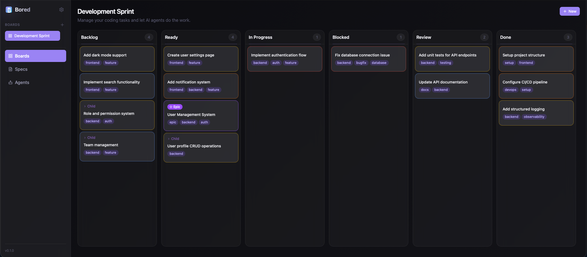
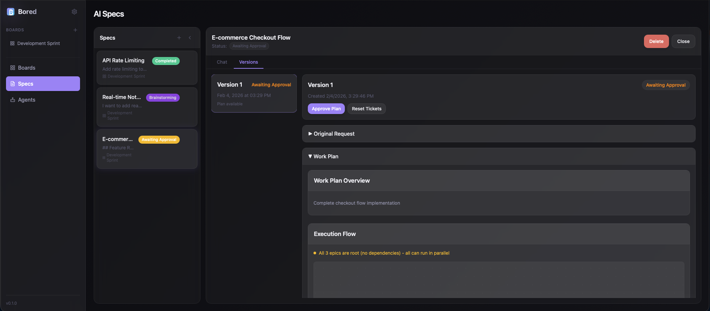
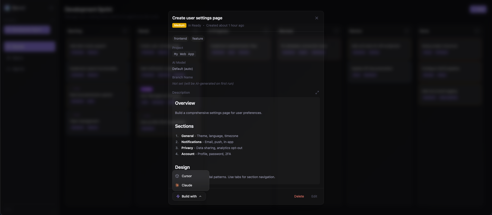
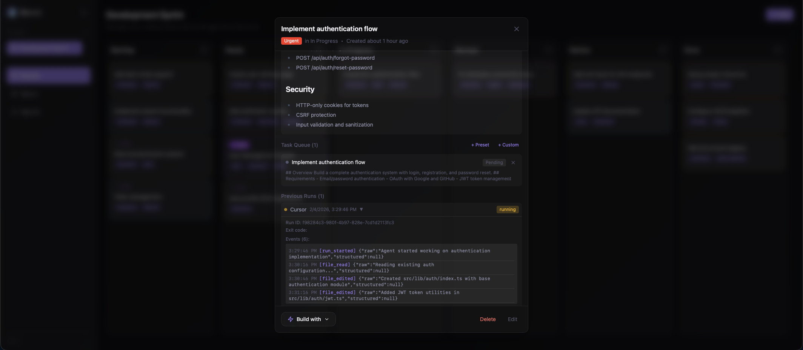

<p align="center">
  
</p>

<h1 align="center">Bored</h1>

<p align="center">
  <strong>Let AI agents handle your coding tasks</strong>
</p>

<p align="center">
  <a href="#installation"></a>
  <a href="#installation"></a>
  <a href="#installation"></a>
  <a href="LICENSE.txt"></a>
</p>

<p align="center">
  A local-first desktop app for managing coding tasks with AI agents.<br>
  Plan features with AI, generate work plans, and let <strong>Cursor</strong> or <strong>Claude Code</strong> build them autonomously.
</p>

---

<p align="center">
  
</p>

---

## Why Bored?

| | Manual Coding | With Bored |
|---|---|---|
| **Planning** | Write specs manually | AI brainstorms and generates work plans |
| **Task Breakdown** | Break down features yourself | AI creates epics and tickets automatically |
| **Implementation** | Code everything yourself | Agents implement tickets autonomously |
| **Progress Tracking** | Check terminal output | Real-time event timeline and dashboards |
| **Multi-tasking** | One task at a time | Queue tickets, workers process them in parallel |

---

## Key Features

### Spec Builder: Plan and Execute Large Features

The Spec Builder is Bored's most powerful feature. Describe what you want to build, and AI will:

1. **Brainstorm** — Chat with AI to refine your requirements
2. **Explore** — AI analyzes your codebase to understand its structure
3. **Plan** — Generate a detailed work plan with epics and tickets
4. **Execute** — Create tickets automatically and work through them

Perfect for features that would normally take days or weeks to implement manually.

<p align="center">
  
</p>

### Visual Kanban Board

Organize your work with drag-and-drop simplicity. Tickets flow through columns: **Backlog** → **Ready** → **In Progress** → **Review** → **Done**.

<p align="center">
  
</p>

### AI Agent Integration

Click **"Build with"** on any ticket to spawn a Cursor or Claude Code agent. Agents receive the task description, work in your project directory, and report progress in real-time.

<p align="center">
  
</p>

### Real-Time Event Timeline

Watch agents work with a live feed of their actions: file edits, shell commands, status changes, and more.

<p align="center">
  
</p>

### Automated Workers

Set up workers to continuously process tickets from the queue. Workers automatically pick up tickets from the Ready column and run agents on them — perfect for batch processing or overnight runs.

### Multi-Stage Workflow

When an agent works on a ticket, it goes through a structured multi-stage workflow designed to produce high-quality, well-tested code:

```
Branch → Plan → Validate → Implement → Review → QA → Commit
```

| Stage | What Happens |
|-------|--------------|
| **Branch** | Creates a dedicated git branch for the work |
| **Plan** | AI generates a detailed implementation plan based on the ticket |
| **Validate** | Checks if the plan needs clarification (moves to Blocked if so) |
| **Implement** | Executes the implementation following the plan |
| **Code Review** | Iterative loop: reviews code, fixes issues, repeats until clean |
| **QA** | Runs cleanup, removes debug code, executes tests, reviews changes |
| **Commit** | Stages and commits all changes with a detailed message |

**Automatic ticket transitions:** Tickets move through columns as work progresses:
- **Ready → In Progress** when the workflow starts
- **In Progress → Review** when entering QA
- **Review → Done** on successful completion
- **Any → Blocked** if clarification is needed

**Pause & Resume:** Workflows can be paused at any stage and resumed later. The agent picks up exactly where it left off, with full context from previous stages preserved.

**Retries & Timeouts:** Each stage has configurable retry limits and timeouts to handle transient failures gracefully.

---

## Quick Start

1. **Download** the latest release for your platform
2. **Create a Board** to organize your work
3. **Add a Project** — point to a local repository
4. **Start Building:**
   - **Single tickets:** Create a ticket, click **"Build with"** → Cursor or Claude
   - **Large features:** Create a Spec, brainstorm with AI, approve the plan, and watch it execute

---

## How the Spec Builder Works

The Spec Builder transforms high-level feature descriptions into working code:

```
Your Idea → Brainstorm → Explore Codebase → Generate Plan → Create Epics & Tickets → Execute
```

### Example Workflow

1. **Create a Spec**: "Add user authentication with OAuth support"
2. **Brainstorm**: AI asks clarifying questions — which providers? Session vs JWT? Password reset flow?
3. **Explore**: AI scans your codebase to understand existing patterns
4. **Plan**: AI generates a structured plan with epics:
   - Epic 1: Core authentication (login, logout, session management)
   - Epic 2: OAuth integration (Google, GitHub)
   - Epic 3: Password reset flow
5. **Approve**: Review and approve the plan (or iterate)
6. **Execute**: AI creates tickets and starts working through them

Each epic becomes a set of tickets on your board, with dependencies tracked automatically.

---

## Installation

### Download Release

Download the latest release for your platform from the [Releases](https://github.com/TannerBurns/bored/releases) page.

### Build from Source

**Prerequisites:**
- [Node.js](https://nodejs.org/) 18+
- [pnpm](https://pnpm.io/) 8+
- [Rust](https://rustup.rs/) 1.70+

```bash
# Clone the repository
git clone https://github.com/TannerBurns/bored.git
cd bored

# Install dependencies
pnpm install

# Run in development mode
pnpm tauri dev

# Build for production
pnpm tauri build
```

---

## Architecture

```
┌─────────────────────────────────────────────────────────┐
│                    Desktop App                          │
│  ┌─────────────┐  ┌─────────────┐  ┌─────────────────┐ │
│  │  React UI   │  │ Tauri/Rust  │  │   Local API     │ │
│  │  (Vite)     │◄─►│  Backend    │◄─►│   (Axum)       │ │
│  └─────────────┘  └─────────────┘  └─────────────────┘ │
│                          │                    ▲         │
│                          ▼                    │         │
│                    ┌──────────┐               │         │
│                    │  SQLite  │               │         │
│                    └──────────┘               │         │
└─────────────────────────────────────────────────────────┘
                           │
            ┌──────────────┴──────────────┐
            ▼                              ▼
    ┌───────────────┐              ┌───────────────┐
    │ Cursor Agent  │              │  Claude Code  │
    │               │              │               │
    │  Hook Script  │─────────────►│  Hook Script  │───────►
    └───────────────┘   POST to    └───────────────┘ Events
                        Local API
```

The app runs a local HTTP API that receives lifecycle events from agent hook scripts. This enables real-time tracking without requiring any external services.

---

## Tech Stack

| Component | Technology |
|-----------|------------|
| Desktop Framework | Tauri 2.x |
| Frontend | React 18 + TypeScript |
| Build Tool | Vite |
| Styling | Tailwind CSS 4 |
| State Management | Zustand |
| Drag & Drop | dnd-kit |
| Backend | Rust |
| HTTP Server | Axum |
| Database | SQLite |

---

## Configuration

### Agent Hooks

Bored uses hook scripts to receive events from AI agents:

**Cursor Hooks:**
- `beforeShellExecution` — Before running shell commands
- `afterFileEdit` — After editing files
- `stop` — When the agent stops

**Claude Hooks:**
- `PreToolUse` / `PostToolUse` — Before/after tool calls
- `Stop` — When the agent stops
- `UserPromptSubmit` — When prompts are submitted

### Settings

Access settings through the sidebar:
- **General** — Theme (light/dark/system)
- **Projects** — Manage registered repositories
- **Cursor** — Cursor agent configuration
- **Claude Code** — Claude agent configuration
- **Data** — Database management

---

## Development

```bash
# Run tests
pnpm test

# Run tests in watch mode
pnpm test:watch

# Type checking
pnpm typecheck

# Lint
pnpm lint

# Run the app in development
pnpm tauri dev
```

---

## License

Copyright (c) 2026 Tanner Burns. All rights reserved.

This software is proprietary and confidential. See [LICENSE.txt](LICENSE.txt) for details.
