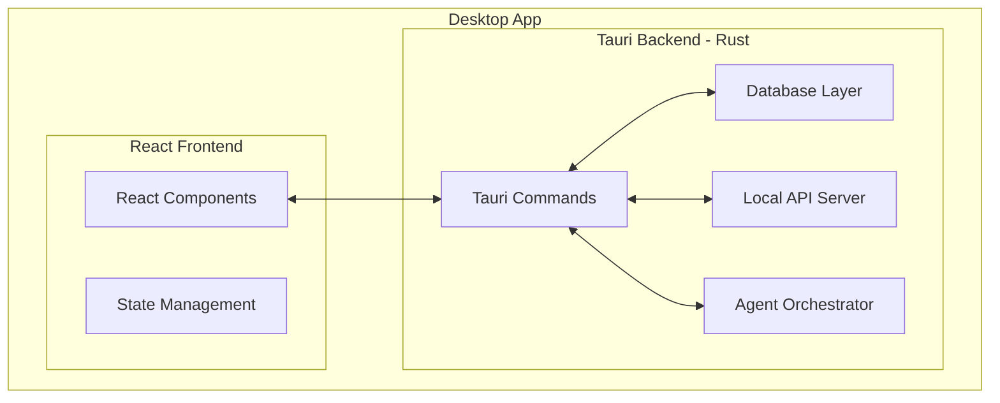

# 01 - Project Setup

Initialize a Tauri + React desktop application with TypeScript, Vite, and the foundational project structure for Agent Kanban.

## Overview

This guide walks through creating the initial Tauri application skeleton with a React frontend. By the end, you'll have:

- A working Tauri desktop app with React + TypeScript
- Proper project structure for scalability
- Development tooling configured (Vite, ESLint, Prettier)
- Logging infrastructure ready for debugging

## Prerequisites

- **Rust** (1.70+): Install via [rustup](https://rustup.rs/)
- **Node.js** (18+): Install via [nvm](https://github.com/nvm-sh/nvm) or [official installer](https://nodejs.org/)
- **System dependencies**: See [Tauri prerequisites](https://tauri.app/v1/guides/getting-started/prerequisites)

Verify installations:

```bash
rustc --version
node --version
npm --version
```

## Architecture



## Implementation Steps

### Step 1: Create Tauri Project

Use the official Tauri scaffolding tool:

```bash
npm create tauri-app@latest agent-kanban -- --template react-ts
cd agent-kanban
```

This creates the following structure:

```
agent-kanban/
├── src/                    # React frontend source
├── src-tauri/              # Rust backend source
├── package.json
├── vite.config.ts
└── tsconfig.json
```

### Step 2: Install Frontend Dependencies

```bash
npm install

# State management
npm install zustand

# UI components and styling
npm install @radix-ui/react-dialog @radix-ui/react-dropdown-menu
npm install tailwindcss postcss autoprefixer
npx tailwindcss init -p

# Drag and drop
npm install @dnd-kit/core @dnd-kit/sortable @dnd-kit/utilities

# Utilities
npm install clsx date-fns uuid
npm install -D @types/uuid
```

### Step 3: Configure Tailwind CSS

Update `tailwind.config.js`:

```javascript
/** @type {import('tailwindcss').Config} */
export default {
  content: [
    "./index.html",
    "./src/**/*.{js,ts,jsx,tsx}",
  ],
  theme: {
    extend: {
      colors: {
        // Custom color palette for the kanban board
        board: {
          bg: '#1a1a2e',
          column: '#16213e',
          card: '#0f3460',
          accent: '#e94560',
        }
      }
    },
  },
  plugins: [],
}
```

Update `src/index.css`:

```css
@tailwind base;
@tailwind components;
@tailwind utilities;

:root {
  font-family: Inter, system-ui, -apple-system, sans-serif;
}

body {
  margin: 0;
  min-height: 100vh;
}
```

### Step 4: Establish Project Structure

Organize the frontend for scalability:

```
src/
├── components/
│   ├── board/
│   │   ├── Board.tsx
│   │   ├── Column.tsx
│   │   └── Ticket.tsx
│   ├── common/
│   │   ├── Button.tsx
│   │   ├── Modal.tsx
│   │   └── Input.tsx
│   └── layout/
│       ├── Sidebar.tsx
│       └── Header.tsx
├── hooks/
│   ├── useBoard.ts
│   └── useTauri.ts
├── stores/
│   ├── boardStore.ts
│   └── settingsStore.ts
├── types/
│   └── index.ts
├── lib/
│   ├── api.ts
│   └── utils.ts
├── App.tsx
├── main.tsx
└── index.css
```

Create the directory structure:

```bash
mkdir -p src/{components/{board,common,layout},hooks,stores,types,lib}
```

### Step 5: Define Core Types

Create `src/types/index.ts`:

```typescript
// Board and ticket types
export interface Board {
  id: string;
  name: string;
  createdAt: Date;
  updatedAt: Date;
}

export interface Column {
  id: string;
  boardId: string;
  name: string;
  position: number;
  wipLimit?: number;
}

export interface Ticket {
  id: string;
  boardId: string;
  columnId: string;
  title: string;
  descriptionMd: string;
  priority: 'low' | 'medium' | 'high' | 'urgent';
  labels: string[];
  createdAt: Date;
  updatedAt: Date;
  lockedByRunId?: string;
  lockExpiresAt?: Date;
  repoPath?: string;
  agentPref?: 'cursor' | 'claude' | 'any';
}

export interface Comment {
  id: string;
  ticketId: string;
  authorType: 'user' | 'agent' | 'system';
  bodyMd: string;
  createdAt: Date;
  metadata?: Record<string, unknown>;
}

// Agent run types
export type AgentType = 'cursor' | 'claude';
export type RunStatus = 'queued' | 'running' | 'finished' | 'error' | 'aborted';

export interface AgentRun {
  id: string;
  ticketId: string;
  agentType: AgentType;
  repoPath: string;
  status: RunStatus;
  startedAt: Date;
  endedAt?: Date;
  exitCode?: number;
  summaryMd?: string;
  metadata?: Record<string, unknown>;
}

export interface AgentEvent {
  id: string;
  runId: string;
  ticketId: string;
  eventType: string;
  payload: Record<string, unknown>;
  createdAt: Date;
}

// Normalized event schema for hook bridge
export interface NormalizedEvent {
  runId: string;
  ticketId: string;
  agentType: AgentType;
  eventType: 
    | 'command_requested'
    | 'command_executed'
    | 'file_read'
    | 'file_edited'
    | 'run_started'
    | 'run_stopped'
    | 'error';
  payload: {
    raw?: string;
    structured?: Record<string, unknown>;
  };
  timestamp: Date;
}
```

### Step 6: Configure Tauri Backend Structure

Organize the Rust backend in `src-tauri/src/`:

```
src-tauri/src/
├── main.rs              # Entry point
├── lib.rs               # Library exports
├── commands/            # Tauri command handlers
│   ├── mod.rs
│   ├── boards.rs
│   ├── tickets.rs
│   └── runs.rs
├── db/                  # Database layer
│   ├── mod.rs
│   ├── schema.rs
│   └── migrations/
├── api/                 # Local HTTP API server
│   ├── mod.rs
│   ├── routes.rs
│   └── handlers.rs
├── agents/              # Agent orchestration
│   ├── mod.rs
│   ├── cursor.rs
│   └── claude.rs
└── logging.rs           # Logging configuration
```

Create the module structure:

```bash
cd src-tauri/src
mkdir -p commands db/migrations api agents
touch commands/mod.rs db/mod.rs api/mod.rs agents/mod.rs logging.rs
```

### Step 7: Add Rust Dependencies

Update `src-tauri/Cargo.toml`:

```toml
[package]
name = "agent-kanban"
version = "0.1.0"
edition = "2021"

[build-dependencies]
tauri-build = { version = "1", features = [] }

[dependencies]
tauri = { version = "1", features = ["shell-open"] }
serde = { version = "1", features = ["derive"] }
serde_json = "1"

# Database
rusqlite = { version = "0.31", features = ["bundled"] }

# Async runtime
tokio = { version = "1", features = ["full"] }

# HTTP server for local API
axum = "0.7"
tower = "0.4"
tower-http = { version = "0.5", features = ["cors"] }

# Utilities
uuid = { version = "1", features = ["v4", "serde"] }
chrono = { version = "0.4", features = ["serde"] }
thiserror = "1"
tracing = "0.1"
tracing-subscriber = { version = "0.3", features = ["env-filter"] }
tracing-appender = "0.2"

[features]
default = ["custom-protocol"]
custom-protocol = ["tauri/custom-protocol"]
```

### Step 8: Implement Logging Infrastructure

Create `src-tauri/src/logging.rs`:

```rust
use std::path::PathBuf;
use tracing_appender::rolling::{RollingFileAppender, Rotation};
use tracing_subscriber::{layer::SubscriberExt, util::SubscriberInitExt, EnvFilter};

pub fn init_logging(app_data_dir: PathBuf) -> anyhow::Result<()> {
    let logs_dir = app_data_dir.join("logs");
    std::fs::create_dir_all(&logs_dir)?;

    // File appender with daily rotation
    let file_appender = RollingFileAppender::new(
        Rotation::DAILY,
        &logs_dir,
        "agent-kanban.log",
    );
    let (non_blocking, _guard) = tracing_appender::non_blocking(file_appender);

    // Set up subscriber with both console and file output
    let env_filter = EnvFilter::try_from_default_env()
        .unwrap_or_else(|_| EnvFilter::new("info,agent_kanban=debug"));

    tracing_subscriber::registry()
        .with(env_filter)
        .with(tracing_subscriber::fmt::layer())
        .with(
            tracing_subscriber::fmt::layer()
                .with_writer(non_blocking)
                .with_ansi(false),
        )
        .init();

    tracing::info!("Logging initialized. Logs directory: {:?}", logs_dir);
    Ok(())
}
```

### Step 9: Set Up Main Entry Point

Update `src-tauri/src/main.rs`:

```rust
#![cfg_attr(not(debug_assertions), windows_subsystem = "windows")]

mod commands;
mod db;
mod api;
mod agents;
mod logging;

use tauri::Manager;

fn main() {
    tauri::Builder::default()
        .setup(|app| {
            // Get app data directory for logs and database
            let app_data_dir = app.path_resolver()
                .app_data_dir()
                .expect("Failed to get app data directory");
            
            // Initialize logging
            if let Err(e) = logging::init_logging(app_data_dir.clone()) {
                eprintln!("Failed to initialize logging: {}", e);
            }

            tracing::info!("Agent Kanban starting up...");
            tracing::info!("App data directory: {:?}", app_data_dir);

            Ok(())
        })
        .invoke_handler(tauri::generate_handler![
            // Commands will be registered here
        ])
        .run(tauri::generate_context!())
        .expect("error while running tauri application");
}
```

### Step 10: Create Tauri Command Wrapper

Create `src/lib/tauri.ts` for frontend-backend communication:

```typescript
import { invoke } from '@tauri-apps/api/tauri';
import type { Board, Column, Ticket, AgentRun } from '../types';

// Board commands
export async function getBoards(): Promise<Board[]> {
  return invoke('get_boards');
}

export async function createBoard(name: string): Promise<Board> {
  return invoke('create_board', { name });
}

// Ticket commands
export async function getTickets(boardId: string): Promise<Ticket[]> {
  return invoke('get_tickets', { boardId });
}

export async function createTicket(ticket: Omit<Ticket, 'id' | 'createdAt' | 'updatedAt'>): Promise<Ticket> {
  return invoke('create_ticket', { ticket });
}

export async function moveTicket(ticketId: string, columnId: string): Promise<void> {
  return invoke('move_ticket', { ticketId, columnId });
}

// Agent run commands
export async function startAgentRun(
  ticketId: string,
  agentType: 'cursor' | 'claude',
  repoPath: string
): Promise<AgentRun> {
  return invoke('start_agent_run', { ticketId, agentType, repoPath });
}

export async function getAgentRuns(ticketId: string): Promise<AgentRun[]> {
  return invoke('get_agent_runs', { ticketId });
}
```

### Step 11: Create Basic App Shell

Update `src/App.tsx`:

```typescript
import { useEffect, useState } from 'react';
import './index.css';

function App() {
  const [ready, setReady] = useState(false);

  useEffect(() => {
    // App initialization
    setReady(true);
  }, []);

  if (!ready) {
    return (
      <div className="flex items-center justify-center h-screen bg-board-bg">
        <div className="text-white text-xl">Loading Agent Kanban...</div>
      </div>
    );
  }

  return (
    <div className="flex h-screen bg-board-bg text-white">
      {/* Sidebar */}
      <aside className="w-64 bg-board-column border-r border-gray-700 p-4">
        <h1 className="text-xl font-bold mb-6">Agent Kanban</h1>
        <nav>
          <ul className="space-y-2">
            <li>
              <a href="#" className="block px-3 py-2 rounded hover:bg-board-card">
                Boards
              </a>
            </li>
            <li>
              <a href="#" className="block px-3 py-2 rounded hover:bg-board-card">
                Agent Runs
              </a>
            </li>
            <li>
              <a href="#" className="block px-3 py-2 rounded hover:bg-board-card">
                Settings
              </a>
            </li>
          </ul>
        </nav>
      </aside>

      {/* Main content */}
      <main className="flex-1 p-6 overflow-auto">
        <header className="mb-6">
          <h2 className="text-2xl font-semibold">Welcome to Agent Kanban</h2>
          <p className="text-gray-400 mt-1">
            Manage your coding tasks and let AI agents do the work.
          </p>
        </header>

        <div className="bg-board-column rounded-lg p-6">
          <p className="text-gray-300">
            Select a board from the sidebar or create a new one to get started.
          </p>
        </div>
      </main>
    </div>
  );
}

export default App;
```

## Testing

### Verify Development Setup

1. Start the development server:

```bash
npm run tauri dev
```

2. You should see:
   - The Tauri window opens with the React app
   - Console shows "Agent Kanban starting up..."
   - No compilation errors in terminal

### Verify Logging

Check that logs are being written:

```bash
# macOS
cat ~/Library/Application\ Support/agent-kanban/logs/agent-kanban.log

# Linux
cat ~/.local/share/agent-kanban/logs/agent-kanban.log

# Windows
type %APPDATA%\agent-kanban\logs\agent-kanban.log
```

## Troubleshooting

### "Command not found: rustc"

Rust isn't installed or not in PATH. Run:

```bash
curl --proto '=https' --tlsv1.2 -sSf https://sh.rustup.rs | sh
source ~/.cargo/env
```

### Tauri build fails on Linux

Install system dependencies:

```bash
# Ubuntu/Debian
sudo apt update
sudo apt install libwebkit2gtk-4.0-dev build-essential curl wget libssl-dev libgtk-3-dev libayatana-appindicator3-dev librsvg2-dev

# Fedora
sudo dnf install webkit2gtk4.0-devel openssl-devel curl wget libappindicator-gtk3 librsvg2-devel
```

### "Module not found" errors in React

Ensure all dependencies are installed:

```bash
rm -rf node_modules package-lock.json
npm install
```

## Next Steps

With the project scaffold in place, proceed to:

- **[02-database-design.md](./02-database-design.md)**: Set up SQLite schema and migrations
