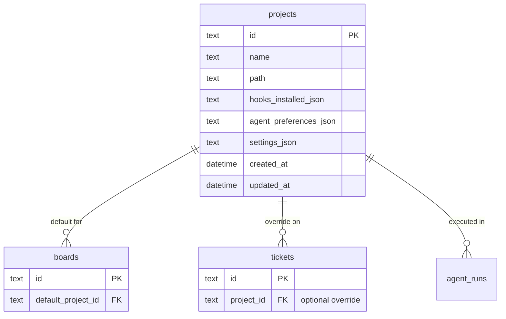

# 01.5 - Project Management

Define the Projects Registry system for managing repositories where agents will work.

## Overview

This guide introduces the **Projects** concept - a first-class entity representing a local repository/directory that agents can work in. Projects provide:

- A registry of directories the user has authorized for agent work
- Per-project configuration (hooks, agent preferences, safety settings)
- Default associations with boards
- Directory validation and safety checks

## Why Projects?

Without explicit project management:
- Agents could accidentally run in unintended directories
- Hook configuration would need to be repeated
- No clear relationship between boards and working directories
- Harder to implement worker mode filtering

With Projects:
- Users explicitly opt-in directories for agent work
- Configuration is stored and reused
- Boards have sensible defaults
- Workers can be scoped to specific projects

## Architecture



## Data Model

### Projects Table

Add to the database schema (will be implemented in `02-database-design.md`):

```sql
CREATE TABLE IF NOT EXISTS projects (
    id TEXT PRIMARY KEY NOT NULL,
    name TEXT NOT NULL,
    path TEXT NOT NULL UNIQUE,
    
    -- Hook installation status
    cursor_hooks_installed INTEGER NOT NULL DEFAULT 0,
    claude_hooks_installed INTEGER NOT NULL DEFAULT 0,
    
    -- Agent preferences for this project
    preferred_agent TEXT CHECK(preferred_agent IN ('cursor', 'claude', 'any')),
    
    -- Safety settings
    allow_shell_commands INTEGER NOT NULL DEFAULT 1,
    allow_file_writes INTEGER NOT NULL DEFAULT 1,
    blocked_patterns_json TEXT NOT NULL DEFAULT '[]',
    
    -- General settings
    settings_json TEXT NOT NULL DEFAULT '{}',
    
    created_at TEXT NOT NULL DEFAULT (datetime('now')),
    updated_at TEXT NOT NULL DEFAULT (datetime('now'))
);

CREATE INDEX IF NOT EXISTS idx_projects_path ON projects(path);
```

### Board-Project Association

Update the boards table to include a default project:

```sql
-- Add to boards table
ALTER TABLE boards ADD COLUMN default_project_id TEXT REFERENCES projects(id) ON DELETE SET NULL;
```

### Ticket-Project Override

Update the tickets table to allow project override:

```sql
-- The existing repo_path column becomes project_id
-- Tickets can override the board's default project
ALTER TABLE tickets ADD COLUMN project_id TEXT REFERENCES projects(id) ON DELETE SET NULL;
```

**Resolution logic:**
1. If `ticket.project_id` is set, use that project
2. Else if `board.default_project_id` is set, use that
3. Else ticket cannot be moved to Ready (no valid project)

## Rust Models

Add to `src-tauri/src/db/models.rs`:

```rust
/// A registered project/repository
#[derive(Debug, Clone, Serialize, Deserialize)]
#[serde(rename_all = "camelCase")]
pub struct Project {
    pub id: String,
    pub name: String,
    pub path: String,
    
    // Hook status
    pub cursor_hooks_installed: bool,
    pub claude_hooks_installed: bool,
    
    // Preferences
    pub preferred_agent: Option<AgentPref>,
    
    // Safety
    pub allow_shell_commands: bool,
    pub allow_file_writes: bool,
    pub blocked_patterns: Vec<String>,
    
    // General
    pub settings: serde_json::Value,
    
    pub created_at: chrono::DateTime<chrono::Utc>,
    pub updated_at: chrono::DateTime<chrono::Utc>,
}

/// Input for creating a project
#[derive(Debug, Clone, Serialize, Deserialize)]
#[serde(rename_all = "camelCase")]
pub struct CreateProject {
    pub name: String,
    pub path: String,
    pub preferred_agent: Option<AgentPref>,
}

/// Input for updating a project
#[derive(Debug, Clone, Serialize, Deserialize)]
#[serde(rename_all = "camelCase")]
pub struct UpdateProject {
    pub name: Option<String>,
    pub preferred_agent: Option<AgentPref>,
    pub allow_shell_commands: Option<bool>,
    pub allow_file_writes: Option<bool>,
    pub blocked_patterns: Option<Vec<String>>,
}
```

## Database Operations

Add to `src-tauri/src/db/mod.rs`:

```rust
// Project operations
impl Database {
    /// Create a new project
    pub fn create_project(&self, input: &CreateProject) -> Result<Project, DbError> {
        // Validate path exists and is a directory
        let path = std::path::Path::new(&input.path);
        if !path.exists() {
            return Err(DbError::Validation(format!(
                "Path does not exist: {}",
                input.path
            )));
        }
        if !path.is_dir() {
            return Err(DbError::Validation(format!(
                "Path is not a directory: {}",
                input.path
            )));
        }

        // Canonicalize path to avoid duplicates
        let canonical_path = path
            .canonicalize()
            .map_err(|e| DbError::Validation(format!("Invalid path: {}", e)))?
            .to_string_lossy()
            .to_string();

        self.with_conn(|conn| {
            let project_id = uuid::Uuid::new_v4().to_string();
            let now = chrono::Utc::now();

            conn.execute(
                r#"INSERT INTO projects 
                   (id, name, path, preferred_agent, created_at, updated_at)
                   VALUES (?, ?, ?, ?, ?, ?)"#,
                rusqlite::params![
                    project_id,
                    input.name,
                    canonical_path,
                    input.preferred_agent.as_ref().map(|p| match p {
                        AgentPref::Cursor => "cursor",
                        AgentPref::Claude => "claude",
                        AgentPref::Any => "any",
                    }),
                    now.to_rfc3339(),
                    now.to_rfc3339(),
                ],
            )?;

            Ok(Project {
                id: project_id,
                name: input.name.clone(),
                path: canonical_path,
                cursor_hooks_installed: false,
                claude_hooks_installed: false,
                preferred_agent: input.preferred_agent.clone(),
                allow_shell_commands: true,
                allow_file_writes: true,
                blocked_patterns: vec![],
                settings: serde_json::json!({}),
                created_at: now,
                updated_at: now,
            })
        })
    }

    /// Get all projects
    pub fn get_projects(&self) -> Result<Vec<Project>, DbError> {
        self.with_conn(|conn| {
            let mut stmt = conn.prepare(
                r#"SELECT id, name, path, cursor_hooks_installed, claude_hooks_installed,
                          preferred_agent, allow_shell_commands, allow_file_writes,
                          blocked_patterns_json, settings_json, created_at, updated_at
                   FROM projects ORDER BY name"#,
            )?;

            let projects = stmt
                .query_map([], |row| {
                    let blocked_json: String = row.get(8)?;
                    let settings_json: String = row.get(9)?;
                    let pref_str: Option<String> = row.get(5)?;

                    Ok(Project {
                        id: row.get(0)?,
                        name: row.get(1)?,
                        path: row.get(2)?,
                        cursor_hooks_installed: row.get::<_, i32>(3)? != 0,
                        claude_hooks_installed: row.get::<_, i32>(4)? != 0,
                        preferred_agent: pref_str.and_then(|s| match s.as_str() {
                            "cursor" => Some(AgentPref::Cursor),
                            "claude" => Some(AgentPref::Claude),
                            "any" => Some(AgentPref::Any),
                            _ => None,
                        }),
                        allow_shell_commands: row.get::<_, i32>(6)? != 0,
                        allow_file_writes: row.get::<_, i32>(7)? != 0,
                        blocked_patterns: serde_json::from_str(&blocked_json).unwrap_or_default(),
                        settings: serde_json::from_str(&settings_json).unwrap_or(serde_json::json!({})),
                        created_at: parse_datetime(row.get(10)?),
                        updated_at: parse_datetime(row.get(11)?),
                    })
                })?
                .collect::<Result<Vec<_>, _>>()?;

            Ok(projects)
        })
    }

    /// Get a project by ID
    pub fn get_project(&self, project_id: &str) -> Result<Option<Project>, DbError> {
        self.get_projects().map(|projects| {
            projects.into_iter().find(|p| p.id == project_id)
        })
    }

    /// Get a project by path
    pub fn get_project_by_path(&self, path: &str) -> Result<Option<Project>, DbError> {
        // Canonicalize the input path for comparison
        let canonical = std::path::Path::new(path)
            .canonicalize()
            .ok()
            .map(|p| p.to_string_lossy().to_string());

        self.get_projects().map(|projects| {
            projects.into_iter().find(|p| {
                Some(&p.path) == canonical.as_ref()
            })
        })
    }

    /// Update hook installation status
    pub fn update_project_hooks(
        &self,
        project_id: &str,
        cursor_installed: Option<bool>,
        claude_installed: Option<bool>,
    ) -> Result<(), DbError> {
        self.with_conn(|conn| {
            let now = chrono::Utc::now().to_rfc3339();

            if let Some(installed) = cursor_installed {
                conn.execute(
                    "UPDATE projects SET cursor_hooks_installed = ?, updated_at = ? WHERE id = ?",
                    rusqlite::params![installed as i32, now, project_id],
                )?;
            }

            if let Some(installed) = claude_installed {
                conn.execute(
                    "UPDATE projects SET claude_hooks_installed = ?, updated_at = ? WHERE id = ?",
                    rusqlite::params![installed as i32, now, project_id],
                )?;
            }

            Ok(())
        })
    }

    /// Delete a project
    pub fn delete_project(&self, project_id: &str) -> Result<(), DbError> {
        self.with_conn(|conn| {
            // Check if any boards use this as default
            let board_count: i64 = conn.query_row(
                "SELECT COUNT(*) FROM boards WHERE default_project_id = ?",
                [project_id],
                |row| row.get(0),
            )?;

            if board_count > 0 {
                return Err(DbError::Validation(format!(
                    "Cannot delete project: {} boards use it as default",
                    board_count
                )));
            }

            conn.execute("DELETE FROM projects WHERE id = ?", [project_id])?;
            Ok(())
        })
    }

    /// Set a board's default project
    pub fn set_board_project(
        &self,
        board_id: &str,
        project_id: Option<&str>,
    ) -> Result<(), DbError> {
        self.with_conn(|conn| {
            conn.execute(
                "UPDATE boards SET default_project_id = ? WHERE id = ?",
                rusqlite::params![project_id, board_id],
            )?;
            Ok(())
        })
    }
}
```

## TypeScript Types

Add to `src/types/index.ts`:

```typescript
export interface Project {
  id: string;
  name: string;
  path: string;
  
  // Hook status
  cursorHooksInstalled: boolean;
  claudeHooksInstalled: boolean;
  
  // Preferences
  preferredAgent?: 'cursor' | 'claude' | 'any';
  
  // Safety settings
  allowShellCommands: boolean;
  allowFileWrites: boolean;
  blockedPatterns: string[];
  
  // General
  settings: Record<string, unknown>;
  
  createdAt: Date;
  updatedAt: Date;
}

export interface CreateProjectInput {
  name: string;
  path: string;
  preferredAgent?: 'cursor' | 'claude' | 'any';
}

// Update Board type
export interface Board {
  id: string;
  name: string;
  defaultProjectId?: string;  // Add this
  createdAt: Date;
  updatedAt: Date;
}

// Update Ticket type  
export interface Ticket {
  // ... existing fields ...
  projectId?: string;  // Add this - overrides board default
}
```

## Tauri Commands

Add to `src-tauri/src/commands/mod.rs`:

```rust
#[tauri::command]
pub async fn get_projects(
    db: State<'_, Arc<Database>>,
) -> Result<Vec<Project>, String> {
    db.get_projects().map_err(|e| e.to_string())
}

#[tauri::command]
pub async fn create_project(
    input: CreateProject,
    db: State<'_, Arc<Database>>,
) -> Result<Project, String> {
    db.create_project(&input).map_err(|e| e.to_string())
}

#[tauri::command]
pub async fn delete_project(
    project_id: String,
    db: State<'_, Arc<Database>>,
) -> Result<(), String> {
    db.delete_project(&project_id).map_err(|e| e.to_string())
}

#[tauri::command]
pub async fn set_board_project(
    board_id: String,
    project_id: Option<String>,
    db: State<'_, Arc<Database>>,
) -> Result<(), String> {
    db.set_board_project(&board_id, project_id.as_deref())
        .map_err(|e| e.to_string())
}

#[tauri::command]
pub async fn browse_for_directory() -> Result<Option<String>, String> {
    use tauri::api::dialog::blocking::FileDialogBuilder;
    
    let path = FileDialogBuilder::new()
        .set_title("Select Project Directory")
        .pick_folder();
    
    Ok(path.map(|p| p.to_string_lossy().to_string()))
}
```

## UI Components

### Projects List Component

Create `src/components/settings/ProjectsList.tsx`:

```typescript
import { useState, useEffect } from 'react';
import { invoke } from '@tauri-apps/api/tauri';
import type { Project } from '../../types';

export function ProjectsList() {
  const [projects, setProjects] = useState<Project[]>([]);
  const [isAdding, setIsAdding] = useState(false);
  const [newName, setNewName] = useState('');
  const [newPath, setNewPath] = useState('');

  useEffect(() => {
    loadProjects();
  }, []);

  const loadProjects = async () => {
    const data = await invoke<Project[]>('get_projects');
    setProjects(data);
  };

  const handleBrowse = async () => {
    const path = await invoke<string | null>('browse_for_directory');
    if (path) {
      setNewPath(path);
      // Auto-fill name from directory name
      if (!newName) {
        const name = path.split('/').pop() || path.split('\\').pop() || 'Project';
        setNewName(name);
      }
    }
  };

  const handleAdd = async () => {
    if (!newName.trim() || !newPath.trim()) return;

    try {
      await invoke('create_project', {
        input: {
          name: newName.trim(),
          path: newPath.trim(),
        },
      });
      setNewName('');
      setNewPath('');
      setIsAdding(false);
      await loadProjects();
    } catch (error) {
      alert(`Failed to add project: ${error}`);
    }
  };

  const handleDelete = async (projectId: string) => {
    if (!confirm('Delete this project? Boards using it will need to be reassigned.')) {
      return;
    }

    try {
      await invoke('delete_project', { projectId });
      await loadProjects();
    } catch (error) {
      alert(`Failed to delete project: ${error}`);
    }
  };

  return (
    <div className="space-y-4">
      <div className="flex items-center justify-between">
        <h3 className="text-lg font-medium">Projects</h3>
        <button
          onClick={() => setIsAdding(true)}
          className="px-3 py-1.5 bg-blue-600 text-white text-sm rounded hover:bg-blue-700"
        >
          + Add Project
        </button>
      </div>

      {/* Add project form */}
      {isAdding && (
        <div className="bg-gray-800 rounded-lg p-4 space-y-3">
          <div>
            <label className="block text-sm text-gray-400 mb-1">Name</label>
            <input
              type="text"
              value={newName}
              onChange={e => setNewName(e.target.value)}
              placeholder="My Project"
              className="w-full px-3 py-2 bg-gray-700 rounded text-white"
            />
          </div>
          <div>
            <label className="block text-sm text-gray-400 mb-1">Path</label>
            <div className="flex gap-2">
              <input
                type="text"
                value={newPath}
                onChange={e => setNewPath(e.target.value)}
                placeholder="/path/to/project"
                className="flex-1 px-3 py-2 bg-gray-700 rounded text-white"
              />
              <button
                onClick={handleBrowse}
                className="px-3 py-2 bg-gray-600 rounded hover:bg-gray-500"
              >
                Browse
              </button>
            </div>
          </div>
          <div className="flex justify-end gap-2">
            <button
              onClick={() => setIsAdding(false)}
              className="px-3 py-1.5 text-gray-400 hover:text-white"
            >
              Cancel
            </button>
            <button
              onClick={handleAdd}
              disabled={!newName.trim() || !newPath.trim()}
              className="px-3 py-1.5 bg-green-600 text-white rounded hover:bg-green-700 disabled:opacity-50"
            >
              Add Project
            </button>
          </div>
        </div>
      )}

      {/* Projects list */}
      <div className="space-y-2">
        {projects.map(project => (
          <div
            key={project.id}
            className="flex items-center justify-between bg-gray-800 rounded-lg p-4"
          >
            <div>
              <div className="font-medium">{project.name}</div>
              <div className="text-sm text-gray-400 font-mono">{project.path}</div>
              <div className="flex gap-2 mt-1">
                {project.cursorHooksInstalled && (
                  <span className="text-xs bg-purple-600 px-2 py-0.5 rounded">
                    Cursor hooks
                  </span>
                )}
                {project.claudeHooksInstalled && (
                  <span className="text-xs bg-green-600 px-2 py-0.5 rounded">
                    Claude hooks
                  </span>
                )}
              </div>
            </div>
            <button
              onClick={() => handleDelete(project.id)}
              className="px-2 py-1 text-red-400 hover:text-red-300"
            >
              Delete
            </button>
          </div>
        ))}

        {projects.length === 0 && !isAdding && (
          <div className="text-center py-8 text-gray-500">
            No projects added yet. Add a project to start using Agent Kanban.
          </div>
        )}
      </div>
    </div>
  );
}
```

### Board Project Selector

Add to board settings:

```typescript
// In Board settings or header
import { useEffect, useState } from 'react';
import { invoke } from '@tauri-apps/api/tauri';
import type { Project } from '../../types';

interface BoardProjectSelectorProps {
  boardId: string;
  currentProjectId?: string;
  onChange: (projectId: string | null) => void;
}

export function BoardProjectSelector({ 
  boardId, 
  currentProjectId, 
  onChange 
}: BoardProjectSelectorProps) {
  const [projects, setProjects] = useState<Project[]>([]);

  useEffect(() => {
    invoke<Project[]>('get_projects').then(setProjects);
  }, []);

  const handleChange = async (projectId: string) => {
    const value = projectId === '' ? null : projectId;
    await invoke('set_board_project', { boardId, projectId: value });
    onChange(value);
  };

  return (
    <div>
      <label className="block text-sm text-gray-400 mb-1">
        Default Project
      </label>
      <select
        value={currentProjectId || ''}
        onChange={e => handleChange(e.target.value)}
        className="w-full px-3 py-2 bg-gray-700 rounded text-white"
      >
        <option value="">No default (set per ticket)</option>
        {projects.map(p => (
          <option key={p.id} value={p.id}>
            {p.name}
          </option>
        ))}
      </select>
    </div>
  );
}
```

## Validation Rules

### Ticket Readiness Check

Before a ticket can be moved to "Ready":

```rust
/// Check if a ticket can be moved to Ready
pub fn can_move_to_ready(
    &self,
    ticket_id: &str,
) -> Result<ReadinessCheck, DbError> {
    self.with_conn(|conn| {
        // Get ticket and its board
        let (ticket_project_id, board_id): (Option<String>, String) = conn.query_row(
            "SELECT project_id, board_id FROM tickets WHERE id = ?",
            [ticket_id],
            |row| Ok((row.get(0)?, row.get(1)?)),
        )?;

        // Get board's default project
        let board_project_id: Option<String> = conn.query_row(
            "SELECT default_project_id FROM boards WHERE id = ?",
            [&board_id],
            |row| row.get(0),
        ).ok().flatten();

        // Determine effective project
        let effective_project_id = ticket_project_id.or(board_project_id);

        match effective_project_id {
            Some(pid) => {
                // Verify project exists and path is valid
                let path: Option<String> = conn.query_row(
                    "SELECT path FROM projects WHERE id = ?",
                    [&pid],
                    |row| row.get(0),
                ).ok();

                if let Some(p) = path {
                    if std::path::Path::new(&p).exists() {
                        Ok(ReadinessCheck::Ready { project_id: pid })
                    } else {
                        Ok(ReadinessCheck::ProjectPathMissing { path: p })
                    }
                } else {
                    Ok(ReadinessCheck::ProjectNotFound)
                }
            }
            None => Ok(ReadinessCheck::NoProject),
        }
    })
}

#[derive(Debug)]
pub enum ReadinessCheck {
    Ready { project_id: String },
    NoProject,
    ProjectNotFound,
    ProjectPathMissing { path: String },
}
```

## Hook Installation per Project

When installing hooks for a project:

```rust
/// Install Cursor hooks for a project
pub async fn install_cursor_hooks_for_project(
    project_id: &str,
    db: &Database,
) -> Result<(), Box<dyn std::error::Error>> {
    let project = db.get_project(project_id)?
        .ok_or("Project not found")?;
    
    // Install hooks in project directory
    let hooks_path = std::path::Path::new(&project.path)
        .join(".cursor")
        .join("hooks.json");
    
    // ... install hooks ...
    
    // Update status
    db.update_project_hooks(project_id, Some(true), None)?;
    
    Ok(())
}
```

## Agent Run Integration

When starting an agent run, the project provides the working directory:

```rust
// In agent orchestration
pub async fn start_run_for_ticket(
    ticket_id: &str,
    agent_type: AgentKind,
    db: &Database,
) -> Result<String, Box<dyn std::error::Error>> {
    // Resolve project for this ticket
    let project = resolve_project_for_ticket(db, ticket_id)?
        .ok_or("No project configured for this ticket")?;
    
    // Validate path exists
    if !std::path::Path::new(&project.path).exists() {
        return Err(format!("Project path does not exist: {}", project.path).into());
    }
    
    // Create run with project context
    let run = db.create_run(&CreateRun {
        ticket_id: ticket_id.to_string(),
        agent_type: match agent_type {
            AgentKind::Cursor => AgentType::Cursor,
            AgentKind::Claude => AgentType::Claude,
        },
        repo_path: project.path.clone(),
    })?;
    
    // Spawn agent in project directory
    let config = AgentRunConfig {
        kind: agent_type,
        ticket_id: ticket_id.to_string(),
        run_id: run.id.clone(),
        repo_path: std::path::PathBuf::from(&project.path),
        // ...
    };
    
    // ...
}
```

## Updates to Other Guides

After implementing this guide, the following guides need minor updates:

### 02-database-design.md
- Include `projects` table in schema
- Add `default_project_id` to `boards`
- Update `project_id` (not `repo_path`) on `tickets`

### 03-kanban-ui.md
- Add project selector to board settings
- Show project indicator on tickets
- Validate project before allowing move to Ready

### 05-agent-orchestration.md
- Resolve project for ticket before spawning
- Use `project.path` as working directory

### 06-cursor-integration.md & 07-claude-code-integration.md
- Install hooks per-project or globally
- Track installation status in project record

### 09-worker-mode.md
- Filter workers by project
- Workers specify which project(s) they handle

## Testing

1. Add a project via the UI
2. Set it as default on a board
3. Create a ticket and try to move to Ready (should work)
4. Remove the project association and try again (should fail)
5. Start an agent run and verify it executes in the correct directory

## Next Steps

Proceed to [02-database-design.md](./02-database-design.md) and incorporate the `projects` table into the schema.
