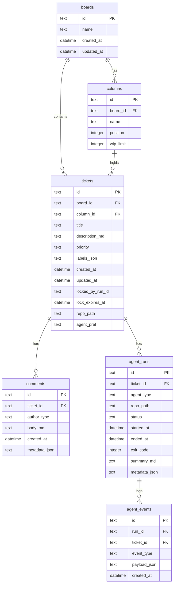

# 02 - Database Design

Design and implement the SQLite database schema for Agent Kanban, including migrations, Rust models, and connection management.

## Overview

This guide covers:

- Complete database schema for boards, tickets, comments, agent runs, and events
- Migration system using rusqlite
- Rust data models with serde serialization
- Connection pooling and thread-safe database access
- The canonical `AgentEvent` schema for hook integration

## Prerequisites

- Completed [01-project-setup.md](./01-project-setup.md)
- Rust environment with rusqlite dependency installed

## Architecture



## Implementation Steps

### Step 1: Create Database Module Structure

Set up the database module files:

```
src-tauri/src/db/
├── mod.rs           # Module exports and connection management
├── schema.rs        # Table creation SQL
├── models.rs        # Rust structs
├── boards.rs        # Board CRUD operations
├── columns.rs       # Column operations
├── tickets.rs       # Ticket CRUD operations
├── comments.rs      # Comment operations
├── runs.rs          # Agent run operations
└── events.rs        # Agent event operations
```

### Step 2: Define the Schema

Create `src-tauri/src/db/schema.rs`:

```rust
//! Database schema definitions and migrations

pub const SCHEMA_VERSION: i32 = 1;

/// Initial schema creation SQL
pub const CREATE_TABLES: &str = r#"
-- Boards table
CREATE TABLE IF NOT EXISTS boards (
    id TEXT PRIMARY KEY NOT NULL,
    name TEXT NOT NULL,
    created_at TEXT NOT NULL DEFAULT (datetime('now')),
    updated_at TEXT NOT NULL DEFAULT (datetime('now'))
);

-- Columns table (kanban columns within a board)
CREATE TABLE IF NOT EXISTS columns (
    id TEXT PRIMARY KEY NOT NULL,
    board_id TEXT NOT NULL REFERENCES boards(id) ON DELETE CASCADE,
    name TEXT NOT NULL,
    position INTEGER NOT NULL DEFAULT 0,
    wip_limit INTEGER,
    UNIQUE(board_id, position)
);

CREATE INDEX IF NOT EXISTS idx_columns_board ON columns(board_id);

-- Tickets table
CREATE TABLE IF NOT EXISTS tickets (
    id TEXT PRIMARY KEY NOT NULL,
    board_id TEXT NOT NULL REFERENCES boards(id) ON DELETE CASCADE,
    column_id TEXT NOT NULL REFERENCES columns(id) ON DELETE RESTRICT,
    title TEXT NOT NULL,
    description_md TEXT NOT NULL DEFAULT '',
    priority TEXT NOT NULL DEFAULT 'medium' CHECK(priority IN ('low', 'medium', 'high', 'urgent')),
    labels_json TEXT NOT NULL DEFAULT '[]',
    created_at TEXT NOT NULL DEFAULT (datetime('now')),
    updated_at TEXT NOT NULL DEFAULT (datetime('now')),
    locked_by_run_id TEXT REFERENCES agent_runs(id) ON DELETE SET NULL,
    lock_expires_at TEXT,
    repo_path TEXT,
    agent_pref TEXT CHECK(agent_pref IN ('cursor', 'claude', 'any'))
);

CREATE INDEX IF NOT EXISTS idx_tickets_board ON tickets(board_id);
CREATE INDEX IF NOT EXISTS idx_tickets_column ON tickets(column_id);
CREATE INDEX IF NOT EXISTS idx_tickets_locked ON tickets(locked_by_run_id) WHERE locked_by_run_id IS NOT NULL;

-- Comments table
CREATE TABLE IF NOT EXISTS comments (
    id TEXT PRIMARY KEY NOT NULL,
    ticket_id TEXT NOT NULL REFERENCES tickets(id) ON DELETE CASCADE,
    author_type TEXT NOT NULL CHECK(author_type IN ('user', 'agent', 'system')),
    body_md TEXT NOT NULL,
    created_at TEXT NOT NULL DEFAULT (datetime('now')),
    metadata_json TEXT
);

CREATE INDEX IF NOT EXISTS idx_comments_ticket ON comments(ticket_id);

-- Agent runs table
CREATE TABLE IF NOT EXISTS agent_runs (
    id TEXT PRIMARY KEY NOT NULL,
    ticket_id TEXT NOT NULL REFERENCES tickets(id) ON DELETE CASCADE,
    agent_type TEXT NOT NULL CHECK(agent_type IN ('cursor', 'claude')),
    repo_path TEXT NOT NULL,
    status TEXT NOT NULL DEFAULT 'queued' CHECK(status IN ('queued', 'running', 'finished', 'error', 'aborted')),
    started_at TEXT NOT NULL DEFAULT (datetime('now')),
    ended_at TEXT,
    exit_code INTEGER,
    summary_md TEXT,
    metadata_json TEXT
);

CREATE INDEX IF NOT EXISTS idx_runs_ticket ON agent_runs(ticket_id);
CREATE INDEX IF NOT EXISTS idx_runs_status ON agent_runs(status);

-- Agent events table (audit trail for hook events)
CREATE TABLE IF NOT EXISTS agent_events (
    id TEXT PRIMARY KEY NOT NULL,
    run_id TEXT NOT NULL REFERENCES agent_runs(id) ON DELETE CASCADE,
    ticket_id TEXT NOT NULL REFERENCES tickets(id) ON DELETE CASCADE,
    event_type TEXT NOT NULL,
    payload_json TEXT NOT NULL DEFAULT '{}',
    created_at TEXT NOT NULL DEFAULT (datetime('now'))
);

CREATE INDEX IF NOT EXISTS idx_events_run ON agent_events(run_id);
CREATE INDEX IF NOT EXISTS idx_events_ticket ON agent_events(ticket_id);
CREATE INDEX IF NOT EXISTS idx_events_type ON agent_events(event_type);

-- Schema version tracking
CREATE TABLE IF NOT EXISTS schema_version (
    version INTEGER PRIMARY KEY,
    applied_at TEXT NOT NULL DEFAULT (datetime('now'))
);
"#;

/// Default columns for a new board
pub const DEFAULT_COLUMNS: &[&str] = &[
    "Backlog",
    "Ready",
    "In Progress",
    "Blocked",
    "Review",
    "Done",
];
```

### Step 3: Define Rust Models

Create `src-tauri/src/db/models.rs`:

```rust
//! Database models with serde serialization

use chrono::{DateTime, Utc};
use serde::{Deserialize, Serialize};

/// Board represents a kanban board
#[derive(Debug, Clone, Serialize, Deserialize)]
#[serde(rename_all = "camelCase")]
pub struct Board {
    pub id: String,
    pub name: String,
    pub created_at: DateTime<Utc>,
    pub updated_at: DateTime<Utc>,
}

/// Column represents a kanban column within a board
#[derive(Debug, Clone, Serialize, Deserialize)]
#[serde(rename_all = "camelCase")]
pub struct Column {
    pub id: String,
    pub board_id: String,
    pub name: String,
    pub position: i32,
    pub wip_limit: Option<i32>,
}

/// Priority levels for tickets
#[derive(Debug, Clone, Serialize, Deserialize, PartialEq)]
#[serde(rename_all = "lowercase")]
pub enum Priority {
    Low,
    Medium,
    High,
    Urgent,
}

impl Priority {
    pub fn as_str(&self) -> &'static str {
        match self {
            Priority::Low => "low",
            Priority::Medium => "medium",
            Priority::High => "high",
            Priority::Urgent => "urgent",
        }
    }

    pub fn from_str(s: &str) -> Option<Self> {
        match s {
            "low" => Some(Priority::Low),
            "medium" => Some(Priority::Medium),
            "high" => Some(Priority::High),
            "urgent" => Some(Priority::Urgent),
            _ => None,
        }
    }
}

/// Agent preference for ticket execution
#[derive(Debug, Clone, Serialize, Deserialize, PartialEq)]
#[serde(rename_all = "lowercase")]
pub enum AgentPref {
    Cursor,
    Claude,
    Any,
}

/// Ticket represents a work item
#[derive(Debug, Clone, Serialize, Deserialize)]
#[serde(rename_all = "camelCase")]
pub struct Ticket {
    pub id: String,
    pub board_id: String,
    pub column_id: String,
    pub title: String,
    pub description_md: String,
    pub priority: Priority,
    pub labels: Vec<String>,
    pub created_at: DateTime<Utc>,
    pub updated_at: DateTime<Utc>,
    pub locked_by_run_id: Option<String>,
    pub lock_expires_at: Option<DateTime<Utc>>,
    pub repo_path: Option<String>,
    pub agent_pref: Option<AgentPref>,
}

/// Author type for comments
#[derive(Debug, Clone, Serialize, Deserialize, PartialEq)]
#[serde(rename_all = "lowercase")]
pub enum AuthorType {
    User,
    Agent,
    System,
}

impl AuthorType {
    pub fn as_str(&self) -> &'static str {
        match self {
            AuthorType::User => "user",
            AuthorType::Agent => "agent",
            AuthorType::System => "system",
        }
    }
}

/// Comment on a ticket
#[derive(Debug, Clone, Serialize, Deserialize)]
#[serde(rename_all = "camelCase")]
pub struct Comment {
    pub id: String,
    pub ticket_id: String,
    pub author_type: AuthorType,
    pub body_md: String,
    pub created_at: DateTime<Utc>,
    pub metadata: Option<serde_json::Value>,
}

/// Agent type (Cursor or Claude)
#[derive(Debug, Clone, Serialize, Deserialize, PartialEq)]
#[serde(rename_all = "lowercase")]
pub enum AgentType {
    Cursor,
    Claude,
}

impl AgentType {
    pub fn as_str(&self) -> &'static str {
        match self {
            AgentType::Cursor => "cursor",
            AgentType::Claude => "claude",
        }
    }
}

/// Status of an agent run
#[derive(Debug, Clone, Serialize, Deserialize, PartialEq)]
#[serde(rename_all = "lowercase")]
pub enum RunStatus {
    Queued,
    Running,
    Finished,
    Error,
    Aborted,
}

impl RunStatus {
    pub fn as_str(&self) -> &'static str {
        match self {
            RunStatus::Queued => "queued",
            RunStatus::Running => "running",
            RunStatus::Finished => "finished",
            RunStatus::Error => "error",
            RunStatus::Aborted => "aborted",
        }
    }

    pub fn from_str(s: &str) -> Option<Self> {
        match s {
            "queued" => Some(RunStatus::Queued),
            "running" => Some(RunStatus::Running),
            "finished" => Some(RunStatus::Finished),
            "error" => Some(RunStatus::Error),
            "aborted" => Some(RunStatus::Aborted),
            _ => None,
        }
    }
}

/// Agent run record
#[derive(Debug, Clone, Serialize, Deserialize)]
#[serde(rename_all = "camelCase")]
pub struct AgentRun {
    pub id: String,
    pub ticket_id: String,
    pub agent_type: AgentType,
    pub repo_path: String,
    pub status: RunStatus,
    pub started_at: DateTime<Utc>,
    pub ended_at: Option<DateTime<Utc>>,
    pub exit_code: Option<i32>,
    pub summary_md: Option<String>,
    pub metadata: Option<serde_json::Value>,
}

/// Canonical event types for the hook bridge
#[derive(Debug, Clone, Serialize, Deserialize, PartialEq)]
#[serde(rename_all = "snake_case")]
pub enum EventType {
    /// Agent requested to run a shell command
    CommandRequested,
    /// Shell command was executed
    CommandExecuted,
    /// Agent read a file
    FileRead,
    /// Agent edited/created a file
    FileEdited,
    /// Agent run started
    RunStarted,
    /// Agent run stopped (finished, error, or aborted)
    RunStopped,
    /// An error occurred
    Error,
    /// Custom/unknown event type
    Custom(String),
}

impl EventType {
    pub fn as_str(&self) -> String {
        match self {
            EventType::CommandRequested => "command_requested".to_string(),
            EventType::CommandExecuted => "command_executed".to_string(),
            EventType::FileRead => "file_read".to_string(),
            EventType::FileEdited => "file_edited".to_string(),
            EventType::RunStarted => "run_started".to_string(),
            EventType::RunStopped => "run_stopped".to_string(),
            EventType::Error => "error".to_string(),
            EventType::Custom(s) => s.clone(),
        }
    }

    pub fn from_str(s: &str) -> Self {
        match s {
            "command_requested" => EventType::CommandRequested,
            "command_executed" => EventType::CommandExecuted,
            "file_read" => EventType::FileRead,
            "file_edited" => EventType::FileEdited,
            "run_started" => EventType::RunStarted,
            "run_stopped" => EventType::RunStopped,
            "error" => EventType::Error,
            other => EventType::Custom(other.to_string()),
        }
    }
}

/// Agent event for audit trail
#[derive(Debug, Clone, Serialize, Deserialize)]
#[serde(rename_all = "camelCase")]
pub struct AgentEvent {
    pub id: String,
    pub run_id: String,
    pub ticket_id: String,
    pub event_type: EventType,
    pub payload: AgentEventPayload,
    pub created_at: DateTime<Utc>,
}

/// Payload for agent events
#[derive(Debug, Clone, Serialize, Deserialize)]
#[serde(rename_all = "camelCase")]
pub struct AgentEventPayload {
    /// Raw event data from the agent hook
    pub raw: Option<String>,
    /// Structured/parsed event data
    pub structured: Option<serde_json::Value>,
}

/// Normalized event schema for hook bridge
/// This is what hook scripts send to the API
#[derive(Debug, Clone, Serialize, Deserialize)]
#[serde(rename_all = "camelCase")]
pub struct NormalizedEvent {
    pub run_id: String,
    pub ticket_id: String,
    pub agent_type: AgentType,
    pub event_type: EventType,
    pub payload: AgentEventPayload,
    pub timestamp: DateTime<Utc>,
}
```

### Step 4: Implement Connection Management

Create `src-tauri/src/db/mod.rs`:

```rust
//! Database module with connection management

pub mod schema;
pub mod models;

use std::path::PathBuf;
use std::sync::{Arc, Mutex};
use rusqlite::{Connection, Result as SqliteResult};
use thiserror::Error;

pub use models::*;
use schema::{CREATE_TABLES, SCHEMA_VERSION, DEFAULT_COLUMNS};

#[derive(Error, Debug)]
pub enum DbError {
    #[error("SQLite error: {0}")]
    Sqlite(#[from] rusqlite::Error),
    
    #[error("Database not initialized")]
    NotInitialized,
    
    #[error("Lock error: {0}")]
    Lock(String),
    
    #[error("Not found: {0}")]
    NotFound(String),
    
    #[error("Validation error: {0}")]
    Validation(String),
}

/// Thread-safe database handle
#[derive(Clone)]
pub struct Database {
    conn: Arc<Mutex<Connection>>,
}

impl Database {
    /// Open or create database at the given path
    pub fn open(db_path: PathBuf) -> Result<Self, DbError> {
        // Ensure parent directory exists
        if let Some(parent) = db_path.parent() {
            std::fs::create_dir_all(parent)
                .map_err(|e| DbError::Sqlite(rusqlite::Error::InvalidPath(parent.into())))?;
        }

        let conn = Connection::open(&db_path)?;
        
        // Enable foreign keys
        conn.execute("PRAGMA foreign_keys = ON", [])?;
        
        // Enable WAL mode for better concurrent access
        conn.execute("PRAGMA journal_mode = WAL", [])?;
        
        let db = Self {
            conn: Arc::new(Mutex::new(conn)),
        };
        
        // Run migrations
        db.migrate()?;
        
        tracing::info!("Database opened at {:?}", db_path);
        Ok(db)
    }

    /// Open an in-memory database (useful for testing)
    pub fn open_in_memory() -> Result<Self, DbError> {
        let conn = Connection::open_in_memory()?;
        conn.execute("PRAGMA foreign_keys = ON", [])?;
        
        let db = Self {
            conn: Arc::new(Mutex::new(conn)),
        };
        
        db.migrate()?;
        Ok(db)
    }

    /// Run database migrations
    fn migrate(&self) -> Result<(), DbError> {
        let conn = self.conn.lock()
            .map_err(|e| DbError::Lock(e.to_string()))?;

        // Check current schema version
        let current_version: i32 = conn
            .query_row(
                "SELECT version FROM schema_version ORDER BY version DESC LIMIT 1",
                [],
                |row| row.get(0),
            )
            .unwrap_or(0);

        if current_version < SCHEMA_VERSION {
            tracing::info!(
                "Migrating database from version {} to {}",
                current_version,
                SCHEMA_VERSION
            );

            // Run schema creation (idempotent with IF NOT EXISTS)
            conn.execute_batch(CREATE_TABLES)?;

            // Record new schema version
            conn.execute(
                "INSERT OR REPLACE INTO schema_version (version) VALUES (?)",
                [SCHEMA_VERSION],
            )?;

            tracing::info!("Database migration complete");
        }

        Ok(())
    }

    /// Execute a function with the database connection
    pub fn with_conn<F, T>(&self, f: F) -> Result<T, DbError>
    where
        F: FnOnce(&Connection) -> Result<T, DbError>,
    {
        let conn = self.conn.lock()
            .map_err(|e| DbError::Lock(e.to_string()))?;
        f(&conn)
    }

    /// Execute a function with a mutable database connection (for transactions)
    pub fn with_conn_mut<F, T>(&self, f: F) -> Result<T, DbError>
    where
        F: FnOnce(&mut Connection) -> Result<T, DbError>,
    {
        let mut conn = self.conn.lock()
            .map_err(|e| DbError::Lock(e.to_string()))?;
        f(&mut conn)
    }
}

// Board operations
impl Database {
    /// Create a new board with default columns
    pub fn create_board(&self, name: &str) -> Result<Board, DbError> {
        self.with_conn_mut(|conn| {
            let tx = conn.transaction()?;
            
            let board_id = uuid::Uuid::new_v4().to_string();
            let now = chrono::Utc::now();
            
            tx.execute(
                "INSERT INTO boards (id, name, created_at, updated_at) VALUES (?, ?, ?, ?)",
                rusqlite::params![board_id, name, now.to_rfc3339(), now.to_rfc3339()],
            )?;

            // Create default columns
            for (position, col_name) in DEFAULT_COLUMNS.iter().enumerate() {
                let col_id = uuid::Uuid::new_v4().to_string();
                tx.execute(
                    "INSERT INTO columns (id, board_id, name, position) VALUES (?, ?, ?, ?)",
                    rusqlite::params![col_id, board_id, col_name, position as i32],
                )?;
            }

            tx.commit()?;

            Ok(Board {
                id: board_id,
                name: name.to_string(),
                created_at: now,
                updated_at: now,
            })
        })
    }

    /// Get all boards
    pub fn get_boards(&self) -> Result<Vec<Board>, DbError> {
        self.with_conn(|conn| {
            let mut stmt = conn.prepare(
                "SELECT id, name, created_at, updated_at FROM boards ORDER BY created_at DESC"
            )?;
            
            let boards = stmt.query_map([], |row| {
                Ok(Board {
                    id: row.get(0)?,
                    name: row.get(1)?,
                    created_at: chrono::DateTime::parse_from_rfc3339(&row.get::<_, String>(2)?)
                        .map(|dt| dt.with_timezone(&chrono::Utc))
                        .unwrap_or_else(|_| chrono::Utc::now()),
                    updated_at: chrono::DateTime::parse_from_rfc3339(&row.get::<_, String>(3)?)
                        .map(|dt| dt.with_timezone(&chrono::Utc))
                        .unwrap_or_else(|_| chrono::Utc::now()),
                })
            })?
            .collect::<Result<Vec<_>, _>>()?;
            
            Ok(boards)
        })
    }

    /// Get columns for a board
    pub fn get_columns(&self, board_id: &str) -> Result<Vec<Column>, DbError> {
        self.with_conn(|conn| {
            let mut stmt = conn.prepare(
                "SELECT id, board_id, name, position, wip_limit 
                 FROM columns WHERE board_id = ? ORDER BY position"
            )?;
            
            let columns = stmt.query_map([board_id], |row| {
                Ok(Column {
                    id: row.get(0)?,
                    board_id: row.get(1)?,
                    name: row.get(2)?,
                    position: row.get(3)?,
                    wip_limit: row.get(4)?,
                })
            })?
            .collect::<Result<Vec<_>, _>>()?;
            
            Ok(columns)
        })
    }
}

// Ticket operations
impl Database {
    /// Create a new ticket
    pub fn create_ticket(&self, ticket: &CreateTicket) -> Result<Ticket, DbError> {
        self.with_conn(|conn| {
            let ticket_id = uuid::Uuid::new_v4().to_string();
            let now = chrono::Utc::now();
            let labels_json = serde_json::to_string(&ticket.labels).unwrap_or_else(|_| "[]".to_string());
            
            conn.execute(
                r#"INSERT INTO tickets 
                   (id, board_id, column_id, title, description_md, priority, labels_json, 
                    created_at, updated_at, repo_path, agent_pref)
                   VALUES (?, ?, ?, ?, ?, ?, ?, ?, ?, ?, ?)"#,
                rusqlite::params![
                    ticket_id,
                    ticket.board_id,
                    ticket.column_id,
                    ticket.title,
                    ticket.description_md,
                    ticket.priority.as_str(),
                    labels_json,
                    now.to_rfc3339(),
                    now.to_rfc3339(),
                    ticket.repo_path,
                    ticket.agent_pref.as_ref().map(|p| match p {
                        AgentPref::Cursor => "cursor",
                        AgentPref::Claude => "claude",
                        AgentPref::Any => "any",
                    }),
                ],
            )?;

            Ok(Ticket {
                id: ticket_id,
                board_id: ticket.board_id.clone(),
                column_id: ticket.column_id.clone(),
                title: ticket.title.clone(),
                description_md: ticket.description_md.clone(),
                priority: ticket.priority.clone(),
                labels: ticket.labels.clone(),
                created_at: now,
                updated_at: now,
                locked_by_run_id: None,
                lock_expires_at: None,
                repo_path: ticket.repo_path.clone(),
                agent_pref: ticket.agent_pref.clone(),
            })
        })
    }

    /// Get tickets for a board, optionally filtered by column
    pub fn get_tickets(&self, board_id: &str, column_id: Option<&str>) -> Result<Vec<Ticket>, DbError> {
        self.with_conn(|conn| {
            let sql = match column_id {
                Some(_) => {
                    "SELECT id, board_id, column_id, title, description_md, priority, 
                            labels_json, created_at, updated_at, locked_by_run_id, 
                            lock_expires_at, repo_path, agent_pref
                     FROM tickets WHERE board_id = ? AND column_id = ? ORDER BY created_at"
                }
                None => {
                    "SELECT id, board_id, column_id, title, description_md, priority, 
                            labels_json, created_at, updated_at, locked_by_run_id, 
                            lock_expires_at, repo_path, agent_pref
                     FROM tickets WHERE board_id = ? ORDER BY created_at"
                }
            };

            let mut stmt = conn.prepare(sql)?;
            
            let rows = match column_id {
                Some(col_id) => stmt.query_map(rusqlite::params![board_id, col_id], Self::map_ticket_row)?,
                None => stmt.query_map([board_id], Self::map_ticket_row)?,
            };

            rows.collect::<Result<Vec<_>, _>>().map_err(DbError::from)
        })
    }

    /// Move a ticket to a different column
    pub fn move_ticket(&self, ticket_id: &str, column_id: &str) -> Result<(), DbError> {
        self.with_conn(|conn| {
            let now = chrono::Utc::now();
            let affected = conn.execute(
                "UPDATE tickets SET column_id = ?, updated_at = ? WHERE id = ?",
                rusqlite::params![column_id, now.to_rfc3339(), ticket_id],
            )?;
            
            if affected == 0 {
                return Err(DbError::NotFound(format!("Ticket {} not found", ticket_id)));
            }
            Ok(())
        })
    }

    fn map_ticket_row(row: &rusqlite::Row) -> rusqlite::Result<Ticket> {
        let labels_json: String = row.get(6)?;
        let labels: Vec<String> = serde_json::from_str(&labels_json).unwrap_or_default();
        
        let priority_str: String = row.get(5)?;
        let priority = Priority::from_str(&priority_str).unwrap_or(Priority::Medium);
        
        let agent_pref_str: Option<String> = row.get(12)?;
        let agent_pref = agent_pref_str.and_then(|s| match s.as_str() {
            "cursor" => Some(AgentPref::Cursor),
            "claude" => Some(AgentPref::Claude),
            "any" => Some(AgentPref::Any),
            _ => None,
        });

        Ok(Ticket {
            id: row.get(0)?,
            board_id: row.get(1)?,
            column_id: row.get(2)?,
            title: row.get(3)?,
            description_md: row.get(4)?,
            priority,
            labels,
            created_at: parse_datetime(row.get(7)?),
            updated_at: parse_datetime(row.get(8)?),
            locked_by_run_id: row.get(9)?,
            lock_expires_at: row.get::<_, Option<String>>(10)?.map(parse_datetime),
            repo_path: row.get(11)?,
            agent_pref,
        })
    }
}

/// Input for creating a ticket
#[derive(Debug, Clone, Serialize, Deserialize)]
#[serde(rename_all = "camelCase")]
pub struct CreateTicket {
    pub board_id: String,
    pub column_id: String,
    pub title: String,
    pub description_md: String,
    pub priority: Priority,
    pub labels: Vec<String>,
    pub repo_path: Option<String>,
    pub agent_pref: Option<AgentPref>,
}

// Agent run operations
impl Database {
    /// Create a new agent run
    pub fn create_run(&self, run: &CreateRun) -> Result<AgentRun, DbError> {
        self.with_conn(|conn| {
            let run_id = uuid::Uuid::new_v4().to_string();
            let now = chrono::Utc::now();
            
            conn.execute(
                r#"INSERT INTO agent_runs 
                   (id, ticket_id, agent_type, repo_path, status, started_at)
                   VALUES (?, ?, ?, ?, ?, ?)"#,
                rusqlite::params![
                    run_id,
                    run.ticket_id,
                    run.agent_type.as_str(),
                    run.repo_path,
                    RunStatus::Queued.as_str(),
                    now.to_rfc3339(),
                ],
            )?;

            Ok(AgentRun {
                id: run_id,
                ticket_id: run.ticket_id.clone(),
                agent_type: run.agent_type.clone(),
                repo_path: run.repo_path.clone(),
                status: RunStatus::Queued,
                started_at: now,
                ended_at: None,
                exit_code: None,
                summary_md: None,
                metadata: None,
            })
        })
    }

    /// Update run status
    pub fn update_run_status(
        &self,
        run_id: &str,
        status: RunStatus,
        exit_code: Option<i32>,
        summary_md: Option<&str>,
    ) -> Result<(), DbError> {
        self.with_conn(|conn| {
            let now = chrono::Utc::now();
            let ended_at = if matches!(status, RunStatus::Finished | RunStatus::Error | RunStatus::Aborted) {
                Some(now.to_rfc3339())
            } else {
                None
            };
            
            conn.execute(
                "UPDATE agent_runs SET status = ?, ended_at = ?, exit_code = ?, summary_md = ? WHERE id = ?",
                rusqlite::params![status.as_str(), ended_at, exit_code, summary_md, run_id],
            )?;
            Ok(())
        })
    }

    /// Get runs for a ticket
    pub fn get_runs(&self, ticket_id: &str) -> Result<Vec<AgentRun>, DbError> {
        self.with_conn(|conn| {
            let mut stmt = conn.prepare(
                r#"SELECT id, ticket_id, agent_type, repo_path, status, 
                          started_at, ended_at, exit_code, summary_md, metadata_json
                   FROM agent_runs WHERE ticket_id = ? ORDER BY started_at DESC"#
            )?;
            
            let runs = stmt.query_map([ticket_id], |row| {
                let agent_type_str: String = row.get(2)?;
                let status_str: String = row.get(4)?;
                let metadata_json: Option<String> = row.get(9)?;
                
                Ok(AgentRun {
                    id: row.get(0)?,
                    ticket_id: row.get(1)?,
                    agent_type: match agent_type_str.as_str() {
                        "cursor" => AgentType::Cursor,
                        _ => AgentType::Claude,
                    },
                    repo_path: row.get(3)?,
                    status: RunStatus::from_str(&status_str).unwrap_or(RunStatus::Error),
                    started_at: parse_datetime(row.get(5)?),
                    ended_at: row.get::<_, Option<String>>(6)?.map(parse_datetime),
                    exit_code: row.get(7)?,
                    summary_md: row.get(8)?,
                    metadata: metadata_json.and_then(|s| serde_json::from_str(&s).ok()),
                })
            })?
            .collect::<Result<Vec<_>, _>>()?;
            
            Ok(runs)
        })
    }
}

// Agent event operations
impl Database {
    /// Record an agent event
    pub fn create_event(&self, event: &NormalizedEvent) -> Result<AgentEvent, DbError> {
        self.with_conn(|conn| {
            let event_id = uuid::Uuid::new_v4().to_string();
            let payload_json = serde_json::to_string(&event.payload)
                .unwrap_or_else(|_| "{}".to_string());
            
            conn.execute(
                r#"INSERT INTO agent_events 
                   (id, run_id, ticket_id, event_type, payload_json, created_at)
                   VALUES (?, ?, ?, ?, ?, ?)"#,
                rusqlite::params![
                    event_id,
                    event.run_id,
                    event.ticket_id,
                    event.event_type.as_str(),
                    payload_json,
                    event.timestamp.to_rfc3339(),
                ],
            )?;

            Ok(AgentEvent {
                id: event_id,
                run_id: event.run_id.clone(),
                ticket_id: event.ticket_id.clone(),
                event_type: event.event_type.clone(),
                payload: event.payload.clone(),
                created_at: event.timestamp,
            })
        })
    }

    /// Get events for a run
    pub fn get_events(&self, run_id: &str) -> Result<Vec<AgentEvent>, DbError> {
        self.with_conn(|conn| {
            let mut stmt = conn.prepare(
                r#"SELECT id, run_id, ticket_id, event_type, payload_json, created_at
                   FROM agent_events WHERE run_id = ? ORDER BY created_at"#
            )?;
            
            let events = stmt.query_map([run_id], |row| {
                let event_type_str: String = row.get(3)?;
                let payload_json: String = row.get(4)?;
                let payload: AgentEventPayload = serde_json::from_str(&payload_json)
                    .unwrap_or(AgentEventPayload { raw: None, structured: None });
                
                Ok(AgentEvent {
                    id: row.get(0)?,
                    run_id: row.get(1)?,
                    ticket_id: row.get(2)?,
                    event_type: EventType::from_str(&event_type_str),
                    payload,
                    created_at: parse_datetime(row.get(5)?),
                })
            })?
            .collect::<Result<Vec<_>, _>>()?;
            
            Ok(events)
        })
    }
}

/// Input for creating a run
#[derive(Debug, Clone, Serialize, Deserialize)]
#[serde(rename_all = "camelCase")]
pub struct CreateRun {
    pub ticket_id: String,
    pub agent_type: AgentType,
    pub repo_path: String,
}

/// Helper to parse datetime strings
fn parse_datetime(s: String) -> chrono::DateTime<chrono::Utc> {
    chrono::DateTime::parse_from_rfc3339(&s)
        .map(|dt| dt.with_timezone(&chrono::Utc))
        .unwrap_or_else(|_| chrono::Utc::now())
}

#[cfg(test)]
mod tests {
    use super::*;

    #[test]
    fn test_create_board() {
        let db = Database::open_in_memory().unwrap();
        let board = db.create_board("Test Board").unwrap();
        
        assert_eq!(board.name, "Test Board");
        
        let columns = db.get_columns(&board.id).unwrap();
        assert_eq!(columns.len(), 6); // Default columns
        assert_eq!(columns[0].name, "Backlog");
        assert_eq!(columns[5].name, "Done");
    }

    #[test]
    fn test_create_ticket() {
        let db = Database::open_in_memory().unwrap();
        let board = db.create_board("Test Board").unwrap();
        let columns = db.get_columns(&board.id).unwrap();
        
        let ticket = db.create_ticket(&CreateTicket {
            board_id: board.id.clone(),
            column_id: columns[0].id.clone(),
            title: "Test Ticket".to_string(),
            description_md: "Description".to_string(),
            priority: Priority::High,
            labels: vec!["bug".to_string()],
            repo_path: Some("/path/to/repo".to_string()),
            agent_pref: Some(AgentPref::Cursor),
        }).unwrap();
        
        assert_eq!(ticket.title, "Test Ticket");
        assert_eq!(ticket.priority, Priority::High);
        assert_eq!(ticket.labels, vec!["bug"]);
    }
}
```

### Step 5: Initialize Database in Main

Update `src-tauri/src/main.rs` to initialize the database:

```rust
#![cfg_attr(not(debug_assertions), windows_subsystem = "windows")]

mod commands;
mod db;
mod api;
mod agents;
mod logging;

use std::sync::Arc;
use tauri::Manager;
use db::Database;

fn main() {
    tauri::Builder::default()
        .setup(|app| {
            let app_data_dir = app.path_resolver()
                .app_data_dir()
                .expect("Failed to get app data directory");
            
            // Initialize logging
            if let Err(e) = logging::init_logging(app_data_dir.clone()) {
                eprintln!("Failed to initialize logging: {}", e);
            }

            // Initialize database
            let db_path = app_data_dir.join("agent-kanban.db");
            let db = Database::open(db_path)
                .expect("Failed to open database");
            
            // Make database available to commands
            app.manage(Arc::new(db));

            tracing::info!("Agent Kanban initialized successfully");
            Ok(())
        })
        .invoke_handler(tauri::generate_handler![
            // Commands will be registered here
        ])
        .run(tauri::generate_context!())
        .expect("error while running tauri application");
}
```

## Testing

### Unit Tests

Run the database tests:

```bash
cd src-tauri
cargo test db::tests
```

### Manual Verification

1. Start the app and check logs for successful database initialization
2. Verify the database file exists:

```bash
# macOS
ls -la ~/Library/Application\ Support/agent-kanban/agent-kanban.db

# Linux  
ls -la ~/.local/share/agent-kanban/agent-kanban.db
```

3. Inspect the schema with SQLite:

```bash
sqlite3 ~/Library/Application\ Support/agent-kanban/agent-kanban.db ".schema"
```

## Troubleshooting

### "no such table" errors

The migrations may not have run. Check:

1. Ensure `PRAGMA foreign_keys = ON` isn't failing
2. Look for migration errors in logs
3. Delete the database file and restart to reinitialize

### "database is locked" errors

This usually means multiple processes are accessing the database. Ensure:

1. Only one instance of the app is running
2. WAL mode is enabled (check with `PRAGMA journal_mode`)

### Slow queries

Add indexes for common query patterns. The schema includes indexes for:

- `tickets.board_id` and `tickets.column_id`
- `comments.ticket_id`
- `agent_runs.ticket_id` and `agent_runs.status`
- `agent_events.run_id` and `agent_events.ticket_id`

## Next Steps

With the database layer complete, proceed to:

- **[03-kanban-ui.md](./03-kanban-ui.md)**: Build the React Kanban board UI
