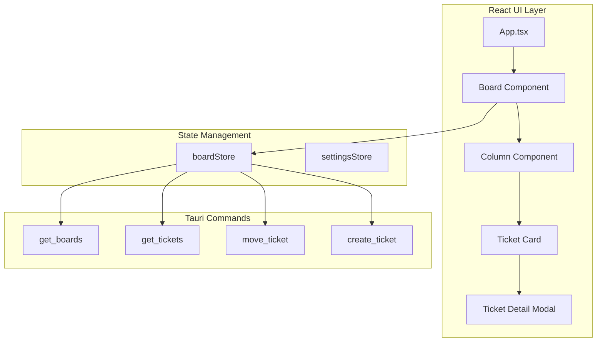

# 03 - Kanban UI

Build a fully functional Kanban board interface with React, featuring drag-and-drop, ticket management, and real-time updates.

## Overview

This guide implements the core Kanban board UI including:

- Board view with columns and drag-and-drop cards
- Ticket creation, editing, and detail views
- Comments display and input
- Labels and priority indicators
- State management with Zustand
- Integration with Tauri backend commands

## Prerequisites

- Completed [01-project-setup.md](./01-project-setup.md)
- Completed [02-database-design.md](./02-database-design.md)
- Dependencies installed: `@dnd-kit/core`, `@dnd-kit/sortable`, `zustand`, `tailwindcss`

## Architecture



## Implementation Steps

### Step 1: Create the Board Store

Create `src/stores/boardStore.ts`:

```typescript
import { create } from 'zustand';
import { invoke } from '@tauri-apps/api/tauri';
import type { Board, Column, Ticket, Comment } from '../types';

interface BoardState {
  // Data
  boards: Board[];
  currentBoard: Board | null;
  columns: Column[];
  tickets: Ticket[];
  selectedTicket: Ticket | null;
  comments: Comment[];
  
  // UI state
  isLoading: boolean;
  error: string | null;
  isTicketModalOpen: boolean;
  isCreateModalOpen: boolean;
  
  // Actions
  loadBoards: () => Promise<void>;
  selectBoard: (boardId: string) => Promise<void>;
  loadBoardData: (boardId: string) => Promise<void>;
  createBoard: (name: string) => Promise<Board>;
  
  // Ticket actions
  createTicket: (ticket: CreateTicketInput) => Promise<Ticket>;
  updateTicket: (ticketId: string, updates: Partial<Ticket>) => Promise<void>;
  moveTicket: (ticketId: string, columnId: string) => Promise<void>;
  selectTicket: (ticket: Ticket | null) => void;
  
  // Comment actions
  loadComments: (ticketId: string) => Promise<void>;
  addComment: (ticketId: string, body: string) => Promise<void>;
  
  // Modal actions
  openTicketModal: (ticket: Ticket) => void;
  closeTicketModal: () => void;
  openCreateModal: () => void;
  closeCreateModal: () => void;
}

interface CreateTicketInput {
  title: string;
  descriptionMd: string;
  priority: 'low' | 'medium' | 'high' | 'urgent';
  labels: string[];
  columnId: string;
  repoPath?: string;
}

export const useBoardStore = create<BoardState>((set, get) => ({
  // Initial state
  boards: [],
  currentBoard: null,
  columns: [],
  tickets: [],
  selectedTicket: null,
  comments: [],
  isLoading: false,
  error: null,
  isTicketModalOpen: false,
  isCreateModalOpen: false,

  // Load all boards
  loadBoards: async () => {
    set({ isLoading: true, error: null });
    try {
      const boards = await invoke<Board[]>('get_boards');
      set({ boards, isLoading: false });
    } catch (error) {
      set({ error: String(error), isLoading: false });
    }
  },

  // Select and load a board
  selectBoard: async (boardId: string) => {
    const { boards } = get();
    const board = boards.find(b => b.id === boardId);
    if (board) {
      set({ currentBoard: board });
      await get().loadBoardData(boardId);
    }
  },

  // Load columns and tickets for a board
  loadBoardData: async (boardId: string) => {
    set({ isLoading: true, error: null });
    try {
      const [columns, tickets] = await Promise.all([
        invoke<Column[]>('get_columns', { boardId }),
        invoke<Ticket[]>('get_tickets', { boardId }),
      ]);
      set({ columns, tickets, isLoading: false });
    } catch (error) {
      set({ error: String(error), isLoading: false });
    }
  },

  // Create a new board
  createBoard: async (name: string) => {
    const board = await invoke<Board>('create_board', { name });
    set(state => ({ boards: [board, ...state.boards] }));
    return board;
  },

  // Create a new ticket
  createTicket: async (input: CreateTicketInput) => {
    const { currentBoard } = get();
    if (!currentBoard) throw new Error('No board selected');

    const ticket = await invoke<Ticket>('create_ticket', {
      ticket: {
        boardId: currentBoard.id,
        columnId: input.columnId,
        title: input.title,
        descriptionMd: input.descriptionMd,
        priority: input.priority,
        labels: input.labels,
        repoPath: input.repoPath,
      },
    });

    set(state => ({ 
      tickets: [...state.tickets, ticket],
      isCreateModalOpen: false,
    }));
    return ticket;
  },

  // Update ticket
  updateTicket: async (ticketId: string, updates: Partial<Ticket>) => {
    await invoke('update_ticket', { ticketId, updates });
    set(state => ({
      tickets: state.tickets.map(t => 
        t.id === ticketId ? { ...t, ...updates } : t
      ),
      selectedTicket: state.selectedTicket?.id === ticketId 
        ? { ...state.selectedTicket, ...updates } 
        : state.selectedTicket,
    }));
  },

  // Move ticket to a different column
  moveTicket: async (ticketId: string, columnId: string) => {
    // Optimistic update
    set(state => ({
      tickets: state.tickets.map(t =>
        t.id === ticketId ? { ...t, columnId } : t
      ),
    }));

    try {
      await invoke('move_ticket', { ticketId, columnId });
    } catch (error) {
      // Revert on error
      await get().loadBoardData(get().currentBoard!.id);
      throw error;
    }
  },

  // Select a ticket
  selectTicket: (ticket: Ticket | null) => {
    set({ selectedTicket: ticket });
  },

  // Load comments for a ticket
  loadComments: async (ticketId: string) => {
    try {
      const comments = await invoke<Comment[]>('get_comments', { ticketId });
      set({ comments });
    } catch (error) {
      console.error('Failed to load comments:', error);
    }
  },

  // Add a comment
  addComment: async (ticketId: string, body: string) => {
    const comment = await invoke<Comment>('add_comment', {
      ticketId,
      body,
      authorType: 'user',
    });
    set(state => ({ comments: [...state.comments, comment] }));
  },

  // Modal actions
  openTicketModal: (ticket: Ticket) => {
    set({ selectedTicket: ticket, isTicketModalOpen: true });
    get().loadComments(ticket.id);
  },
  
  closeTicketModal: () => {
    set({ isTicketModalOpen: false, selectedTicket: null, comments: [] });
  },
  
  openCreateModal: () => {
    set({ isCreateModalOpen: true });
  },
  
  closeCreateModal: () => {
    set({ isCreateModalOpen: false });
  },
}));
```

### Step 2: Create the Board Component

Create `src/components/board/Board.tsx`:

```typescript
import { useEffect } from 'react';
import {
  DndContext,
  DragEndEvent,
  DragOverlay,
  DragStartEvent,
  PointerSensor,
  useSensor,
  useSensors,
  closestCorners,
} from '@dnd-kit/core';
import { useState } from 'react';
import { useBoardStore } from '../../stores/boardStore';
import { Column } from './Column';
import { TicketCard } from './TicketCard';
import { TicketModal } from './TicketModal';
import { CreateTicketModal } from './CreateTicketModal';
import type { Ticket } from '../../types';

export function Board() {
  const {
    currentBoard,
    columns,
    tickets,
    isLoading,
    moveTicket,
    isTicketModalOpen,
    isCreateModalOpen,
    openCreateModal,
  } = useBoardStore();

  const [activeTicket, setActiveTicket] = useState<Ticket | null>(null);

  const sensors = useSensors(
    useSensor(PointerSensor, {
      activationConstraint: {
        distance: 8, // 8px movement before drag starts
      },
    })
  );

  // Group tickets by column
  const ticketsByColumn = columns.reduce((acc, column) => {
    acc[column.id] = tickets.filter(t => t.columnId === column.id);
    return acc;
  }, {} as Record<string, Ticket[]>);

  const handleDragStart = (event: DragStartEvent) => {
    const ticket = tickets.find(t => t.id === event.active.id);
    setActiveTicket(ticket || null);
  };

  const handleDragEnd = async (event: DragEndEvent) => {
    const { active, over } = event;
    setActiveTicket(null);

    if (!over) return;

    const ticketId = active.id as string;
    const overId = over.id as string;

    // Find the target column
    let targetColumnId: string | null = null;

    // Check if dropped on a column
    const column = columns.find(c => c.id === overId);
    if (column) {
      targetColumnId = column.id;
    } else {
      // Dropped on another ticket - find its column
      const targetTicket = tickets.find(t => t.id === overId);
      if (targetTicket) {
        targetColumnId = targetTicket.columnId;
      }
    }

    if (targetColumnId) {
      const ticket = tickets.find(t => t.id === ticketId);
      if (ticket && ticket.columnId !== targetColumnId) {
        await moveTicket(ticketId, targetColumnId);
      }
    }
  };

  if (!currentBoard) {
    return (
      <div className="flex items-center justify-center h-full">
        <p className="text-gray-400">Select a board to get started</p>
      </div>
    );
  }

  if (isLoading) {
    return (
      <div className="flex items-center justify-center h-full">
        <div className="animate-spin rounded-full h-8 w-8 border-b-2 border-white"></div>
      </div>
    );
  }

  return (
    <div className="flex flex-col h-full">
      {/* Board header */}
      <header className="flex items-center justify-between px-6 py-4 border-b border-gray-700">
        <h2 className="text-xl font-semibold">{currentBoard.name}</h2>
        <button
          onClick={openCreateModal}
          className="px-4 py-2 bg-board-accent text-white rounded-lg hover:bg-opacity-80 transition"
        >
          + New Ticket
        </button>
      </header>

      {/* Board columns */}
      <div className="flex-1 overflow-x-auto p-6">
        <DndContext
          sensors={sensors}
          collisionDetection={closestCorners}
          onDragStart={handleDragStart}
          onDragEnd={handleDragEnd}
        >
          <div className="flex gap-4 h-full min-w-max">
            {columns.map(column => (
              <Column
                key={column.id}
                column={column}
                tickets={ticketsByColumn[column.id] || []}
              />
            ))}
          </div>

          <DragOverlay>
            {activeTicket ? (
              <TicketCard ticket={activeTicket} isDragging />
            ) : null}
          </DragOverlay>
        </DndContext>
      </div>

      {/* Modals */}
      {isTicketModalOpen && <TicketModal />}
      {isCreateModalOpen && <CreateTicketModal />}
    </div>
  );
}
```

### Step 3: Create the Column Component

Create `src/components/board/Column.tsx`:

```typescript
import { useDroppable } from '@dnd-kit/core';
import {
  SortableContext,
  verticalListSortingStrategy,
} from '@dnd-kit/sortable';
import { TicketCard } from './TicketCard';
import type { Column as ColumnType, Ticket } from '../../types';

interface ColumnProps {
  column: ColumnType;
  tickets: Ticket[];
}

export function Column({ column, tickets }: ColumnProps) {
  const { setNodeRef, isOver } = useDroppable({
    id: column.id,
  });

  // Column colors based on name
  const getColumnColor = (name: string) => {
    const colors: Record<string, string> = {
      'Backlog': 'border-gray-500',
      'Ready': 'border-blue-500',
      'In Progress': 'border-yellow-500',
      'Blocked': 'border-red-500',
      'Review': 'border-purple-500',
      'Done': 'border-green-500',
    };
    return colors[name] || 'border-gray-500';
  };

  return (
    <div
      ref={setNodeRef}
      className={`
        flex flex-col w-72 bg-board-column rounded-lg
        border-t-4 ${getColumnColor(column.name)}
        ${isOver ? 'ring-2 ring-board-accent ring-opacity-50' : ''}
      `}
    >
      {/* Column header */}
      <div className="flex items-center justify-between px-3 py-3 border-b border-gray-700">
        <h3 className="font-medium text-sm text-gray-200">{column.name}</h3>
        <span className="px-2 py-0.5 text-xs bg-gray-700 rounded-full">
          {tickets.length}
          {column.wipLimit && ` / ${column.wipLimit}`}
        </span>
      </div>

      {/* Tickets */}
      <div className="flex-1 p-2 space-y-2 overflow-y-auto min-h-[200px]">
        <SortableContext
          items={tickets.map(t => t.id)}
          strategy={verticalListSortingStrategy}
        >
          {tickets.map(ticket => (
            <TicketCard key={ticket.id} ticket={ticket} />
          ))}
        </SortableContext>

        {tickets.length === 0 && (
          <div className="flex items-center justify-center h-20 text-gray-500 text-sm">
            Drop tickets here
          </div>
        )}
      </div>
    </div>
  );
}
```

### Step 4: Create the Ticket Card Component

Create `src/components/board/TicketCard.tsx`:

```typescript
import { useSortable } from '@dnd-kit/sortable';
import { CSS } from '@dnd-kit/utilities';
import { useBoardStore } from '../../stores/boardStore';
import type { Ticket } from '../../types';

interface TicketCardProps {
  ticket: Ticket;
  isDragging?: boolean;
}

export function TicketCard({ ticket, isDragging = false }: TicketCardProps) {
  const { openTicketModal } = useBoardStore();

  const {
    attributes,
    listeners,
    setNodeRef,
    transform,
    transition,
    isDragging: isSortableDragging,
  } = useSortable({ id: ticket.id });

  const style = {
    transform: CSS.Transform.toString(transform),
    transition,
  };

  // Priority colors
  const priorityColors: Record<string, string> = {
    low: 'bg-gray-500',
    medium: 'bg-blue-500',
    high: 'bg-orange-500',
    urgent: 'bg-red-500',
  };

  // Priority labels
  const priorityLabels: Record<string, string> = {
    low: 'Low',
    medium: 'Med',
    high: 'High',
    urgent: 'Urgent',
  };

  const handleClick = () => {
    if (!isSortableDragging) {
      openTicketModal(ticket);
    }
  };

  return (
    <div
      ref={setNodeRef}
      style={style}
      {...attributes}
      {...listeners}
      onClick={handleClick}
      className={`
        p-3 bg-board-card rounded-lg cursor-pointer
        hover:bg-opacity-80 transition
        ${isDragging || isSortableDragging ? 'opacity-50 shadow-lg' : ''}
        ${ticket.lockedByRunId ? 'ring-2 ring-yellow-500' : ''}
      `}
    >
      {/* Title */}
      <h4 className="font-medium text-sm text-white mb-2 line-clamp-2">
        {ticket.title}
      </h4>

      {/* Labels */}
      {ticket.labels.length > 0 && (
        <div className="flex flex-wrap gap-1 mb-2">
          {ticket.labels.slice(0, 3).map(label => (
            <span
              key={label}
              className="px-1.5 py-0.5 text-xs bg-gray-600 rounded text-gray-300"
            >
              {label}
            </span>
          ))}
          {ticket.labels.length > 3 && (
            <span className="px-1.5 py-0.5 text-xs text-gray-400">
              +{ticket.labels.length - 3}
            </span>
          )}
        </div>
      )}

      {/* Footer: Priority and agent indicator */}
      <div className="flex items-center justify-between mt-2">
        <span
          className={`px-1.5 py-0.5 text-xs rounded ${priorityColors[ticket.priority]} text-white`}
        >
          {priorityLabels[ticket.priority]}
        </span>

        <div className="flex items-center gap-2">
          {/* Agent preference indicator */}
          {ticket.agentPref && (
            <span className="text-xs text-gray-400">
              {ticket.agentPref === 'cursor' ? '⌘' : '🤖'}
            </span>
          )}

          {/* Locked indicator */}
          {ticket.lockedByRunId && (
            <span className="text-xs text-yellow-500" title="In progress">
              ⚡
            </span>
          )}
        </div>
      </div>
    </div>
  );
}
```

### Step 5: Create the Ticket Detail Modal

Create `src/components/board/TicketModal.tsx`:

```typescript
import { useState } from 'react';
import { useBoardStore } from '../../stores/boardStore';
import { formatDistanceToNow } from 'date-fns';

export function TicketModal() {
  const {
    selectedTicket,
    comments,
    columns,
    closeTicketModal,
    updateTicket,
    addComment,
  } = useBoardStore();

  const [isEditing, setIsEditing] = useState(false);
  const [editTitle, setEditTitle] = useState(selectedTicket?.title || '');
  const [editDescription, setEditDescription] = useState(
    selectedTicket?.descriptionMd || ''
  );
  const [newComment, setNewComment] = useState('');
  const [isSubmitting, setIsSubmitting] = useState(false);

  if (!selectedTicket) return null;

  const currentColumn = columns.find(c => c.id === selectedTicket.columnId);

  const handleSave = async () => {
    if (!selectedTicket) return;
    await updateTicket(selectedTicket.id, {
      title: editTitle,
      descriptionMd: editDescription,
    });
    setIsEditing(false);
  };

  const handleAddComment = async () => {
    if (!newComment.trim() || !selectedTicket) return;
    setIsSubmitting(true);
    try {
      await addComment(selectedTicket.id, newComment);
      setNewComment('');
    } finally {
      setIsSubmitting(false);
    }
  };

  const priorityColors: Record<string, string> = {
    low: 'bg-gray-500',
    medium: 'bg-blue-500',
    high: 'bg-orange-500',
    urgent: 'bg-red-500',
  };

  return (
    <div className="fixed inset-0 z-50 flex items-center justify-center">
      {/* Backdrop */}
      <div
        className="absolute inset-0 bg-black bg-opacity-50"
        onClick={closeTicketModal}
      />

      {/* Modal */}
      <div className="relative w-full max-w-2xl max-h-[90vh] bg-board-column rounded-lg shadow-xl overflow-hidden flex flex-col">
        {/* Header */}
        <div className="flex items-start justify-between p-4 border-b border-gray-700">
          <div className="flex-1">
            {isEditing ? (
              <input
                type="text"
                value={editTitle}
                onChange={e => setEditTitle(e.target.value)}
                className="w-full px-2 py-1 bg-gray-700 rounded text-white text-lg font-semibold"
              />
            ) : (
              <h2 className="text-lg font-semibold text-white">
                {selectedTicket.title}
              </h2>
            )}
            <div className="flex items-center gap-2 mt-2 text-sm text-gray-400">
              <span className={`px-2 py-0.5 rounded ${priorityColors[selectedTicket.priority]} text-white text-xs`}>
                {selectedTicket.priority}
              </span>
              <span>in {currentColumn?.name || 'Unknown'}</span>
              <span>•</span>
              <span>
                Created {formatDistanceToNow(new Date(selectedTicket.createdAt))} ago
              </span>
            </div>
          </div>
          <button
            onClick={closeTicketModal}
            className="p-1 text-gray-400 hover:text-white"
          >
            ✕
          </button>
        </div>

        {/* Content */}
        <div className="flex-1 overflow-y-auto p-4 space-y-4">
          {/* Labels */}
          {selectedTicket.labels.length > 0 && (
            <div className="flex flex-wrap gap-2">
              {selectedTicket.labels.map(label => (
                <span
                  key={label}
                  className="px-2 py-1 text-sm bg-gray-600 rounded text-gray-200"
                >
                  {label}
                </span>
              ))}
            </div>
          )}

          {/* Description */}
          <div>
            <h3 className="text-sm font-medium text-gray-400 mb-2">Description</h3>
            {isEditing ? (
              <textarea
                value={editDescription}
                onChange={e => setEditDescription(e.target.value)}
                rows={6}
                className="w-full px-3 py-2 bg-gray-700 rounded text-white text-sm resize-none"
              />
            ) : (
              <div className="prose prose-sm prose-invert max-w-none">
                {selectedTicket.descriptionMd || (
                  <span className="text-gray-500">No description</span>
                )}
              </div>
            )}
          </div>

          {/* Repo path */}
          {selectedTicket.repoPath && (
            <div>
              <h3 className="text-sm font-medium text-gray-400 mb-1">Repository</h3>
              <code className="text-sm text-gray-300 bg-gray-800 px-2 py-1 rounded">
                {selectedTicket.repoPath}
              </code>
            </div>
          )}

          {/* Agent info */}
          {selectedTicket.lockedByRunId && (
            <div className="p-3 bg-yellow-900 bg-opacity-30 rounded border border-yellow-700">
              <p className="text-sm text-yellow-200">
                ⚡ This ticket is currently being worked on by an agent
              </p>
            </div>
          )}

          {/* Comments */}
          <div>
            <h3 className="text-sm font-medium text-gray-400 mb-3">
              Comments ({comments.length})
            </h3>
            
            <div className="space-y-3 mb-4">
              {comments.map(comment => (
                <div key={comment.id} className="p-3 bg-gray-800 rounded">
                  <div className="flex items-center gap-2 mb-1">
                    <span className={`text-xs px-1.5 py-0.5 rounded ${
                      comment.authorType === 'agent' 
                        ? 'bg-purple-600' 
                        : comment.authorType === 'system'
                        ? 'bg-gray-600'
                        : 'bg-blue-600'
                    }`}>
                      {comment.authorType}
                    </span>
                    <span className="text-xs text-gray-500">
                      {formatDistanceToNow(new Date(comment.createdAt))} ago
                    </span>
                  </div>
                  <p className="text-sm text-gray-300 whitespace-pre-wrap">
                    {comment.bodyMd}
                  </p>
                </div>
              ))}
              
              {comments.length === 0 && (
                <p className="text-sm text-gray-500">No comments yet</p>
              )}
            </div>

            {/* Add comment */}
            <div className="flex gap-2">
              <input
                type="text"
                value={newComment}
                onChange={e => setNewComment(e.target.value)}
                onKeyDown={e => e.key === 'Enter' && handleAddComment()}
                placeholder="Add a comment..."
                className="flex-1 px-3 py-2 bg-gray-700 rounded text-sm text-white placeholder-gray-500"
              />
              <button
                onClick={handleAddComment}
                disabled={isSubmitting || !newComment.trim()}
                className="px-4 py-2 bg-board-accent text-white text-sm rounded hover:bg-opacity-80 disabled:opacity-50"
              >
                Send
              </button>
            </div>
          </div>
        </div>

        {/* Footer */}
        <div className="flex items-center justify-between p-4 border-t border-gray-700">
          <div className="flex gap-2">
            {!selectedTicket.lockedByRunId && (
              <>
                <button className="px-3 py-1.5 bg-purple-600 text-white text-sm rounded hover:bg-opacity-80">
                  Run with Cursor
                </button>
                <button className="px-3 py-1.5 bg-green-600 text-white text-sm rounded hover:bg-opacity-80">
                  Run with Claude
                </button>
              </>
            )}
          </div>
          
          <div className="flex gap-2">
            {isEditing ? (
              <>
                <button
                  onClick={() => setIsEditing(false)}
                  className="px-3 py-1.5 text-gray-400 text-sm hover:text-white"
                >
                  Cancel
                </button>
                <button
                  onClick={handleSave}
                  className="px-3 py-1.5 bg-blue-600 text-white text-sm rounded hover:bg-opacity-80"
                >
                  Save
                </button>
              </>
            ) : (
              <button
                onClick={() => setIsEditing(true)}
                className="px-3 py-1.5 text-gray-400 text-sm hover:text-white"
              >
                Edit
              </button>
            )}
          </div>
        </div>
      </div>
    </div>
  );
}
```

### Step 6: Create the Create Ticket Modal

Create `src/components/board/CreateTicketModal.tsx`:

```typescript
import { useState } from 'react';
import { useBoardStore } from '../../stores/boardStore';

export function CreateTicketModal() {
  const { columns, closeCreateModal, createTicket } = useBoardStore();

  const [title, setTitle] = useState('');
  const [description, setDescription] = useState('');
  const [priority, setPriority] = useState<'low' | 'medium' | 'high' | 'urgent'>('medium');
  const [labels, setLabels] = useState('');
  const [columnId, setColumnId] = useState(columns[0]?.id || '');
  const [repoPath, setRepoPath] = useState('');
  const [isSubmitting, setIsSubmitting] = useState(false);

  const handleSubmit = async (e: React.FormEvent) => {
    e.preventDefault();
    if (!title.trim() || !columnId) return;

    setIsSubmitting(true);
    try {
      await createTicket({
        title: title.trim(),
        descriptionMd: description,
        priority,
        labels: labels.split(',').map(l => l.trim()).filter(Boolean),
        columnId,
        repoPath: repoPath || undefined,
      });
    } finally {
      setIsSubmitting(false);
    }
  };

  return (
    <div className="fixed inset-0 z-50 flex items-center justify-center">
      {/* Backdrop */}
      <div
        className="absolute inset-0 bg-black bg-opacity-50"
        onClick={closeCreateModal}
      />

      {/* Modal */}
      <div className="relative w-full max-w-lg bg-board-column rounded-lg shadow-xl">
        <form onSubmit={handleSubmit}>
          {/* Header */}
          <div className="flex items-center justify-between p-4 border-b border-gray-700">
            <h2 className="text-lg font-semibold text-white">Create Ticket</h2>
            <button
              type="button"
              onClick={closeCreateModal}
              className="p-1 text-gray-400 hover:text-white"
            >
              ✕
            </button>
          </div>

          {/* Content */}
          <div className="p-4 space-y-4">
            {/* Title */}
            <div>
              <label className="block text-sm font-medium text-gray-400 mb-1">
                Title *
              </label>
              <input
                type="text"
                value={title}
                onChange={e => setTitle(e.target.value)}
                placeholder="What needs to be done?"
                className="w-full px-3 py-2 bg-gray-700 rounded text-white placeholder-gray-500"
                required
                autoFocus
              />
            </div>

            {/* Description */}
            <div>
              <label className="block text-sm font-medium text-gray-400 mb-1">
                Description
              </label>
              <textarea
                value={description}
                onChange={e => setDescription(e.target.value)}
                placeholder="Add more details, acceptance criteria, etc."
                rows={4}
                className="w-full px-3 py-2 bg-gray-700 rounded text-white placeholder-gray-500 resize-none"
              />
            </div>

            {/* Column and Priority row */}
            <div className="grid grid-cols-2 gap-4">
              <div>
                <label className="block text-sm font-medium text-gray-400 mb-1">
                  Column
                </label>
                <select
                  value={columnId}
                  onChange={e => setColumnId(e.target.value)}
                  className="w-full px-3 py-2 bg-gray-700 rounded text-white"
                >
                  {columns.map(col => (
                    <option key={col.id} value={col.id}>
                      {col.name}
                    </option>
                  ))}
                </select>
              </div>

              <div>
                <label className="block text-sm font-medium text-gray-400 mb-1">
                  Priority
                </label>
                <select
                  value={priority}
                  onChange={e => setPriority(e.target.value as any)}
                  className="w-full px-3 py-2 bg-gray-700 rounded text-white"
                >
                  <option value="low">Low</option>
                  <option value="medium">Medium</option>
                  <option value="high">High</option>
                  <option value="urgent">Urgent</option>
                </select>
              </div>
            </div>

            {/* Labels */}
            <div>
              <label className="block text-sm font-medium text-gray-400 mb-1">
                Labels (comma-separated)
              </label>
              <input
                type="text"
                value={labels}
                onChange={e => setLabels(e.target.value)}
                placeholder="bug, frontend, urgent"
                className="w-full px-3 py-2 bg-gray-700 rounded text-white placeholder-gray-500"
              />
            </div>

            {/* Repo path */}
            <div>
              <label className="block text-sm font-medium text-gray-400 mb-1">
                Repository Path
              </label>
              <input
                type="text"
                value={repoPath}
                onChange={e => setRepoPath(e.target.value)}
                placeholder="/path/to/your/repo"
                className="w-full px-3 py-2 bg-gray-700 rounded text-white placeholder-gray-500"
              />
              <p className="mt-1 text-xs text-gray-500">
                The local path where the agent will work
              </p>
            </div>
          </div>

          {/* Footer */}
          <div className="flex justify-end gap-2 p-4 border-t border-gray-700">
            <button
              type="button"
              onClick={closeCreateModal}
              className="px-4 py-2 text-gray-400 hover:text-white"
            >
              Cancel
            </button>
            <button
              type="submit"
              disabled={isSubmitting || !title.trim()}
              className="px-4 py-2 bg-board-accent text-white rounded hover:bg-opacity-80 disabled:opacity-50"
            >
              {isSubmitting ? 'Creating...' : 'Create Ticket'}
            </button>
          </div>
        </form>
      </div>
    </div>
  );
}
```

### Step 7: Create the Sidebar Component

Create `src/components/layout/Sidebar.tsx`:

```typescript
import { useState } from 'react';
import { useBoardStore } from '../../stores/boardStore';

export function Sidebar() {
  const { boards, currentBoard, selectBoard, createBoard, loadBoards } = useBoardStore();
  const [isCreating, setIsCreating] = useState(false);
  const [newBoardName, setNewBoardName] = useState('');

  const handleCreateBoard = async () => {
    if (!newBoardName.trim()) return;
    const board = await createBoard(newBoardName.trim());
    setNewBoardName('');
    setIsCreating(false);
    await selectBoard(board.id);
  };

  return (
    <aside className="w-64 bg-board-column border-r border-gray-700 flex flex-col">
      {/* Logo / Title */}
      <div className="p-4 border-b border-gray-700">
        <h1 className="text-xl font-bold text-white">Agent Kanban</h1>
        <p className="text-xs text-gray-500 mt-1">AI-powered task management</p>
      </div>

      {/* Navigation */}
      <nav className="flex-1 p-4 overflow-y-auto">
        <div className="mb-6">
          <div className="flex items-center justify-between mb-2">
            <h2 className="text-xs font-semibold text-gray-400 uppercase tracking-wider">
              Boards
            </h2>
            <button
              onClick={() => setIsCreating(true)}
              className="text-gray-400 hover:text-white text-sm"
            >
              +
            </button>
          </div>

          {/* Create board input */}
          {isCreating && (
            <div className="mb-2">
              <input
                type="text"
                value={newBoardName}
                onChange={e => setNewBoardName(e.target.value)}
                onKeyDown={e => {
                  if (e.key === 'Enter') handleCreateBoard();
                  if (e.key === 'Escape') setIsCreating(false);
                }}
                placeholder="Board name..."
                className="w-full px-2 py-1 text-sm bg-gray-700 rounded text-white placeholder-gray-500"
                autoFocus
              />
            </div>
          )}

          {/* Board list */}
          <ul className="space-y-1">
            {boards.map(board => (
              <li key={board.id}>
                <button
                  onClick={() => selectBoard(board.id)}
                  className={`
                    w-full text-left px-3 py-2 rounded text-sm transition
                    ${currentBoard?.id === board.id
                      ? 'bg-board-card text-white'
                      : 'text-gray-400 hover:text-white hover:bg-gray-700'
                    }
                  `}
                >
                  {board.name}
                </button>
              </li>
            ))}

            {boards.length === 0 && !isCreating && (
              <li className="text-sm text-gray-500 px-3 py-2">
                No boards yet
              </li>
            )}
          </ul>
        </div>

        {/* Other nav items */}
        <div>
          <h2 className="text-xs font-semibold text-gray-400 uppercase tracking-wider mb-2">
            Tools
          </h2>
          <ul className="space-y-1">
            <li>
              <a
                href="#runs"
                className="block px-3 py-2 rounded text-sm text-gray-400 hover:text-white hover:bg-gray-700"
              >
                Agent Runs
              </a>
            </li>
            <li>
              <a
                href="#settings"
                className="block px-3 py-2 rounded text-sm text-gray-400 hover:text-white hover:bg-gray-700"
              >
                Settings
              </a>
            </li>
          </ul>
        </div>
      </nav>

      {/* Footer */}
      <div className="p-4 border-t border-gray-700 text-xs text-gray-500">
        v0.1.0
      </div>
    </aside>
  );
}
```

### Step 8: Update the Main App

Update `src/App.tsx`:

```typescript
import { useEffect } from 'react';
import { useBoardStore } from './stores/boardStore';
import { Sidebar } from './components/layout/Sidebar';
import { Board } from './components/board/Board';
import './index.css';

function App() {
  const { loadBoards, boards, selectBoard } = useBoardStore();

  useEffect(() => {
    // Load boards on mount
    loadBoards().then(() => {
      // Auto-select first board if available
      const { boards } = useBoardStore.getState();
      if (boards.length > 0) {
        selectBoard(boards[0].id);
      }
    });
  }, []);

  return (
    <div className="flex h-screen bg-board-bg text-white">
      <Sidebar />
      <main className="flex-1 flex flex-col overflow-hidden">
        <Board />
      </main>
    </div>
  );
}

export default App;
```

### Step 9: Register Tauri Commands

Create `src-tauri/src/commands/mod.rs`:

```rust
use std::sync::Arc;
use tauri::State;
use crate::db::{Database, DbError, Board, Column, Ticket, Comment, CreateTicket};

type DbState = Arc<Database>;

#[tauri::command]
pub async fn get_boards(db: State<'_, DbState>) -> Result<Vec<Board>, String> {
    db.get_boards().map_err(|e| e.to_string())
}

#[tauri::command]
pub async fn create_board(name: String, db: State<'_, DbState>) -> Result<Board, String> {
    db.create_board(&name).map_err(|e| e.to_string())
}

#[tauri::command]
pub async fn get_columns(board_id: String, db: State<'_, DbState>) -> Result<Vec<Column>, String> {
    db.get_columns(&board_id).map_err(|e| e.to_string())
}

#[tauri::command]
pub async fn get_tickets(
    board_id: String,
    column_id: Option<String>,
    db: State<'_, DbState>,
) -> Result<Vec<Ticket>, String> {
    db.get_tickets(&board_id, column_id.as_deref())
        .map_err(|e| e.to_string())
}

#[tauri::command]
pub async fn create_ticket(
    ticket: CreateTicket,
    db: State<'_, DbState>,
) -> Result<Ticket, String> {
    db.create_ticket(&ticket).map_err(|e| e.to_string())
}

#[tauri::command]
pub async fn move_ticket(
    ticket_id: String,
    column_id: String,
    db: State<'_, DbState>,
) -> Result<(), String> {
    db.move_ticket(&ticket_id, &column_id).map_err(|e| e.to_string())
}

#[tauri::command]
pub async fn get_comments(
    ticket_id: String,
    db: State<'_, DbState>,
) -> Result<Vec<Comment>, String> {
    // TODO: Implement get_comments in Database
    Ok(vec![])
}

#[tauri::command]
pub async fn add_comment(
    ticket_id: String,
    body: String,
    author_type: String,
    db: State<'_, DbState>,
) -> Result<Comment, String> {
    // TODO: Implement add_comment in Database
    Err("Not implemented".to_string())
}
```

Update `src-tauri/src/main.rs` to register commands:

```rust
#![cfg_attr(not(debug_assertions), windows_subsystem = "windows")]

mod commands;
mod db;
mod api;
mod agents;
mod logging;

use std::sync::Arc;
use tauri::Manager;
use db::Database;

fn main() {
    tauri::Builder::default()
        .setup(|app| {
            let app_data_dir = app.path_resolver()
                .app_data_dir()
                .expect("Failed to get app data directory");
            
            if let Err(e) = logging::init_logging(app_data_dir.clone()) {
                eprintln!("Failed to initialize logging: {}", e);
            }

            let db_path = app_data_dir.join("agent-kanban.db");
            let db = Database::open(db_path)
                .expect("Failed to open database");
            
            app.manage(Arc::new(db));

            tracing::info!("Agent Kanban initialized successfully");
            Ok(())
        })
        .invoke_handler(tauri::generate_handler![
            commands::get_boards,
            commands::create_board,
            commands::get_columns,
            commands::get_tickets,
            commands::create_ticket,
            commands::move_ticket,
            commands::get_comments,
            commands::add_comment,
        ])
        .run(tauri::generate_context!())
        .expect("error while running tauri application");
}
```

## Testing

### Component Testing

1. Start the development server:

```bash
npm run tauri dev
```

2. Verify:
   - Sidebar shows "No boards yet"
   - Can create a new board
   - Board appears with 6 default columns
   - Can create tickets via "+ New Ticket"
   - Tickets appear in the selected column
   - Can drag tickets between columns
   - Clicking a ticket opens the detail modal

### Visual Testing Checklist

- [ ] Columns have correct border colors
- [ ] Tickets show priority badges
- [ ] Drag overlay appears when dragging
- [ ] Drop zones highlight on hover
- [ ] Modal backdrop darkens the board
- [ ] Forms validate required fields

## Troubleshooting

### Drag and drop not working

1. Ensure `@dnd-kit/core` and `@dnd-kit/sortable` are installed
2. Check that `useSortable` is properly configured on ticket cards
3. Verify the `DndContext` wraps the columns

### Tickets not persisting

1. Check the browser console for Tauri command errors
2. Verify the database file exists and has the correct schema
3. Check Rust logs for database errors

### State not updating

1. Verify Zustand store actions are being called
2. Check that optimistic updates match the actual data structure
3. Use React DevTools to inspect component state

## Next Steps

With the Kanban UI complete, proceed to:

- **[04-local-api.md](./04-local-api.md)**: Build the REST API for agent communication
