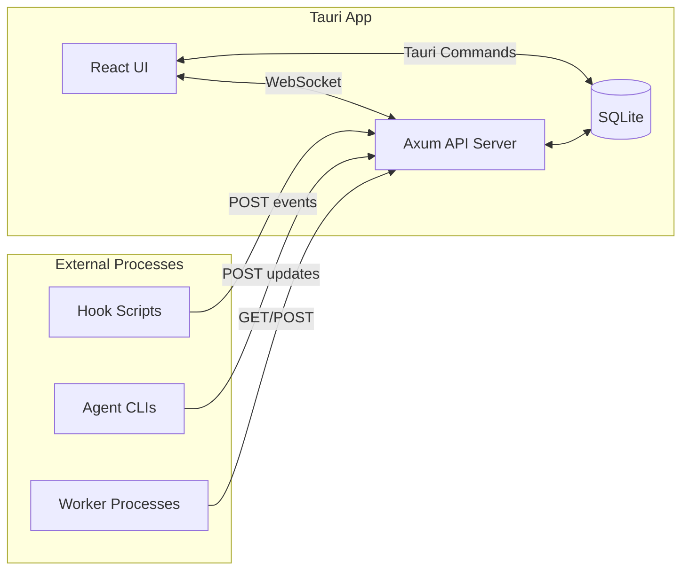

# 04 - Local API

Implement a REST API server within the Tauri app for agent hook scripts and external tools to communicate with the board.

## Overview

This guide implements:

- An embedded HTTP server (Axum) running on localhost
- REST endpoints for tickets, runs, events, and queue operations
- WebSocket/SSE support for real-time UI updates
- Token-based authentication for security
- CORS configuration for local development

## Prerequisites

- Completed [01-project-setup.md](./01-project-setup.md)
- Completed [02-database-design.md](./02-database-design.md)
- Completed [03-kanban-ui.md](./03-kanban-ui.md)
- Rust dependencies: `axum`, `tokio`, `tower-http`

## Architecture



## Implementation Steps

### Step 1: Create API Module Structure

Set up the API module files:

```
src-tauri/src/api/
├── mod.rs           # Module exports and server setup
├── routes.rs        # Route definitions
├── handlers.rs      # Request handlers
├── auth.rs          # Authentication middleware
├── state.rs         # Shared state
└── events.rs        # WebSocket/SSE for live updates
```

### Step 2: Define API State

Create `src-tauri/src/api/state.rs`:

```rust
use std::sync::Arc;
use tokio::sync::broadcast;
use crate::db::Database;

/// Event sent to connected clients
#[derive(Debug, Clone, serde::Serialize)]
#[serde(tag = "type", rename_all = "snake_case")]
pub enum LiveEvent {
    TicketCreated { ticket_id: String },
    TicketUpdated { ticket_id: String },
    TicketMoved { ticket_id: String, column_id: String },
    CommentAdded { ticket_id: String, comment_id: String },
    RunStarted { run_id: String, ticket_id: String },
    RunUpdated { run_id: String, status: String },
    EventReceived { run_id: String, event_type: String },
}

/// Shared application state for the API server
#[derive(Clone)]
pub struct AppState {
    pub db: Arc<Database>,
    pub api_token: String,
    pub event_tx: broadcast::Sender<LiveEvent>,
}

impl AppState {
    pub fn new(db: Arc<Database>, api_token: String) -> Self {
        let (event_tx, _) = broadcast::channel(100);
        Self { db, api_token, event_tx }
    }

    /// Broadcast an event to all connected clients
    pub fn broadcast(&self, event: LiveEvent) {
        // Ignore send errors (no receivers)
        let _ = self.event_tx.send(event);
    }
}
```

### Step 3: Implement Authentication Middleware

Create `src-tauri/src/api/auth.rs`:

```rust
use axum::{
    extract::State,
    http::{Request, StatusCode},
    middleware::Next,
    response::Response,
};

use super::state::AppState;

/// Header name for the API token
pub const AUTH_HEADER: &str = "X-AgentKanban-Token";

/// Authentication middleware
pub async fn auth_middleware<B>(
    State(state): State<AppState>,
    request: Request<B>,
    next: Next<B>,
) -> Result<Response, StatusCode> {
    // Check for auth header
    let token = request
        .headers()
        .get(AUTH_HEADER)
        .and_then(|v| v.to_str().ok());

    match token {
        Some(t) if t == state.api_token => Ok(next.run(request).await),
        Some(_) => {
            tracing::warn!("Invalid API token provided");
            Err(StatusCode::UNAUTHORIZED)
        }
        None => {
            tracing::warn!("Missing API token");
            Err(StatusCode::UNAUTHORIZED)
        }
    }
}

/// Generate a random API token
pub fn generate_token() -> String {
    use std::iter;
    use rand::Rng;
    
    const CHARSET: &[u8] = b"ABCDEFGHIJKLMNOPQRSTUVWXYZabcdefghijklmnopqrstuvwxyz0123456789";
    let mut rng = rand::thread_rng();
    
    iter::repeat_with(|| CHARSET[rng.gen_range(0..CHARSET.len())] as char)
        .take(32)
        .collect()
}
```

### Step 4: Define Request/Response Types

Create `src-tauri/src/api/types.rs`:

```rust
use serde::{Deserialize, Serialize};
use crate::db::{Priority, AgentType, AgentPref};

// ===== Ticket Types =====

#[derive(Debug, Deserialize)]
#[serde(rename_all = "camelCase")]
pub struct CreateTicketRequest {
    pub board_id: String,
    pub column_id: String,
    pub title: String,
    #[serde(default)]
    pub description_md: String,
    #[serde(default = "default_priority")]
    pub priority: Priority,
    #[serde(default)]
    pub labels: Vec<String>,
    pub repo_path: Option<String>,
    pub agent_pref: Option<AgentPref>,
}

fn default_priority() -> Priority {
    Priority::Medium
}

#[derive(Debug, Deserialize)]
#[serde(rename_all = "camelCase")]
pub struct UpdateTicketRequest {
    pub title: Option<String>,
    pub description_md: Option<String>,
    pub priority: Option<Priority>,
    pub labels: Option<Vec<String>>,
    pub repo_path: Option<String>,
    pub agent_pref: Option<AgentPref>,
}

#[derive(Debug, Deserialize)]
#[serde(rename_all = "camelCase")]
pub struct MoveTicketRequest {
    pub column_id: String,
}

// ===== Reservation Types =====

#[derive(Debug, Serialize)]
#[serde(rename_all = "camelCase")]
pub struct ReservationResponse {
    pub run_id: String,
    pub lock_expires_at: String,
}

#[derive(Debug, Deserialize)]
#[serde(rename_all = "camelCase")]
pub struct ReserveTicketRequest {
    pub agent_type: AgentType,
    pub repo_path: String,
}

// ===== Run Types =====

#[derive(Debug, Deserialize)]
#[serde(rename_all = "camelCase")]
pub struct CreateRunRequest {
    pub ticket_id: String,
    pub agent_type: AgentType,
    pub repo_path: String,
}

#[derive(Debug, Deserialize)]
#[serde(rename_all = "camelCase")]
pub struct UpdateRunRequest {
    pub status: Option<String>,
    pub exit_code: Option<i32>,
    pub summary_md: Option<String>,
}

// ===== Event Types =====

#[derive(Debug, Deserialize)]
#[serde(rename_all = "camelCase")]
pub struct CreateEventRequest {
    pub event_type: String,
    pub payload: serde_json::Value,
    #[serde(default = "chrono::Utc::now")]
    pub timestamp: chrono::DateTime<chrono::Utc>,
}

// ===== Comment Types =====

#[derive(Debug, Deserialize)]
#[serde(rename_all = "camelCase")]
pub struct CreateCommentRequest {
    pub body_md: String,
    #[serde(default = "default_author_type")]
    pub author_type: String,
    pub metadata: Option<serde_json::Value>,
}

fn default_author_type() -> String {
    "agent".to_string()
}

// ===== Queue Types =====

#[derive(Debug, Deserialize)]
#[serde(rename_all = "camelCase")]
pub struct QueueNextRequest {
    pub agent_type: AgentType,
    pub repo_path: Option<String>,
}

#[derive(Debug, Serialize)]
#[serde(rename_all = "camelCase")]
pub struct QueueNextResponse {
    pub ticket: crate::db::Ticket,
    pub run_id: String,
    pub lock_expires_at: String,
}

// ===== Generic Response =====

#[derive(Debug, Serialize)]
pub struct ApiResponse<T> {
    pub data: T,
}

#[derive(Debug, Serialize)]
pub struct ApiError {
    pub error: String,
    pub code: String,
}
```

### Step 5: Implement Request Handlers

Create `src-tauri/src/api/handlers.rs`:

```rust
use axum::{
    extract::{Path, Query, State},
    http::StatusCode,
    Json,
};
use chrono::{Duration, Utc};
use serde::Deserialize;

use super::state::{AppState, LiveEvent};
use super::types::*;
use crate::db::{
    AgentEvent, AgentEventPayload, AgentRun, Board, Column, Comment, CreateRun,
    CreateTicket, EventType, NormalizedEvent, RunStatus, Ticket,
};

// ===== Health Check =====

pub async fn health() -> &'static str {
    "ok"
}

// ===== Boards =====

pub async fn list_boards(
    State(state): State<AppState>,
) -> Result<Json<Vec<Board>>, (StatusCode, String)> {
    state.db.get_boards()
        .map(Json)
        .map_err(|e| (StatusCode::INTERNAL_SERVER_ERROR, e.to_string()))
}

pub async fn get_board(
    State(state): State<AppState>,
    Path(board_id): Path<String>,
) -> Result<Json<Board>, (StatusCode, String)> {
    state.db.get_boards()
        .map_err(|e| (StatusCode::INTERNAL_SERVER_ERROR, e.to_string()))?
        .into_iter()
        .find(|b| b.id == board_id)
        .map(Json)
        .ok_or((StatusCode::NOT_FOUND, "Board not found".to_string()))
}

// ===== Columns =====

pub async fn list_columns(
    State(state): State<AppState>,
    Path(board_id): Path<String>,
) -> Result<Json<Vec<Column>>, (StatusCode, String)> {
    state.db.get_columns(&board_id)
        .map(Json)
        .map_err(|e| (StatusCode::INTERNAL_SERVER_ERROR, e.to_string()))
}

// ===== Tickets =====

#[derive(Debug, Deserialize)]
pub struct TicketQuery {
    pub column: Option<String>,
}

pub async fn list_tickets(
    State(state): State<AppState>,
    Path(board_id): Path<String>,
    Query(query): Query<TicketQuery>,
) -> Result<Json<Vec<Ticket>>, (StatusCode, String)> {
    state.db.get_tickets(&board_id, query.column.as_deref())
        .map(Json)
        .map_err(|e| (StatusCode::INTERNAL_SERVER_ERROR, e.to_string()))
}

pub async fn create_ticket(
    State(state): State<AppState>,
    Json(req): Json<CreateTicketRequest>,
) -> Result<(StatusCode, Json<Ticket>), (StatusCode, String)> {
    let ticket = state.db.create_ticket(&CreateTicket {
        board_id: req.board_id,
        column_id: req.column_id,
        title: req.title,
        description_md: req.description_md,
        priority: req.priority,
        labels: req.labels,
        repo_path: req.repo_path,
        agent_pref: req.agent_pref,
    })
    .map_err(|e| (StatusCode::INTERNAL_SERVER_ERROR, e.to_string()))?;

    state.broadcast(LiveEvent::TicketCreated {
        ticket_id: ticket.id.clone(),
    });

    Ok((StatusCode::CREATED, Json(ticket)))
}

pub async fn get_ticket(
    State(state): State<AppState>,
    Path(ticket_id): Path<String>,
) -> Result<Json<Ticket>, (StatusCode, String)> {
    // Get all tickets and find the one we want
    // In a real implementation, add a get_ticket_by_id method
    state.db.get_boards()
        .map_err(|e| (StatusCode::INTERNAL_SERVER_ERROR, e.to_string()))?
        .into_iter()
        .find_map(|board| {
            state.db.get_tickets(&board.id, None)
                .ok()
                .and_then(|tickets| tickets.into_iter().find(|t| t.id == ticket_id))
        })
        .map(Json)
        .ok_or((StatusCode::NOT_FOUND, "Ticket not found".to_string()))
}

pub async fn move_ticket(
    State(state): State<AppState>,
    Path(ticket_id): Path<String>,
    Json(req): Json<MoveTicketRequest>,
) -> Result<StatusCode, (StatusCode, String)> {
    state.db.move_ticket(&ticket_id, &req.column_id)
        .map_err(|e| (StatusCode::INTERNAL_SERVER_ERROR, e.to_string()))?;

    state.broadcast(LiveEvent::TicketMoved {
        ticket_id,
        column_id: req.column_id,
    });

    Ok(StatusCode::OK)
}

// ===== Ticket Reservation =====

pub async fn reserve_ticket(
    State(state): State<AppState>,
    Path(ticket_id): Path<String>,
    Json(req): Json<ReserveTicketRequest>,
) -> Result<Json<ReservationResponse>, (StatusCode, String)> {
    // Create a new run
    let run = state.db.create_run(&CreateRun {
        ticket_id: ticket_id.clone(),
        agent_type: req.agent_type,
        repo_path: req.repo_path,
    })
    .map_err(|e| (StatusCode::INTERNAL_SERVER_ERROR, e.to_string()))?;

    // Calculate lock expiration (30 minutes from now)
    let lock_expires_at = Utc::now() + Duration::minutes(30);

    // TODO: Update ticket with locked_by_run_id and lock_expires_at
    // state.db.lock_ticket(&ticket_id, &run.id, lock_expires_at)?;

    // Move ticket to In Progress
    // Find "In Progress" column and move ticket there
    // This would require board_id which we'd get from the ticket

    state.broadcast(LiveEvent::RunStarted {
        run_id: run.id.clone(),
        ticket_id,
    });

    Ok(Json(ReservationResponse {
        run_id: run.id,
        lock_expires_at: lock_expires_at.to_rfc3339(),
    }))
}

// ===== Runs =====

pub async fn create_run(
    State(state): State<AppState>,
    Json(req): Json<CreateRunRequest>,
) -> Result<(StatusCode, Json<AgentRun>), (StatusCode, String)> {
    let run = state.db.create_run(&CreateRun {
        ticket_id: req.ticket_id.clone(),
        agent_type: req.agent_type,
        repo_path: req.repo_path,
    })
    .map_err(|e| (StatusCode::INTERNAL_SERVER_ERROR, e.to_string()))?;

    state.broadcast(LiveEvent::RunStarted {
        run_id: run.id.clone(),
        ticket_id: req.ticket_id,
    });

    Ok((StatusCode::CREATED, Json(run)))
}

pub async fn get_run(
    State(state): State<AppState>,
    Path(run_id): Path<String>,
) -> Result<Json<AgentRun>, (StatusCode, String)> {
    // TODO: Add get_run_by_id method to Database
    Err((StatusCode::NOT_IMPLEMENTED, "Not implemented".to_string()))
}

pub async fn update_run(
    State(state): State<AppState>,
    Path(run_id): Path<String>,
    Json(req): Json<UpdateRunRequest>,
) -> Result<StatusCode, (StatusCode, String)> {
    let status = req.status
        .and_then(|s| RunStatus::from_str(&s))
        .unwrap_or(RunStatus::Running);

    state.db.update_run_status(&run_id, status.clone(), req.exit_code, req.summary_md.as_deref())
        .map_err(|e| (StatusCode::INTERNAL_SERVER_ERROR, e.to_string()))?;

    state.broadcast(LiveEvent::RunUpdated {
        run_id,
        status: status.as_str().to_string(),
    });

    Ok(StatusCode::OK)
}

pub async fn heartbeat(
    State(_state): State<AppState>,
    Path(run_id): Path<String>,
) -> Result<StatusCode, (StatusCode, String)> {
    // TODO: Extend lock expiration
    tracing::debug!("Heartbeat received for run {}", run_id);
    Ok(StatusCode::OK)
}

pub async fn release_run(
    State(state): State<AppState>,
    Path(run_id): Path<String>,
) -> Result<StatusCode, (StatusCode, String)> {
    // TODO: Release the lock on the ticket
    state.db.update_run_status(&run_id, RunStatus::Aborted, None, None)
        .map_err(|e| (StatusCode::INTERNAL_SERVER_ERROR, e.to_string()))?;

    state.broadcast(LiveEvent::RunUpdated {
        run_id,
        status: "aborted".to_string(),
    });

    Ok(StatusCode::OK)
}

// ===== Events =====

pub async fn create_event(
    State(state): State<AppState>,
    Path(run_id): Path<String>,
    Json(req): Json<CreateEventRequest>,
) -> Result<(StatusCode, Json<AgentEvent>), (StatusCode, String)> {
    // We need to get the ticket_id from the run
    // For now, we'll require it in the event or look it up
    let ticket_id = "unknown".to_string(); // TODO: Look up from run

    let normalized = NormalizedEvent {
        run_id: run_id.clone(),
        ticket_id: ticket_id.clone(),
        agent_type: crate::db::AgentType::Cursor, // TODO: Get from run
        event_type: EventType::from_str(&req.event_type),
        payload: AgentEventPayload {
            raw: None,
            structured: Some(req.payload),
        },
        timestamp: req.timestamp,
    };

    let event = state.db.create_event(&normalized)
        .map_err(|e| (StatusCode::INTERNAL_SERVER_ERROR, e.to_string()))?;

    state.broadcast(LiveEvent::EventReceived {
        run_id,
        event_type: req.event_type,
    });

    Ok((StatusCode::CREATED, Json(event)))
}

pub async fn list_events(
    State(state): State<AppState>,
    Path(run_id): Path<String>,
) -> Result<Json<Vec<AgentEvent>>, (StatusCode, String)> {
    state.db.get_events(&run_id)
        .map(Json)
        .map_err(|e| (StatusCode::INTERNAL_SERVER_ERROR, e.to_string()))
}

// ===== Comments =====

pub async fn create_comment(
    State(state): State<AppState>,
    Path(ticket_id): Path<String>,
    Json(req): Json<CreateCommentRequest>,
) -> Result<(StatusCode, Json<Comment>), (StatusCode, String)> {
    // TODO: Implement create_comment in Database
    Err((StatusCode::NOT_IMPLEMENTED, "Not implemented".to_string()))
}

pub async fn list_comments(
    State(state): State<AppState>,
    Path(ticket_id): Path<String>,
) -> Result<Json<Vec<Comment>>, (StatusCode, String)> {
    // TODO: Implement get_comments in Database
    Ok(Json(vec![]))
}

// ===== Queue =====

pub async fn queue_next(
    State(state): State<AppState>,
    Json(req): Json<QueueNextRequest>,
) -> Result<Json<QueueNextResponse>, (StatusCode, String)> {
    // Find the first ticket in "Ready" column that matches criteria
    // This is a simplified implementation

    let boards = state.db.get_boards()
        .map_err(|e| (StatusCode::INTERNAL_SERVER_ERROR, e.to_string()))?;

    for board in boards {
        let columns = state.db.get_columns(&board.id)
            .map_err(|e| (StatusCode::INTERNAL_SERVER_ERROR, e.to_string()))?;

        // Find "Ready" column
        let ready_column = columns.iter().find(|c| c.name == "Ready");
        if let Some(col) = ready_column {
            let tickets = state.db.get_tickets(&board.id, Some(&col.id))
                .map_err(|e| (StatusCode::INTERNAL_SERVER_ERROR, e.to_string()))?;

            // Find first unlocked ticket
            if let Some(ticket) = tickets.into_iter().find(|t| t.locked_by_run_id.is_none()) {
                // Check repo_path filter
                if let Some(ref filter_path) = req.repo_path {
                    if ticket.repo_path.as_ref() != Some(filter_path) {
                        continue;
                    }
                }

                // Reserve this ticket
                let run = state.db.create_run(&CreateRun {
                    ticket_id: ticket.id.clone(),
                    agent_type: req.agent_type.clone(),
                    repo_path: req.repo_path.clone().unwrap_or_else(|| {
                        ticket.repo_path.clone().unwrap_or_default()
                    }),
                })
                .map_err(|e| (StatusCode::INTERNAL_SERVER_ERROR, e.to_string()))?;

                let lock_expires_at = Utc::now() + Duration::minutes(30);

                state.broadcast(LiveEvent::RunStarted {
                    run_id: run.id.clone(),
                    ticket_id: ticket.id.clone(),
                });

                return Ok(Json(QueueNextResponse {
                    ticket,
                    run_id: run.id,
                    lock_expires_at: lock_expires_at.to_rfc3339(),
                }));
            }
        }
    }

    Err((StatusCode::NOT_FOUND, "No tickets available in queue".to_string()))
}
```

### Step 6: Implement Real-time Events

Create `src-tauri/src/api/events.rs`:

```rust
use axum::{
    extract::State,
    response::sse::{Event, KeepAlive, Sse},
};
use futures::stream::{self, Stream};
use std::{convert::Infallible, time::Duration};
use tokio_stream::StreamExt;

use super::state::{AppState, LiveEvent};

/// Server-Sent Events endpoint for real-time updates
pub async fn sse_handler(
    State(state): State<AppState>,
) -> Sse<impl Stream<Item = Result<Event, Infallible>>> {
    let rx = state.event_tx.subscribe();

    let stream = tokio_stream::wrappers::BroadcastStream::new(rx)
        .filter_map(|result| {
            result.ok().map(|event| {
                let json = serde_json::to_string(&event).unwrap_or_default();
                Ok(Event::default().data(json))
            })
        });

    Sse::new(stream).keep_alive(
        KeepAlive::new()
            .interval(Duration::from_secs(30))
            .text("ping"),
    )
}
```

### Step 7: Define Routes

Create `src-tauri/src/api/routes.rs`:

```rust
use axum::{
    middleware,
    routing::{get, post, patch, delete},
    Router,
};
use tower_http::cors::{Any, CorsLayer};

use super::auth::auth_middleware;
use super::handlers::*;
use super::events::sse_handler;
use super::state::AppState;

pub fn create_router(state: AppState) -> Router {
    // Public routes (no auth required)
    let public_routes = Router::new()
        .route("/health", get(health));

    // Protected routes (auth required)
    let protected_routes = Router::new()
        // Boards
        .route("/v1/boards", get(list_boards))
        .route("/v1/boards/:board_id", get(get_board))
        .route("/v1/boards/:board_id/columns", get(list_columns))
        .route("/v1/boards/:board_id/tickets", get(list_tickets))
        
        // Tickets
        .route("/v1/tickets", post(create_ticket))
        .route("/v1/tickets/:ticket_id", get(get_ticket))
        .route("/v1/tickets/:ticket_id/move", post(move_ticket))
        .route("/v1/tickets/:ticket_id/reserve", post(reserve_ticket))
        .route("/v1/tickets/:ticket_id/comments", get(list_comments))
        .route("/v1/tickets/:ticket_id/comments", post(create_comment))
        
        // Runs
        .route("/v1/runs", post(create_run))
        .route("/v1/runs/:run_id", get(get_run))
        .route("/v1/runs/:run_id", patch(update_run))
        .route("/v1/runs/:run_id/heartbeat", post(heartbeat))
        .route("/v1/runs/:run_id/release", post(release_run))
        .route("/v1/runs/:run_id/events", get(list_events))
        .route("/v1/runs/:run_id/events", post(create_event))
        
        // Queue
        .route("/v1/queue/next", post(queue_next))
        
        // Real-time updates
        .route("/v1/stream", get(sse_handler))
        
        // Apply auth middleware
        .layer(middleware::from_fn_with_state(state.clone(), auth_middleware));

    // Combine routes
    let app = Router::new()
        .merge(public_routes)
        .merge(protected_routes)
        .with_state(state);

    // Add CORS for local development
    let cors = CorsLayer::new()
        .allow_origin(Any)
        .allow_methods(Any)
        .allow_headers(Any);

    app.layer(cors)
}
```

### Step 8: Set Up the API Server

Update `src-tauri/src/api/mod.rs`:

```rust
pub mod auth;
pub mod events;
pub mod handlers;
pub mod routes;
pub mod state;
pub mod types;

use std::net::SocketAddr;
use std::sync::Arc;
use tokio::sync::oneshot;
use crate::db::Database;

pub use auth::generate_token;
pub use state::AppState;

/// API server configuration
pub struct ApiConfig {
    pub port: u16,
    pub token: String,
}

impl Default for ApiConfig {
    fn default() -> Self {
        Self {
            port: 7432,
            token: generate_token(),
        }
    }
}

/// Start the API server
pub async fn start_server(
    db: Arc<Database>,
    config: ApiConfig,
) -> Result<(SocketAddr, oneshot::Sender<()>), Box<dyn std::error::Error + Send + Sync>> {
    let state = AppState::new(db, config.token.clone());
    let router = routes::create_router(state);

    // Bind to localhost only for security
    let addr = SocketAddr::from(([127, 0, 0, 1], config.port));

    // Create shutdown channel
    let (shutdown_tx, shutdown_rx) = oneshot::channel::<()>();

    // Start server
    let listener = tokio::net::TcpListener::bind(addr).await?;
    let actual_addr = listener.local_addr()?;

    tracing::info!("API server listening on http://{}", actual_addr);
    tracing::info!("API token: {}", config.token);

    tokio::spawn(async move {
        axum::serve(listener, router)
            .with_graceful_shutdown(async {
                shutdown_rx.await.ok();
            })
            .await
            .expect("API server error");
    });

    Ok((actual_addr, shutdown_tx))
}
```

### Step 9: Integrate with Tauri

Update `src-tauri/src/main.rs`:

```rust
#![cfg_attr(not(debug_assertions), windows_subsystem = "windows")]

mod commands;
mod db;
mod api;
mod agents;
mod logging;

use std::sync::Arc;
use tauri::Manager;
use db::Database;

fn main() {
    tauri::Builder::default()
        .setup(|app| {
            let app_data_dir = app.path_resolver()
                .app_data_dir()
                .expect("Failed to get app data directory");
            
            if let Err(e) = logging::init_logging(app_data_dir.clone()) {
                eprintln!("Failed to initialize logging: {}", e);
            }

            // Initialize database
            let db_path = app_data_dir.join("agent-kanban.db");
            let db = Arc::new(
                Database::open(db_path).expect("Failed to open database")
            );
            
            app.manage(db.clone());

            // Start API server
            let api_config = api::ApiConfig::default();
            
            // Store token for hook scripts
            let token_path = app_data_dir.join("api_token");
            std::fs::write(&token_path, &api_config.token)
                .expect("Failed to write API token");
            
            // Store port for hook scripts
            let port_path = app_data_dir.join("api_port");
            std::fs::write(&port_path, api_config.port.to_string())
                .expect("Failed to write API port");

            let db_for_api = db.clone();
            tauri::async_runtime::spawn(async move {
                match api::start_server(db_for_api, api_config).await {
                    Ok((addr, _shutdown)) => {
                        tracing::info!("API server started at {}", addr);
                    }
                    Err(e) => {
                        tracing::error!("Failed to start API server: {}", e);
                    }
                }
            });

            tracing::info!("Agent Kanban initialized successfully");
            Ok(())
        })
        .invoke_handler(tauri::generate_handler![
            commands::get_boards,
            commands::create_board,
            commands::get_columns,
            commands::get_tickets,
            commands::create_ticket,
            commands::move_ticket,
            commands::get_comments,
            commands::add_comment,
        ])
        .run(tauri::generate_context!())
        .expect("error while running tauri application");
}
```

### Step 10: Add Rust Dependencies

Update `src-tauri/Cargo.toml` to include additional dependencies:

```toml
[dependencies]
# ... existing dependencies ...

# For random token generation
rand = "0.8"

# For async streams
tokio-stream = "0.1"
futures = "0.3"
```

### Step 11: Create Frontend SSE Hook

Create `src/hooks/useSSE.ts`:

```typescript
import { useEffect, useRef } from 'react';
import { useBoardStore } from '../stores/boardStore';

interface LiveEvent {
  type: 
    | 'ticket_created'
    | 'ticket_updated'
    | 'ticket_moved'
    | 'comment_added'
    | 'run_started'
    | 'run_updated'
    | 'event_received';
  ticket_id?: string;
  column_id?: string;
  comment_id?: string;
  run_id?: string;
  status?: string;
  event_type?: string;
}

export function useSSE(apiUrl: string, token: string) {
  const eventSourceRef = useRef<EventSource | null>(null);
  const { currentBoard, loadBoardData } = useBoardStore();

  useEffect(() => {
    if (!apiUrl || !token) return;

    const url = `${apiUrl}/v1/stream`;
    
    // Note: EventSource doesn't support custom headers
    // You may need to use a polyfill or pass token as query param
    const eventSource = new EventSource(url);
    eventSourceRef.current = eventSource;

    eventSource.onopen = () => {
      console.log('SSE connection established');
    };

    eventSource.onmessage = (event) => {
      try {
        const data: LiveEvent = JSON.parse(event.data);
        handleEvent(data);
      } catch (e) {
        console.error('Failed to parse SSE event:', e);
      }
    };

    eventSource.onerror = (error) => {
      console.error('SSE error:', error);
      // Reconnect after a delay
      setTimeout(() => {
        if (eventSourceRef.current === eventSource) {
          eventSource.close();
          // The useEffect will re-run and create a new connection
        }
      }, 5000);
    };

    return () => {
      eventSource.close();
      eventSourceRef.current = null;
    };
  }, [apiUrl, token]);

  const handleEvent = (event: LiveEvent) => {
    const { currentBoard, loadBoardData } = useBoardStore.getState();

    switch (event.type) {
      case 'ticket_created':
      case 'ticket_updated':
      case 'ticket_moved':
        // Reload board data to get latest
        if (currentBoard) {
          loadBoardData(currentBoard.id);
        }
        break;

      case 'run_started':
      case 'run_updated':
        // Could update a runs store or show notifications
        console.log('Run update:', event);
        break;

      case 'event_received':
        // Could show in a timeline or log view
        console.log('Agent event:', event);
        break;
    }
  };
}
```

## Testing

### Test API Endpoints

1. Start the app and note the API port and token from logs

2. Test health endpoint:

```bash
curl http://127.0.0.1:7432/health
# Should return: ok
```

3. Test authenticated endpoint:

```bash
# Get token from ~/Library/Application Support/agent-kanban/api_token
TOKEN=$(cat ~/Library/Application\ Support/agent-kanban/api_token)

curl -H "X-AgentKanban-Token: $TOKEN" \
  http://127.0.0.1:7432/v1/boards
```

4. Test creating a ticket via API:

```bash
curl -X POST \
  -H "X-AgentKanban-Token: $TOKEN" \
  -H "Content-Type: application/json" \
  -d '{"boardId":"...", "columnId":"...", "title":"API Test", "priority":"high"}' \
  http://127.0.0.1:7432/v1/tickets
```

### Test SSE Stream

```bash
curl -N -H "X-AgentKanban-Token: $TOKEN" \
  http://127.0.0.1:7432/v1/stream
```

Create a ticket in another terminal and observe the event.

## Troubleshooting

### "Connection refused" errors

1. Check the API port in logs
2. Verify the server is running (check for errors in logs)
3. Ensure you're connecting to `127.0.0.1`, not `localhost` (IPv6 issues)

### "Unauthorized" errors

1. Check the token is correct (read from file, not manually typed)
2. Verify the header name is exactly `X-AgentKanban-Token`
3. Check for any whitespace in the token

### Events not reaching UI

1. Verify SSE connection is established (check browser console)
2. Check that events are being broadcast (add logging in `state.broadcast`)
3. Verify CORS is configured correctly

## Next Steps

With the local API complete, proceed to:

- **[05-agent-orchestration.md](./05-agent-orchestration.md)**: Spawn and manage agent CLI processes
