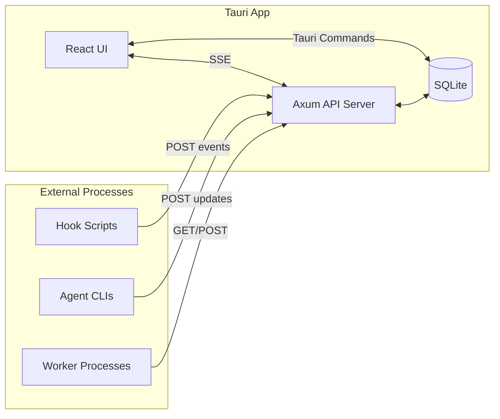
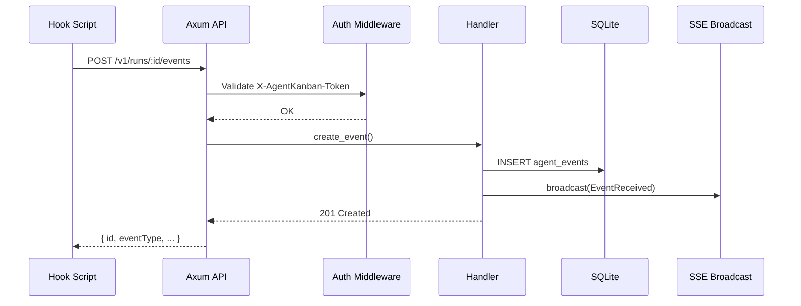

# 04 - Local API

Implement a REST API server within the Tauri app for agent hook scripts and external tools to communicate with the board.

## Overview

This guide implements:

- An embedded HTTP server (Axum) running on localhost
- REST endpoints for tickets, runs, events, and queue operations
- Server-Sent Events (SSE) for real-time UI updates
- Token-based authentication for security
- CORS configuration for local development
- Complete error handling patterns

## Prerequisites

- Completed [01-project-setup.md](./01-project-setup.md)
- Completed [02-database-design.md](./02-database-design.md)
- Completed [03-kanban-ui.md](./03-kanban-ui.md)
- Rust dependencies: `axum`, `tokio`, `tower-http`

## Architecture



### Request Flow



## Implementation Steps

### Step 1: Create API Module Structure

Set up the API module files:

```
src-tauri/src/api/
├── mod.rs           # Module exports and server setup
├── routes.rs        # Route definitions
├── handlers.rs      # Request handlers
├── auth.rs          # Authentication middleware
├── state.rs         # Shared state
├── events.rs        # SSE for live updates
├── types.rs         # Request/response types
└── error.rs         # Error handling
```

### Step 2: Define Error Types

Create `src-tauri/src/api/error.rs`:

```rust
use axum::{
    http::StatusCode,
    response::{IntoResponse, Response},
    Json,
};
use serde::Serialize;

/// API error codes for client handling
#[derive(Debug, Clone, Serialize)]
#[serde(rename_all = "SCREAMING_SNAKE_CASE")]
pub enum ErrorCode {
    /// Resource not found
    NotFound,
    /// Invalid request data
    BadRequest,
    /// Authentication required
    Unauthorized,
    /// Insufficient permissions
    Forbidden,
    /// Resource conflict (e.g., ticket already locked)
    Conflict,
    /// Database error
    DatabaseError,
    /// Internal server error
    InternalError,
    /// Queue is empty
    QueueEmpty,
    /// Lock expired
    LockExpired,
    /// Validation failed
    ValidationError,
}

/// Standard API error response
#[derive(Debug, Serialize)]
#[serde(rename_all = "camelCase")]
pub struct ApiError {
    pub error: String,
    pub code: ErrorCode,
    #[serde(skip_serializing_if = "Option::is_none")]
    pub details: Option<serde_json::Value>,
}

impl ApiError {
    pub fn new(code: ErrorCode, message: impl Into<String>) -> Self {
        Self {
            error: message.into(),
            code,
            details: None,
        }
    }

    pub fn with_details(mut self, details: serde_json::Value) -> Self {
        self.details = Some(details);
        self
    }

    pub fn not_found(resource: &str) -> Self {
        Self::new(ErrorCode::NotFound, format!("{} not found", resource))
    }

    pub fn bad_request(message: impl Into<String>) -> Self {
        Self::new(ErrorCode::BadRequest, message)
    }

    pub fn unauthorized() -> Self {
        Self::new(ErrorCode::Unauthorized, "Authentication required")
    }

    pub fn conflict(message: impl Into<String>) -> Self {
        Self::new(ErrorCode::Conflict, message)
    }

    pub fn database(message: impl Into<String>) -> Self {
        Self::new(ErrorCode::DatabaseError, message)
    }

    pub fn internal(message: impl Into<String>) -> Self {
        Self::new(ErrorCode::InternalError, message)
    }

    pub fn queue_empty() -> Self {
        Self::new(ErrorCode::QueueEmpty, "No tickets available in queue")
    }

    pub fn lock_expired() -> Self {
        Self::new(ErrorCode::LockExpired, "Lock has expired")
    }

    pub fn validation(message: impl Into<String>) -> Self {
        Self::new(ErrorCode::ValidationError, message)
    }
}

/// Wrapper for API results
pub type ApiResult<T> = Result<T, AppError>;

/// Application error that converts to HTTP responses
#[derive(Debug)]
pub struct AppError {
    pub status: StatusCode,
    pub body: ApiError,
}

impl AppError {
    pub fn new(status: StatusCode, body: ApiError) -> Self {
        Self { status, body }
    }

    pub fn not_found(resource: &str) -> Self {
        Self::new(StatusCode::NOT_FOUND, ApiError::not_found(resource))
    }

    pub fn bad_request(message: impl Into<String>) -> Self {
        Self::new(StatusCode::BAD_REQUEST, ApiError::bad_request(message))
    }

    pub fn unauthorized() -> Self {
        Self::new(StatusCode::UNAUTHORIZED, ApiError::unauthorized())
    }

    pub fn conflict(message: impl Into<String>) -> Self {
        Self::new(StatusCode::CONFLICT, ApiError::conflict(message))
    }

    pub fn database(err: impl std::fmt::Display) -> Self {
        Self::new(
            StatusCode::INTERNAL_SERVER_ERROR,
            ApiError::database(err.to_string()),
        )
    }

    pub fn internal(message: impl Into<String>) -> Self {
        Self::new(
            StatusCode::INTERNAL_SERVER_ERROR,
            ApiError::internal(message),
        )
    }

    pub fn queue_empty() -> Self {
        Self::new(StatusCode::NOT_FOUND, ApiError::queue_empty())
    }

    pub fn lock_expired() -> Self {
        Self::new(StatusCode::CONFLICT, ApiError::lock_expired())
    }

    pub fn validation(message: impl Into<String>) -> Self {
        Self::new(StatusCode::BAD_REQUEST, ApiError::validation(message))
    }
}

impl IntoResponse for AppError {
    fn into_response(self) -> Response {
        (self.status, Json(self.body)).into_response()
    }
}

impl From<crate::db::DbError> for AppError {
    fn from(err: crate::db::DbError) -> Self {
        match &err {
            crate::db::DbError::NotFound(msg) => Self::not_found(msg),
            crate::db::DbError::Validation(msg) => Self::validation(msg.clone()),
            _ => Self::database(err),
        }
    }
}
```

### Step 3: Define API State

Create `src-tauri/src/api/state.rs`:

```rust
use std::sync::Arc;
use tokio::sync::broadcast;
use crate::db::Database;

/// Event sent to connected clients via SSE
#[derive(Debug, Clone, serde::Serialize)]
#[serde(tag = "type", rename_all = "snake_case")]
pub enum LiveEvent {
    /// A new ticket was created
    TicketCreated {
        ticket_id: String,
        board_id: String,
    },
    /// A ticket was updated
    TicketUpdated {
        ticket_id: String,
    },
    /// A ticket was moved to a different column
    TicketMoved {
        ticket_id: String,
        from_column_id: String,
        to_column_id: String,
    },
    /// A ticket was deleted
    TicketDeleted {
        ticket_id: String,
        board_id: String,
    },
    /// A comment was added to a ticket
    CommentAdded {
        ticket_id: String,
        comment_id: String,
    },
    /// An agent run was started
    RunStarted {
        run_id: String,
        ticket_id: String,
        agent_type: String,
    },
    /// An agent run status was updated
    RunUpdated {
        run_id: String,
        status: String,
    },
    /// An agent run completed
    RunCompleted {
        run_id: String,
        ticket_id: String,
        status: String,
        exit_code: Option<i32>,
    },
    /// An agent event was received
    EventReceived {
        run_id: String,
        event_id: String,
        event_type: String,
    },
    /// A ticket lock was acquired
    TicketLocked {
        ticket_id: String,
        run_id: String,
    },
    /// A ticket lock was released
    TicketUnlocked {
        ticket_id: String,
    },
    /// Heartbeat for connection keep-alive
    Heartbeat {
        timestamp: String,
    },
}

/// Shared application state for the API server
#[derive(Clone)]
pub struct AppState {
    /// Database handle
    pub db: Arc<Database>,
    /// API authentication token
    pub api_token: String,
    /// Broadcast channel for SSE events
    pub event_tx: broadcast::Sender<LiveEvent>,
}

impl AppState {
    /// Create new application state
    pub fn new(db: Arc<Database>, api_token: String) -> Self {
        // Buffer size of 256 events; older events dropped if not consumed
        let (event_tx, _) = broadcast::channel(256);
        Self { db, api_token, event_tx }
    }

    /// Broadcast an event to all connected SSE clients
    pub fn broadcast(&self, event: LiveEvent) {
        // Log broadcast for debugging
        tracing::debug!("Broadcasting event: {:?}", event);
        // Ignore send errors (happens when no receivers are connected)
        let _ = self.event_tx.send(event);
    }

    /// Subscribe to the event stream
    pub fn subscribe(&self) -> broadcast::Receiver<LiveEvent> {
        self.event_tx.subscribe()
    }
}
```

### Step 4: Implement Authentication Middleware

Create `src-tauri/src/api/auth.rs`:

```rust
use axum::{
    extract::{Query, State},
    http::{Request, StatusCode},
    middleware::Next,
    response::Response,
};
use serde::Deserialize;

use super::state::AppState;

/// Header name for the API token
pub const AUTH_HEADER: &str = "X-AgentKanban-Token";

/// Query parameter for token (used by SSE since EventSource doesn't support headers)
#[derive(Debug, Deserialize)]
pub struct TokenQuery {
    pub token: Option<String>,
}

/// Authentication middleware
/// 
/// Accepts token via:
/// 1. X-AgentKanban-Token header (preferred)
/// 2. ?token= query parameter (for SSE/EventSource)
pub async fn auth_middleware<B>(
    State(state): State<AppState>,
    Query(query): Query<TokenQuery>,
    request: Request<B>,
    next: Next<B>,
) -> Result<Response, StatusCode> {
    // Try header first, then query parameter
    let token = request
        .headers()
        .get(AUTH_HEADER)
        .and_then(|v| v.to_str().ok())
        .map(String::from)
        .or(query.token);

    match token {
        Some(t) if t == state.api_token => {
            tracing::trace!("Request authenticated successfully");
            Ok(next.run(request).await)
        }
        Some(_) => {
            tracing::warn!(
                "Invalid API token provided for {} {}",
                request.method(),
                request.uri().path()
            );
            Err(StatusCode::UNAUTHORIZED)
        }
        None => {
            tracing::warn!(
                "Missing API token for {} {}",
                request.method(),
                request.uri().path()
            );
            Err(StatusCode::UNAUTHORIZED)
        }
    }
}

/// Generate a cryptographically secure random API token
pub fn generate_token() -> String {
    use rand::Rng;
    
    const CHARSET: &[u8] = b"ABCDEFGHIJKLMNOPQRSTUVWXYZabcdefghijklmnopqrstuvwxyz0123456789";
    const TOKEN_LENGTH: usize = 32;
    
    let mut rng = rand::thread_rng();
    (0..TOKEN_LENGTH)
        .map(|_| CHARSET[rng.gen_range(0..CHARSET.len())] as char)
        .collect()
}

#[cfg(test)]
mod tests {
    use super::*;

    #[test]
    fn test_generate_token() {
        let token1 = generate_token();
        let token2 = generate_token();
        
        assert_eq!(token1.len(), 32);
        assert_eq!(token2.len(), 32);
        assert_ne!(token1, token2); // Should be random
        
        // All characters should be alphanumeric
        assert!(token1.chars().all(|c| c.is_ascii_alphanumeric()));
    }
}
```

### Step 5: Define Request/Response Types

Create `src-tauri/src/api/types.rs`:

```rust
use chrono::{DateTime, Utc};
use serde::{Deserialize, Serialize};
use crate::db::{Priority, AgentType, AgentPref, Ticket, AgentRun, Column};

// ===== Ticket Types =====

#[derive(Debug, Deserialize)]
#[serde(rename_all = "camelCase")]
pub struct CreateTicketRequest {
    pub board_id: String,
    pub column_id: String,
    pub title: String,
    #[serde(default)]
    pub description_md: String,
    #[serde(default = "default_priority")]
    pub priority: Priority,
    #[serde(default)]
    pub labels: Vec<String>,
    pub repo_path: Option<String>,
    pub agent_pref: Option<AgentPref>,
}

fn default_priority() -> Priority {
    Priority::Medium
}

#[derive(Debug, Deserialize)]
#[serde(rename_all = "camelCase")]
pub struct UpdateTicketRequest {
    pub title: Option<String>,
    pub description_md: Option<String>,
    pub priority: Option<Priority>,
    pub labels: Option<Vec<String>>,
    pub repo_path: Option<String>,
    pub agent_pref: Option<AgentPref>,
}

#[derive(Debug, Deserialize)]
#[serde(rename_all = "camelCase")]
pub struct MoveTicketRequest {
    pub column_id: String,
}

// ===== Reservation Types =====

#[derive(Debug, Serialize)]
#[serde(rename_all = "camelCase")]
pub struct ReservationResponse {
    pub run_id: String,
    pub ticket_id: String,
    pub lock_expires_at: DateTime<Utc>,
    pub heartbeat_interval_secs: u64,
}

#[derive(Debug, Deserialize)]
#[serde(rename_all = "camelCase")]
pub struct ReserveTicketRequest {
    pub agent_type: AgentType,
    #[serde(default)]
    pub repo_path: Option<String>,
}

// ===== Run Types =====

#[derive(Debug, Deserialize)]
#[serde(rename_all = "camelCase")]
pub struct CreateRunRequest {
    pub ticket_id: String,
    pub agent_type: AgentType,
    pub repo_path: String,
}

#[derive(Debug, Deserialize)]
#[serde(rename_all = "camelCase")]
pub struct UpdateRunRequest {
    pub status: Option<String>,
    pub exit_code: Option<i32>,
    pub summary_md: Option<String>,
}

#[derive(Debug, Serialize)]
#[serde(rename_all = "camelCase")]
pub struct HeartbeatResponse {
    pub run_id: String,
    pub lock_expires_at: DateTime<Utc>,
    pub ok: bool,
}

// ===== Event Types =====

#[derive(Debug, Deserialize)]
#[serde(rename_all = "camelCase")]
pub struct CreateEventRequest {
    pub event_type: String,
    pub payload: serde_json::Value,
    #[serde(default = "Utc::now")]
    pub timestamp: DateTime<Utc>,
}

// ===== Comment Types =====

#[derive(Debug, Deserialize)]
#[serde(rename_all = "camelCase")]
pub struct CreateCommentRequest {
    pub body_md: String,
    #[serde(default = "default_author_type")]
    pub author_type: String,
    pub metadata: Option<serde_json::Value>,
}

fn default_author_type() -> String {
    "agent".to_string()
}

// ===== Queue Types =====

#[derive(Debug, Deserialize)]
#[serde(rename_all = "camelCase")]
pub struct QueueNextRequest {
    pub agent_type: AgentType,
    #[serde(default)]
    pub repo_path: Option<String>,
    #[serde(default)]
    pub board_id: Option<String>,
}

#[derive(Debug, Serialize)]
#[serde(rename_all = "camelCase")]
pub struct QueueNextResponse {
    pub ticket: Ticket,
    pub run_id: String,
    pub lock_expires_at: DateTime<Utc>,
    pub heartbeat_interval_secs: u64,
}

#[derive(Debug, Serialize)]
#[serde(rename_all = "camelCase")]
pub struct QueueStatusResponse {
    pub ready_count: usize,
    pub in_progress_count: usize,
    pub boards: Vec<BoardQueueStatus>,
}

#[derive(Debug, Serialize)]
#[serde(rename_all = "camelCase")]
pub struct BoardQueueStatus {
    pub board_id: String,
    pub board_name: String,
    pub ready_count: usize,
}

// ===== Board Response Types =====

#[derive(Debug, Serialize)]
#[serde(rename_all = "camelCase")]
pub struct BoardWithColumns {
    pub id: String,
    pub name: String,
    pub created_at: DateTime<Utc>,
    pub updated_at: DateTime<Utc>,
    pub columns: Vec<Column>,
}

// ===== Generic Responses =====

#[derive(Debug, Serialize)]
#[serde(rename_all = "camelCase")]
pub struct DeleteResponse {
    pub deleted: bool,
    pub id: String,
}

/// Constant for lock duration in minutes
pub const LOCK_DURATION_MINUTES: i64 = 30;

/// Constant for heartbeat interval in seconds (should be < lock duration)
pub const HEARTBEAT_INTERVAL_SECS: u64 = 60;
```

### Step 6: Implement Request Handlers

Create `src-tauri/src/api/handlers.rs`:

```rust
use axum::{
    extract::{Path, Query, State},
    http::StatusCode,
    Json,
};
use chrono::{Duration, Utc};
use serde::Deserialize;

use super::error::{ApiResult, AppError};
use super::state::{AppState, LiveEvent};
use super::types::*;
use crate::db::{
    AgentEvent, AgentEventPayload, AgentRun, Board, Column, Comment, CreateRun,
    CreateTicket, EventType, NormalizedEvent, RunStatus, Ticket, AuthorType,
    CreateComment,
};

// ===== Health Check =====

pub async fn health() -> &'static str {
    "ok"
}

pub async fn health_detailed(
    State(state): State<AppState>,
) -> ApiResult<Json<serde_json::Value>> {
    // Verify database connection
    let board_count = state.db.get_boards()
        .map(|b| b.len())
        .unwrap_or(0);

    Ok(Json(serde_json::json!({
        "status": "ok",
        "version": env!("CARGO_PKG_VERSION"),
        "database": "connected",
        "boardCount": board_count
    })))
}

// ===== Boards =====

pub async fn list_boards(
    State(state): State<AppState>,
) -> ApiResult<Json<Vec<Board>>> {
    let boards = state.db.get_boards()?;
    Ok(Json(boards))
}

pub async fn get_board(
    State(state): State<AppState>,
    Path(board_id): Path<String>,
) -> ApiResult<Json<BoardWithColumns>> {
    let board = state.db.get_board(&board_id)?;
    let columns = state.db.get_columns(&board_id)?;
    
    Ok(Json(BoardWithColumns {
        id: board.id,
        name: board.name,
        created_at: board.created_at,
        updated_at: board.updated_at,
        columns,
    }))
}

// ===== Columns =====

pub async fn list_columns(
    State(state): State<AppState>,
    Path(board_id): Path<String>,
) -> ApiResult<Json<Vec<Column>>> {
    // Verify board exists
    state.db.get_board(&board_id)?;
    let columns = state.db.get_columns(&board_id)?;
    Ok(Json(columns))
}

// ===== Tickets =====

#[derive(Debug, Deserialize)]
pub struct TicketQuery {
    pub column: Option<String>,
}

pub async fn list_tickets(
    State(state): State<AppState>,
    Path(board_id): Path<String>,
    Query(query): Query<TicketQuery>,
) -> ApiResult<Json<Vec<Ticket>>> {
    // Verify board exists
    state.db.get_board(&board_id)?;
    let tickets = state.db.get_tickets(&board_id, query.column.as_deref())?;
    Ok(Json(tickets))
}

pub async fn create_ticket(
    State(state): State<AppState>,
    Json(req): Json<CreateTicketRequest>,
) -> ApiResult<(StatusCode, Json<Ticket>)> {
    // Validate board and column exist
    state.db.get_board(&req.board_id)?;
    let columns = state.db.get_columns(&req.board_id)?;
    if !columns.iter().any(|c| c.id == req.column_id) {
        return Err(AppError::not_found("Column"));
    }

    // Validate title is not empty
    if req.title.trim().is_empty() {
        return Err(AppError::validation("Title cannot be empty"));
    }

    let ticket = state.db.create_ticket(&CreateTicket {
        board_id: req.board_id.clone(),
        column_id: req.column_id,
        title: req.title,
        description_md: req.description_md,
        priority: req.priority,
        labels: req.labels,
        repo_path: req.repo_path,
        agent_pref: req.agent_pref,
    })?;

    state.broadcast(LiveEvent::TicketCreated {
        ticket_id: ticket.id.clone(),
        board_id: req.board_id,
    });

    Ok((StatusCode::CREATED, Json(ticket)))
}

pub async fn get_ticket(
    State(state): State<AppState>,
    Path(ticket_id): Path<String>,
) -> ApiResult<Json<Ticket>> {
    let ticket = state.db.get_ticket(&ticket_id)?;
    Ok(Json(ticket))
}

pub async fn update_ticket(
    State(state): State<AppState>,
    Path(ticket_id): Path<String>,
    Json(req): Json<UpdateTicketRequest>,
) -> ApiResult<Json<Ticket>> {
    // Verify ticket exists
    let existing = state.db.get_ticket(&ticket_id)?;

    // Validate title if provided
    if let Some(ref title) = req.title {
        if title.trim().is_empty() {
            return Err(AppError::validation("Title cannot be empty"));
        }
    }

    let ticket = state.db.update_ticket(&ticket_id, req)?;

    state.broadcast(LiveEvent::TicketUpdated {
        ticket_id: ticket.id.clone(),
    });

    Ok(Json(ticket))
}

pub async fn delete_ticket(
    State(state): State<AppState>,
    Path(ticket_id): Path<String>,
) -> ApiResult<Json<DeleteResponse>> {
    let ticket = state.db.get_ticket(&ticket_id)?;
    state.db.delete_ticket(&ticket_id)?;

    state.broadcast(LiveEvent::TicketDeleted {
        ticket_id: ticket_id.clone(),
        board_id: ticket.board_id,
    });

    Ok(Json(DeleteResponse {
        deleted: true,
        id: ticket_id,
    }))
}

pub async fn move_ticket(
    State(state): State<AppState>,
    Path(ticket_id): Path<String>,
    Json(req): Json<MoveTicketRequest>,
) -> ApiResult<Json<Ticket>> {
    let ticket = state.db.get_ticket(&ticket_id)?;
    let from_column_id = ticket.column_id.clone();

    // Validate target column exists in the same board
    let columns = state.db.get_columns(&ticket.board_id)?;
    if !columns.iter().any(|c| c.id == req.column_id) {
        return Err(AppError::not_found("Column"));
    }

    state.db.move_ticket(&ticket_id, &req.column_id)?;
    let updated = state.db.get_ticket(&ticket_id)?;

    state.broadcast(LiveEvent::TicketMoved {
        ticket_id,
        from_column_id,
        to_column_id: req.column_id,
    });

    Ok(Json(updated))
}

// ===== Ticket Reservation =====

pub async fn reserve_ticket(
    State(state): State<AppState>,
    Path(ticket_id): Path<String>,
    Json(req): Json<ReserveTicketRequest>,
) -> ApiResult<Json<ReservationResponse>> {
    let ticket = state.db.get_ticket(&ticket_id)?;

    // Check if ticket is already locked
    if let Some(ref lock_expires) = ticket.lock_expires_at {
        if *lock_expires > Utc::now() {
            return Err(AppError::conflict("Ticket is already locked by another run"));
        }
    }

    // Determine repo path
    let repo_path = req.repo_path
        .or(ticket.repo_path.clone())
        .ok_or_else(|| AppError::validation("repo_path is required"))?;

    // Create a new run
    let run = state.db.create_run(&CreateRun {
        ticket_id: ticket_id.clone(),
        agent_type: req.agent_type.clone(),
        repo_path,
    })?;

    // Lock the ticket
    let lock_expires_at = Utc::now() + Duration::minutes(LOCK_DURATION_MINUTES);
    state.db.lock_ticket(&ticket_id, &run.id, lock_expires_at)?;

    // Move ticket to In Progress column
    let columns = state.db.get_columns(&ticket.board_id)?;
    if let Some(in_progress) = columns.iter().find(|c| c.name == "In Progress") {
        let _ = state.db.move_ticket(&ticket_id, &in_progress.id);
    }

    state.broadcast(LiveEvent::TicketLocked {
        ticket_id: ticket_id.clone(),
        run_id: run.id.clone(),
    });

    state.broadcast(LiveEvent::RunStarted {
        run_id: run.id.clone(),
        ticket_id: ticket_id.clone(),
        agent_type: req.agent_type.as_str().to_string(),
    });

    Ok(Json(ReservationResponse {
        run_id: run.id,
        ticket_id,
        lock_expires_at,
        heartbeat_interval_secs: HEARTBEAT_INTERVAL_SECS,
    }))
}

// ===== Runs =====

pub async fn create_run(
    State(state): State<AppState>,
    Json(req): Json<CreateRunRequest>,
) -> ApiResult<(StatusCode, Json<AgentRun>)> {
    // Verify ticket exists
    let ticket = state.db.get_ticket(&req.ticket_id)?;

    // Check if ticket is already locked
    if let Some(ref lock_expires) = ticket.lock_expires_at {
        if *lock_expires > Utc::now() {
            return Err(AppError::conflict("Ticket is already locked"));
        }
    }

    let run = state.db.create_run(&CreateRun {
        ticket_id: req.ticket_id.clone(),
        agent_type: req.agent_type.clone(),
        repo_path: req.repo_path,
    })?;

    state.broadcast(LiveEvent::RunStarted {
        run_id: run.id.clone(),
        ticket_id: req.ticket_id,
        agent_type: req.agent_type.as_str().to_string(),
    });

    Ok((StatusCode::CREATED, Json(run)))
}

pub async fn get_run(
    State(state): State<AppState>,
    Path(run_id): Path<String>,
) -> ApiResult<Json<AgentRun>> {
    let run = state.db.get_run(&run_id)?;
    Ok(Json(run))
}

pub async fn list_runs(
    State(state): State<AppState>,
    Path(ticket_id): Path<String>,
) -> ApiResult<Json<Vec<AgentRun>>> {
    // Verify ticket exists
    state.db.get_ticket(&ticket_id)?;
    let runs = state.db.get_runs(&ticket_id)?;
    Ok(Json(runs))
}

pub async fn update_run(
    State(state): State<AppState>,
    Path(run_id): Path<String>,
    Json(req): Json<UpdateRunRequest>,
) -> ApiResult<Json<AgentRun>> {
    let existing = state.db.get_run(&run_id)?;

    let status = req.status
        .as_ref()
        .and_then(|s| RunStatus::from_str(s))
        .unwrap_or(existing.status.clone());

    state.db.update_run_status(
        &run_id,
        status.clone(),
        req.exit_code,
        req.summary_md.as_deref(),
    )?;

    let updated = state.db.get_run(&run_id)?;

    // If run is terminal, unlock the ticket
    if matches!(status, RunStatus::Finished | RunStatus::Error | RunStatus::Aborted) {
        if let Ok(ticket) = state.db.get_ticket(&existing.ticket_id) {
            if ticket.locked_by_run_id.as_ref() == Some(&run_id) {
                state.db.unlock_ticket(&existing.ticket_id)?;
                state.broadcast(LiveEvent::TicketUnlocked {
                    ticket_id: existing.ticket_id.clone(),
                });
            }
        }

        state.broadcast(LiveEvent::RunCompleted {
            run_id: run_id.clone(),
            ticket_id: existing.ticket_id,
            status: status.as_str().to_string(),
            exit_code: req.exit_code,
        });
    } else {
        state.broadcast(LiveEvent::RunUpdated {
            run_id,
            status: status.as_str().to_string(),
        });
    }

    Ok(Json(updated))
}

pub async fn heartbeat(
    State(state): State<AppState>,
    Path(run_id): Path<String>,
) -> ApiResult<Json<HeartbeatResponse>> {
    let run = state.db.get_run(&run_id)?;

    // Check run is still active
    if !matches!(run.status, RunStatus::Queued | RunStatus::Running) {
        return Err(AppError::conflict(format!(
            "Run is not active (status: {})",
            run.status.as_str()
        )));
    }

    // Extend the lock
    let new_expiry = Utc::now() + Duration::minutes(LOCK_DURATION_MINUTES);
    state.db.extend_lock(&run.ticket_id, &run_id, new_expiry)?;

    tracing::debug!("Heartbeat received for run {}, lock extended to {}", run_id, new_expiry);

    Ok(Json(HeartbeatResponse {
        run_id,
        lock_expires_at: new_expiry,
        ok: true,
    }))
}

pub async fn release_run(
    State(state): State<AppState>,
    Path(run_id): Path<String>,
) -> ApiResult<Json<AgentRun>> {
    let run = state.db.get_run(&run_id)?;

    // Update run status to aborted
    state.db.update_run_status(&run_id, RunStatus::Aborted, None, None)?;

    // Unlock the ticket
    if let Ok(ticket) = state.db.get_ticket(&run.ticket_id) {
        if ticket.locked_by_run_id.as_ref() == Some(&run_id) {
            state.db.unlock_ticket(&run.ticket_id)?;
            state.broadcast(LiveEvent::TicketUnlocked {
                ticket_id: run.ticket_id.clone(),
            });
        }
    }

    let updated = state.db.get_run(&run_id)?;

    state.broadcast(LiveEvent::RunCompleted {
        run_id: run_id.clone(),
        ticket_id: run.ticket_id,
        status: "aborted".to_string(),
        exit_code: None,
    });

    Ok(Json(updated))
}

// ===== Events =====

pub async fn create_event(
    State(state): State<AppState>,
    Path(run_id): Path<String>,
    Json(req): Json<CreateEventRequest>,
) -> ApiResult<(StatusCode, Json<AgentEvent>)> {
    let run = state.db.get_run(&run_id)?;

    let normalized = NormalizedEvent {
        run_id: run_id.clone(),
        ticket_id: run.ticket_id.clone(),
        agent_type: run.agent_type.clone(),
        event_type: EventType::from_str(&req.event_type),
        payload: AgentEventPayload {
            raw: None,
            structured: Some(req.payload),
        },
        timestamp: req.timestamp,
    };

    let event = state.db.create_event(&normalized)?;

    state.broadcast(LiveEvent::EventReceived {
        run_id,
        event_id: event.id.clone(),
        event_type: req.event_type,
    });

    Ok((StatusCode::CREATED, Json(event)))
}

pub async fn list_events(
    State(state): State<AppState>,
    Path(run_id): Path<String>,
) -> ApiResult<Json<Vec<AgentEvent>>> {
    // Verify run exists
    state.db.get_run(&run_id)?;
    let events = state.db.get_events(&run_id)?;
    Ok(Json(events))
}

// ===== Comments =====

pub async fn create_comment(
    State(state): State<AppState>,
    Path(ticket_id): Path<String>,
    Json(req): Json<CreateCommentRequest>,
) -> ApiResult<(StatusCode, Json<Comment>)> {
    // Verify ticket exists
    state.db.get_ticket(&ticket_id)?;

    // Validate body is not empty
    if req.body_md.trim().is_empty() {
        return Err(AppError::validation("Comment body cannot be empty"));
    }

    // Parse author type
    let author_type = match req.author_type.as_str() {
        "user" => AuthorType::User,
        "agent" => AuthorType::Agent,
        "system" => AuthorType::System,
        _ => return Err(AppError::validation("Invalid author_type")),
    };

    let comment = state.db.create_comment(&CreateComment {
        ticket_id: ticket_id.clone(),
        author_type,
        body_md: req.body_md,
        metadata: req.metadata,
    })?;

    state.broadcast(LiveEvent::CommentAdded {
        ticket_id,
        comment_id: comment.id.clone(),
    });

    Ok((StatusCode::CREATED, Json(comment)))
}

pub async fn list_comments(
    State(state): State<AppState>,
    Path(ticket_id): Path<String>,
) -> ApiResult<Json<Vec<Comment>>> {
    // Verify ticket exists
    state.db.get_ticket(&ticket_id)?;
    let comments = state.db.get_comments(&ticket_id)?;
    Ok(Json(comments))
}

// ===== Queue =====

pub async fn queue_next(
    State(state): State<AppState>,
    Json(req): Json<QueueNextRequest>,
) -> ApiResult<Json<QueueNextResponse>> {
    let boards = match &req.board_id {
        Some(id) => vec![state.db.get_board(id)?],
        None => state.db.get_boards()?,
    };

    for board in boards {
        let columns = state.db.get_columns(&board.id)?;

        // Find "Ready" column
        let ready_column = match columns.iter().find(|c| c.name == "Ready") {
            Some(c) => c,
            None => continue,
        };

        let tickets = state.db.get_tickets(&board.id, Some(&ready_column.id))?;

        // Find first unlocked ticket that matches criteria
        for ticket in tickets {
            // Skip locked tickets
            if let Some(ref lock_expires) = ticket.lock_expires_at {
                if *lock_expires > Utc::now() {
                    continue;
                }
            }

            // Check repo_path filter if provided
            if let Some(ref filter_path) = req.repo_path {
                if ticket.repo_path.as_ref() != Some(filter_path) {
                    continue;
                }
            }

            // Check agent preference
            if let Some(ref pref) = ticket.agent_pref {
                use crate::db::AgentPref;
                match pref {
                    AgentPref::Cursor if req.agent_type != crate::db::AgentType::Cursor => continue,
                    AgentPref::Claude if req.agent_type != crate::db::AgentType::Claude => continue,
                    AgentPref::Any => {}
                    _ => {}
                }
            }

            // Determine repo path
            let repo_path = req.repo_path.clone()
                .or(ticket.repo_path.clone())
                .unwrap_or_default();

            // Reserve this ticket
            let run = state.db.create_run(&CreateRun {
                ticket_id: ticket.id.clone(),
                agent_type: req.agent_type.clone(),
                repo_path,
            })?;

            let lock_expires_at = Utc::now() + Duration::minutes(LOCK_DURATION_MINUTES);
            state.db.lock_ticket(&ticket.id, &run.id, lock_expires_at)?;

            // Move to In Progress
            if let Some(in_progress) = columns.iter().find(|c| c.name == "In Progress") {
                let _ = state.db.move_ticket(&ticket.id, &in_progress.id);
            }

            state.broadcast(LiveEvent::TicketLocked {
                ticket_id: ticket.id.clone(),
                run_id: run.id.clone(),
            });

            state.broadcast(LiveEvent::RunStarted {
                run_id: run.id.clone(),
                ticket_id: ticket.id.clone(),
                agent_type: req.agent_type.as_str().to_string(),
            });

            return Ok(Json(QueueNextResponse {
                ticket,
                run_id: run.id,
                lock_expires_at,
                heartbeat_interval_secs: HEARTBEAT_INTERVAL_SECS,
            }));
        }
    }

    Err(AppError::queue_empty())
}

pub async fn queue_status(
    State(state): State<AppState>,
) -> ApiResult<Json<QueueStatusResponse>> {
    let boards = state.db.get_boards()?;
    let mut total_ready = 0;
    let mut total_in_progress = 0;
    let mut board_statuses = Vec::new();

    for board in &boards {
        let columns = state.db.get_columns(&board.id)?;

        // Count Ready tickets
        let ready_count = if let Some(ready_col) = columns.iter().find(|c| c.name == "Ready") {
            let tickets = state.db.get_tickets(&board.id, Some(&ready_col.id))?;
            tickets.iter().filter(|t| {
                t.lock_expires_at.map_or(true, |exp| exp <= Utc::now())
            }).count()
        } else {
            0
        };

        // Count In Progress tickets
        let in_progress_count = if let Some(ip_col) = columns.iter().find(|c| c.name == "In Progress") {
            state.db.get_tickets(&board.id, Some(&ip_col.id))?.len()
        } else {
            0
        };

        total_ready += ready_count;
        total_in_progress += in_progress_count;

        if ready_count > 0 {
            board_statuses.push(BoardQueueStatus {
                board_id: board.id.clone(),
                board_name: board.name.clone(),
                ready_count,
            });
        }
    }

    Ok(Json(QueueStatusResponse {
        ready_count: total_ready,
        in_progress_count: total_in_progress,
        boards: board_statuses,
    }))
}
```

### Step 7: Implement Real-time Events (SSE)

Create `src-tauri/src/api/events.rs`:

```rust
use axum::{
    extract::State,
    response::sse::{Event, KeepAlive, Sse},
};
use futures::stream::Stream;
use std::{convert::Infallible, time::Duration};
use tokio_stream::StreamExt;

use super::state::{AppState, LiveEvent};

/// Server-Sent Events endpoint for real-time updates
/// 
/// Clients connect to this endpoint to receive live updates about:
/// - Ticket changes (created, updated, moved, deleted)
/// - Run lifecycle (started, updated, completed)
/// - Agent events
/// - Lock status changes
pub async fn sse_handler(
    State(state): State<AppState>,
) -> Sse<impl Stream<Item = Result<Event, Infallible>>> {
    let rx = state.subscribe();

    let stream = tokio_stream::wrappers::BroadcastStream::new(rx)
        .filter_map(|result| {
            match result {
                Ok(event) => {
                    match serde_json::to_string(&event) {
                        Ok(json) => Some(Ok(Event::default().data(json))),
                        Err(e) => {
                            tracing::error!("Failed to serialize SSE event: {}", e);
                            None
                        }
                    }
                }
                Err(e) => {
                    // Log lag errors but don't send to client
                    tracing::warn!("SSE broadcast lag: {}", e);
                    None
                }
            }
        });

    Sse::new(stream).keep_alive(
        KeepAlive::new()
            .interval(Duration::from_secs(30))
            .text("ping"),
    )
}

/// SSE endpoint with event type filtering
#[derive(Debug, serde::Deserialize)]
pub struct SseFilter {
    /// Filter to only these event types (comma-separated)
    #[serde(default)]
    pub types: Option<String>,
    /// Filter to only events for this ticket
    #[serde(default)]
    pub ticket_id: Option<String>,
    /// Filter to only events for this run
    #[serde(default)]
    pub run_id: Option<String>,
}

pub async fn sse_filtered(
    State(state): State<AppState>,
    axum::extract::Query(filter): axum::extract::Query<SseFilter>,
) -> Sse<impl Stream<Item = Result<Event, Infallible>>> {
    let rx = state.subscribe();

    // Parse type filter
    let type_filter: Option<Vec<String>> = filter.types.map(|t| {
        t.split(',').map(|s| s.trim().to_string()).collect()
    });

    let ticket_filter = filter.ticket_id;
    let run_filter = filter.run_id;

    let stream = tokio_stream::wrappers::BroadcastStream::new(rx)
        .filter_map(move |result| {
            match result {
                Ok(event) => {
                    // Apply filters
                    if !event_matches_filter(&event, &type_filter, &ticket_filter, &run_filter) {
                        return None;
                    }

                    match serde_json::to_string(&event) {
                        Ok(json) => Some(Ok(Event::default().data(json))),
                        Err(_) => None,
                    }
                }
                Err(_) => None,
            }
        });

    Sse::new(stream).keep_alive(
        KeepAlive::new()
            .interval(Duration::from_secs(30))
            .text("ping"),
    )
}

/// Check if an event matches the given filters
fn event_matches_filter(
    event: &LiveEvent,
    type_filter: &Option<Vec<String>>,
    ticket_filter: &Option<String>,
    run_filter: &Option<String>,
) -> bool {
    // Type filter
    if let Some(ref types) = type_filter {
        let event_type = match event {
            LiveEvent::TicketCreated { .. } => "ticket_created",
            LiveEvent::TicketUpdated { .. } => "ticket_updated",
            LiveEvent::TicketMoved { .. } => "ticket_moved",
            LiveEvent::TicketDeleted { .. } => "ticket_deleted",
            LiveEvent::CommentAdded { .. } => "comment_added",
            LiveEvent::RunStarted { .. } => "run_started",
            LiveEvent::RunUpdated { .. } => "run_updated",
            LiveEvent::RunCompleted { .. } => "run_completed",
            LiveEvent::EventReceived { .. } => "event_received",
            LiveEvent::TicketLocked { .. } => "ticket_locked",
            LiveEvent::TicketUnlocked { .. } => "ticket_unlocked",
            LiveEvent::Heartbeat { .. } => "heartbeat",
        };

        if !types.iter().any(|t| t == event_type) {
            return false;
        }
    }

    // Ticket filter
    if let Some(ref ticket_id) = ticket_filter {
        let event_ticket = match event {
            LiveEvent::TicketCreated { ticket_id, .. } => Some(ticket_id),
            LiveEvent::TicketUpdated { ticket_id } => Some(ticket_id),
            LiveEvent::TicketMoved { ticket_id, .. } => Some(ticket_id),
            LiveEvent::TicketDeleted { ticket_id, .. } => Some(ticket_id),
            LiveEvent::CommentAdded { ticket_id, .. } => Some(ticket_id),
            LiveEvent::RunStarted { ticket_id, .. } => Some(ticket_id),
            LiveEvent::RunCompleted { ticket_id, .. } => Some(ticket_id),
            LiveEvent::TicketLocked { ticket_id, .. } => Some(ticket_id),
            LiveEvent::TicketUnlocked { ticket_id } => Some(ticket_id),
            _ => None,
        };

        if event_ticket != Some(ticket_id) {
            return false;
        }
    }

    // Run filter
    if let Some(ref run_id) = run_filter {
        let event_run = match event {
            LiveEvent::RunStarted { run_id, .. } => Some(run_id),
            LiveEvent::RunUpdated { run_id, .. } => Some(run_id),
            LiveEvent::RunCompleted { run_id, .. } => Some(run_id),
            LiveEvent::EventReceived { run_id, .. } => Some(run_id),
            LiveEvent::TicketLocked { run_id, .. } => Some(run_id),
            _ => None,
        };

        if event_run != Some(run_id) {
            return false;
        }
    }

    true
}
```

### Step 8: Define Routes

Create `src-tauri/src/api/routes.rs`:

```rust
use axum::{
    middleware,
    routing::{get, post, patch, delete},
    Router,
};
use tower_http::cors::{Any, CorsLayer};

use super::auth::auth_middleware;
use super::handlers::*;
use super::events::{sse_handler, sse_filtered};
use super::state::AppState;

pub fn create_router(state: AppState) -> Router {
    // Public routes (no auth required)
    let public_routes = Router::new()
        .route("/health", get(health))
        .route("/health/detailed", get(health_detailed));

    // Protected routes (auth required)
    let protected_routes = Router::new()
        // Boards
        .route("/v1/boards", get(list_boards))
        .route("/v1/boards/:board_id", get(get_board))
        .route("/v1/boards/:board_id/columns", get(list_columns))
        .route("/v1/boards/:board_id/tickets", get(list_tickets))
        
        // Tickets
        .route("/v1/tickets", post(create_ticket))
        .route("/v1/tickets/:ticket_id", get(get_ticket))
        .route("/v1/tickets/:ticket_id", patch(update_ticket))
        .route("/v1/tickets/:ticket_id", delete(delete_ticket))
        .route("/v1/tickets/:ticket_id/move", post(move_ticket))
        .route("/v1/tickets/:ticket_id/reserve", post(reserve_ticket))
        .route("/v1/tickets/:ticket_id/comments", get(list_comments))
        .route("/v1/tickets/:ticket_id/comments", post(create_comment))
        .route("/v1/tickets/:ticket_id/runs", get(list_runs))
        
        // Runs
        .route("/v1/runs", post(create_run))
        .route("/v1/runs/:run_id", get(get_run))
        .route("/v1/runs/:run_id", patch(update_run))
        .route("/v1/runs/:run_id/heartbeat", post(heartbeat))
        .route("/v1/runs/:run_id/release", post(release_run))
        .route("/v1/runs/:run_id/events", get(list_events))
        .route("/v1/runs/:run_id/events", post(create_event))
        
        // Queue
        .route("/v1/queue/next", post(queue_next))
        .route("/v1/queue/status", get(queue_status))
        
        // Real-time updates (SSE)
        // Token can be passed via query param for EventSource compatibility
        .route("/v1/stream", get(sse_handler))
        .route("/v1/stream/filtered", get(sse_filtered))
        
        // Apply auth middleware to all protected routes
        .layer(middleware::from_fn_with_state(state.clone(), auth_middleware));

    // Combine routes with state
    let app = Router::new()
        .merge(public_routes)
        .merge(protected_routes)
        .with_state(state);

    // Add CORS for local development
    // In production, you'd want to restrict this
    let cors = CorsLayer::new()
        .allow_origin(Any)
        .allow_methods(Any)
        .allow_headers(Any);

    app.layer(cors)
}
```

### Step 9: Set Up the API Server

Update `src-tauri/src/api/mod.rs`:

```rust
pub mod auth;
pub mod error;
pub mod events;
pub mod handlers;
pub mod routes;
pub mod state;
pub mod types;

use std::net::SocketAddr;
use std::sync::Arc;
use tokio::sync::oneshot;
use crate::db::Database;

pub use auth::generate_token;
pub use state::AppState;
pub use error::{ApiError, AppError, ApiResult};

/// API server configuration
#[derive(Debug, Clone)]
pub struct ApiConfig {
    /// Port to listen on
    pub port: u16,
    /// Authentication token
    pub token: String,
    /// Host to bind to (default: 127.0.0.1)
    pub host: [u8; 4],
}

impl Default for ApiConfig {
    fn default() -> Self {
        Self {
            port: 7432,
            token: generate_token(),
            host: [127, 0, 0, 1],
        }
    }
}

/// Server handle for managing the running server
pub struct ServerHandle {
    pub addr: SocketAddr,
    pub shutdown_tx: oneshot::Sender<()>,
}

impl ServerHandle {
    /// Stop the server
    pub fn shutdown(self) {
        let _ = self.shutdown_tx.send(());
    }
}

/// Start the API server
pub async fn start_server(
    db: Arc<Database>,
    config: ApiConfig,
) -> Result<ServerHandle, Box<dyn std::error::Error + Send + Sync>> {
    let state = AppState::new(db, config.token.clone());
    let router = routes::create_router(state);

    // Bind to localhost only for security
    let addr = SocketAddr::from((config.host, config.port));

    // Create shutdown channel
    let (shutdown_tx, shutdown_rx) = oneshot::channel::<()>();

    // Start server
    let listener = tokio::net::TcpListener::bind(addr).await?;
    let actual_addr = listener.local_addr()?;

    tracing::info!("API server listening on http://{}", actual_addr);
    tracing::info!("API token: {}", config.token);

    tokio::spawn(async move {
        axum::serve(listener, router)
            .with_graceful_shutdown(async {
                shutdown_rx.await.ok();
                tracing::info!("API server shutting down");
            })
            .await
            .expect("API server error");
    });

    Ok(ServerHandle {
        addr: actual_addr,
        shutdown_tx,
    })
}
```

### Step 10: Add Database Methods

Add these methods to `src-tauri/src/db/mod.rs`:

```rust
// Add to Database impl block

impl Database {
    /// Get a single board by ID
    pub fn get_board(&self, board_id: &str) -> Result<Board, DbError> {
        self.with_conn(|conn| {
            let mut stmt = conn.prepare(
                "SELECT id, name, created_at, updated_at FROM boards WHERE id = ?"
            )?;
            
            stmt.query_row([board_id], |row| {
                Ok(Board {
                    id: row.get(0)?,
                    name: row.get(1)?,
                    created_at: parse_datetime(row.get(2)?),
                    updated_at: parse_datetime(row.get(3)?),
                })
            }).map_err(|e| match e {
                rusqlite::Error::QueryReturnedNoRows => {
                    DbError::NotFound(format!("Board {}", board_id))
                }
                other => DbError::Sqlite(other),
            })
        })
    }

    /// Get a single ticket by ID
    pub fn get_ticket(&self, ticket_id: &str) -> Result<Ticket, DbError> {
        self.with_conn(|conn| {
            let mut stmt = conn.prepare(
                r#"SELECT id, board_id, column_id, title, description_md, priority, 
                          labels_json, created_at, updated_at, locked_by_run_id, 
                          lock_expires_at, repo_path, agent_pref
                   FROM tickets WHERE id = ?"#
            )?;
            
            stmt.query_row([ticket_id], Self::map_ticket_row)
                .map_err(|e| match e {
                    rusqlite::Error::QueryReturnedNoRows => {
                        DbError::NotFound(format!("Ticket {}", ticket_id))
                    }
                    other => DbError::Sqlite(other),
                })
        })
    }

    /// Update a ticket
    pub fn update_ticket(
        &self,
        ticket_id: &str,
        updates: crate::api::types::UpdateTicketRequest,
    ) -> Result<Ticket, DbError> {
        self.with_conn(|conn| {
            let existing = {
                let mut stmt = conn.prepare(
                    r#"SELECT id, board_id, column_id, title, description_md, priority, 
                              labels_json, created_at, updated_at, locked_by_run_id, 
                              lock_expires_at, repo_path, agent_pref
                       FROM tickets WHERE id = ?"#
                )?;
                stmt.query_row([ticket_id], Self::map_ticket_row)
                    .map_err(|e| match e {
                        rusqlite::Error::QueryReturnedNoRows => {
                            DbError::NotFound(format!("Ticket {}", ticket_id))
                        }
                        other => DbError::Sqlite(other),
                    })?
            };

            let now = chrono::Utc::now();
            let title = updates.title.unwrap_or(existing.title);
            let description_md = updates.description_md.unwrap_or(existing.description_md);
            let priority = updates.priority.unwrap_or(existing.priority);
            let labels = updates.labels.unwrap_or(existing.labels);
            let repo_path = updates.repo_path.or(existing.repo_path);
            let agent_pref = updates.agent_pref.or(existing.agent_pref);

            let labels_json = serde_json::to_string(&labels).unwrap_or_else(|_| "[]".to_string());
            let agent_pref_str = agent_pref.as_ref().map(|p| match p {
                AgentPref::Cursor => "cursor",
                AgentPref::Claude => "claude",
                AgentPref::Any => "any",
            });

            conn.execute(
                r#"UPDATE tickets 
                   SET title = ?, description_md = ?, priority = ?, labels_json = ?,
                       repo_path = ?, agent_pref = ?, updated_at = ?
                   WHERE id = ?"#,
                rusqlite::params![
                    title,
                    description_md,
                    priority.as_str(),
                    labels_json,
                    repo_path,
                    agent_pref_str,
                    now.to_rfc3339(),
                    ticket_id,
                ],
            )?;

            self.get_ticket(ticket_id)
        })
    }

    /// Delete a ticket
    pub fn delete_ticket(&self, ticket_id: &str) -> Result<(), DbError> {
        self.with_conn(|conn| {
            let affected = conn.execute(
                "DELETE FROM tickets WHERE id = ?",
                [ticket_id],
            )?;
            
            if affected == 0 {
                return Err(DbError::NotFound(format!("Ticket {}", ticket_id)));
            }
            Ok(())
        })
    }

    /// Lock a ticket for a run
    pub fn lock_ticket(
        &self,
        ticket_id: &str,
        run_id: &str,
        expires_at: chrono::DateTime<chrono::Utc>,
    ) -> Result<(), DbError> {
        self.with_conn(|conn| {
            let affected = conn.execute(
                r#"UPDATE tickets 
                   SET locked_by_run_id = ?, lock_expires_at = ?, updated_at = ?
                   WHERE id = ?"#,
                rusqlite::params![
                    run_id,
                    expires_at.to_rfc3339(),
                    chrono::Utc::now().to_rfc3339(),
                    ticket_id,
                ],
            )?;
            
            if affected == 0 {
                return Err(DbError::NotFound(format!("Ticket {}", ticket_id)));
            }
            Ok(())
        })
    }

    /// Unlock a ticket
    pub fn unlock_ticket(&self, ticket_id: &str) -> Result<(), DbError> {
        self.with_conn(|conn| {
            conn.execute(
                r#"UPDATE tickets 
                   SET locked_by_run_id = NULL, lock_expires_at = NULL, updated_at = ?
                   WHERE id = ?"#,
                rusqlite::params![chrono::Utc::now().to_rfc3339(), ticket_id],
            )?;
            Ok(())
        })
    }

    /// Extend lock expiration (for heartbeat)
    pub fn extend_lock(
        &self,
        ticket_id: &str,
        run_id: &str,
        new_expires_at: chrono::DateTime<chrono::Utc>,
    ) -> Result<(), DbError> {
        self.with_conn(|conn| {
            let affected = conn.execute(
                r#"UPDATE tickets 
                   SET lock_expires_at = ?, updated_at = ?
                   WHERE id = ? AND locked_by_run_id = ?"#,
                rusqlite::params![
                    new_expires_at.to_rfc3339(),
                    chrono::Utc::now().to_rfc3339(),
                    ticket_id,
                    run_id,
                ],
            )?;
            
            if affected == 0 {
                return Err(DbError::NotFound("Lock not found or expired".to_string()));
            }
            Ok(())
        })
    }

    /// Get a single run by ID
    pub fn get_run(&self, run_id: &str) -> Result<AgentRun, DbError> {
        self.with_conn(|conn| {
            let mut stmt = conn.prepare(
                r#"SELECT id, ticket_id, agent_type, repo_path, status, 
                          started_at, ended_at, exit_code, summary_md, metadata_json
                   FROM agent_runs WHERE id = ?"#
            )?;
            
            stmt.query_row([run_id], |row| {
                let agent_type_str: String = row.get(2)?;
                let status_str: String = row.get(4)?;
                let metadata_json: Option<String> = row.get(9)?;
                
                Ok(AgentRun {
                    id: row.get(0)?,
                    ticket_id: row.get(1)?,
                    agent_type: match agent_type_str.as_str() {
                        "cursor" => AgentType::Cursor,
                        _ => AgentType::Claude,
                    },
                    repo_path: row.get(3)?,
                    status: RunStatus::from_str(&status_str).unwrap_or(RunStatus::Error),
                    started_at: parse_datetime(row.get(5)?),
                    ended_at: row.get::<_, Option<String>>(6)?.map(parse_datetime),
                    exit_code: row.get(7)?,
                    summary_md: row.get(8)?,
                    metadata: metadata_json.and_then(|s| serde_json::from_str(&s).ok()),
                })
            }).map_err(|e| match e {
                rusqlite::Error::QueryReturnedNoRows => {
                    DbError::NotFound(format!("Run {}", run_id))
                }
                other => DbError::Sqlite(other),
            })
        })
    }

    /// Create a comment on a ticket
    pub fn create_comment(&self, comment: &CreateComment) -> Result<Comment, DbError> {
        self.with_conn(|conn| {
            let comment_id = uuid::Uuid::new_v4().to_string();
            let now = chrono::Utc::now();
            let metadata_json = comment.metadata
                .as_ref()
                .and_then(|m| serde_json::to_string(m).ok());
            
            conn.execute(
                r#"INSERT INTO comments 
                   (id, ticket_id, author_type, body_md, created_at, metadata_json)
                   VALUES (?, ?, ?, ?, ?, ?)"#,
                rusqlite::params![
                    comment_id,
                    comment.ticket_id,
                    comment.author_type.as_str(),
                    comment.body_md,
                    now.to_rfc3339(),
                    metadata_json,
                ],
            )?;

            Ok(Comment {
                id: comment_id,
                ticket_id: comment.ticket_id.clone(),
                author_type: comment.author_type.clone(),
                body_md: comment.body_md.clone(),
                created_at: now,
                metadata: comment.metadata.clone(),
            })
        })
    }

    /// Get comments for a ticket
    pub fn get_comments(&self, ticket_id: &str) -> Result<Vec<Comment>, DbError> {
        self.with_conn(|conn| {
            let mut stmt = conn.prepare(
                r#"SELECT id, ticket_id, author_type, body_md, created_at, metadata_json
                   FROM comments WHERE ticket_id = ? ORDER BY created_at"#
            )?;
            
            let comments = stmt.query_map([ticket_id], |row| {
                let author_type_str: String = row.get(2)?;
                let metadata_json: Option<String> = row.get(5)?;
                
                Ok(Comment {
                    id: row.get(0)?,
                    ticket_id: row.get(1)?,
                    author_type: match author_type_str.as_str() {
                        "user" => AuthorType::User,
                        "system" => AuthorType::System,
                        _ => AuthorType::Agent,
                    },
                    body_md: row.get(3)?,
                    created_at: parse_datetime(row.get(4)?),
                    metadata: metadata_json.and_then(|s| serde_json::from_str(&s).ok()),
                })
            })?
            .collect::<Result<Vec<_>, _>>()?;
            
            Ok(comments)
        })
    }
}

/// Input for creating a comment
#[derive(Debug, Clone)]
pub struct CreateComment {
    pub ticket_id: String,
    pub author_type: AuthorType,
    pub body_md: String,
    pub metadata: Option<serde_json::Value>,
}
```

### Step 11: Integrate with Tauri

Update `src-tauri/src/main.rs`:

```rust
#![cfg_attr(not(debug_assertions), windows_subsystem = "windows")]

mod commands;
mod db;
mod api;
mod agents;
mod logging;

use std::sync::Arc;
use tauri::Manager;
use db::Database;

fn main() {
    tauri::Builder::default()
        .setup(|app| {
            let app_data_dir = app.path_resolver()
                .app_data_dir()
                .expect("Failed to get app data directory");
            
            // Initialize logging
            if let Err(e) = logging::init_logging(app_data_dir.clone()) {
                eprintln!("Failed to initialize logging: {}", e);
            }

            // Initialize database
            let db_path = app_data_dir.join("agent-kanban.db");
            let db = Arc::new(
                Database::open(db_path).expect("Failed to open database")
            );
            
            app.manage(db.clone());

            // Configure API server
            let api_config = api::ApiConfig::default();
            
            // Write token and port for hook scripts to read
            let token_path = app_data_dir.join("api_token");
            std::fs::write(&token_path, &api_config.token)
                .expect("Failed to write API token");
            
            let port_path = app_data_dir.join("api_port");
            std::fs::write(&port_path, api_config.port.to_string())
                .expect("Failed to write API port");

            // Make config available via environment for child processes
            std::env::set_var("AGENT_KANBAN_API_TOKEN", &api_config.token);
            std::env::set_var("AGENT_KANBAN_API_PORT", api_config.port.to_string());

            // Start API server
            let db_for_api = db.clone();
            tauri::async_runtime::spawn(async move {
                match api::start_server(db_for_api, api_config).await {
                    Ok(handle) => {
                        tracing::info!("API server started at {}", handle.addr);
                        // Keep handle alive - server runs until app exits
                        std::mem::forget(handle);
                    }
                    Err(e) => {
                        tracing::error!("Failed to start API server: {}", e);
                    }
                }
            });

            tracing::info!("Agent Kanban initialized successfully");
            Ok(())
        })
        .invoke_handler(tauri::generate_handler![
            commands::get_boards,
            commands::create_board,
            commands::get_columns,
            commands::get_tickets,
            commands::create_ticket,
            commands::move_ticket,
            commands::get_comments,
            commands::add_comment,
        ])
        .run(tauri::generate_context!())
        .expect("error while running tauri application");
}
```

### Step 12: Add Rust Dependencies

Update `src-tauri/Cargo.toml`:

```toml
[dependencies]
# Existing dependencies...
tauri = { version = "1", features = ["shell-open"] }
serde = { version = "1", features = ["derive"] }
serde_json = "1"
rusqlite = { version = "0.31", features = ["bundled"] }
chrono = { version = "0.4", features = ["serde"] }
uuid = { version = "1", features = ["v4"] }
thiserror = "1"
tracing = "0.1"
tracing-subscriber = { version = "0.3", features = ["env-filter"] }

# API server
axum = "0.7"
tokio = { version = "1", features = ["full"] }
tower-http = { version = "0.5", features = ["cors"] }
rand = "0.8"
tokio-stream = "0.1"
futures = "0.3"
```

### Step 13: Create Frontend SSE Hook

Create `src/hooks/useSSE.ts`:

```typescript
import { useEffect, useRef, useCallback } from 'react';
import { useBoardStore } from '../stores/boardStore';

interface LiveEvent {
  type:
    | 'ticket_created'
    | 'ticket_updated'
    | 'ticket_moved'
    | 'ticket_deleted'
    | 'comment_added'
    | 'run_started'
    | 'run_updated'
    | 'run_completed'
    | 'event_received'
    | 'ticket_locked'
    | 'ticket_unlocked'
    | 'heartbeat';
  ticket_id?: string;
  board_id?: string;
  from_column_id?: string;
  to_column_id?: string;
  comment_id?: string;
  run_id?: string;
  agent_type?: string;
  event_id?: string;
  event_type?: string;
  status?: string;
  exit_code?: number;
  timestamp?: string;
}

interface UseSSEOptions {
  /** Reconnect delay in ms (default: 3000) */
  reconnectDelay?: number;
  /** Max reconnect attempts (default: 10) */
  maxReconnects?: number;
  /** Event type filter (comma-separated) */
  typeFilter?: string;
  /** Ticket ID filter */
  ticketFilter?: string;
  /** Run ID filter */
  runFilter?: string;
  /** Callback for events */
  onEvent?: (event: LiveEvent) => void;
}

export function useSSE(apiUrl: string, token: string, options: UseSSEOptions = {}) {
  const {
    reconnectDelay = 3000,
    maxReconnects = 10,
    typeFilter,
    ticketFilter,
    runFilter,
    onEvent,
  } = options;

  const eventSourceRef = useRef<EventSource | null>(null);
  const reconnectCountRef = useRef(0);
  const reconnectTimeoutRef = useRef<number | null>(null);

  const { currentBoard, loadBoardData } = useBoardStore();

  const connect = useCallback(() => {
    if (!apiUrl || !token) return;

    // Build URL with token and optional filters
    const params = new URLSearchParams({ token });
    if (typeFilter) params.set('types', typeFilter);
    if (ticketFilter) params.set('ticket_id', ticketFilter);
    if (runFilter) params.set('run_id', runFilter);

    const endpoint = typeFilter || ticketFilter || runFilter
      ? 'stream/filtered'
      : 'stream';
    const url = `${apiUrl}/v1/${endpoint}?${params}`;

    console.log('[SSE] Connecting to', url.replace(token, '***'));

    const eventSource = new EventSource(url);
    eventSourceRef.current = eventSource;

    eventSource.onopen = () => {
      console.log('[SSE] Connection established');
      reconnectCountRef.current = 0;
    };

    eventSource.onmessage = (event) => {
      try {
        // Ignore ping messages
        if (event.data === 'ping') return;

        const data: LiveEvent = JSON.parse(event.data);
        handleEvent(data);
        onEvent?.(data);
      } catch (e) {
        console.error('[SSE] Failed to parse event:', e, event.data);
      }
    };

    eventSource.onerror = (error) => {
      console.error('[SSE] Connection error:', error);
      eventSource.close();
      eventSourceRef.current = null;

      // Attempt reconnect
      if (reconnectCountRef.current < maxReconnects) {
        reconnectCountRef.current++;
        console.log(
          `[SSE] Reconnecting in ${reconnectDelay}ms (attempt ${reconnectCountRef.current}/${maxReconnects})`
        );
        reconnectTimeoutRef.current = window.setTimeout(connect, reconnectDelay);
      } else {
        console.error('[SSE] Max reconnect attempts reached');
      }
    };
  }, [apiUrl, token, typeFilter, ticketFilter, runFilter, reconnectDelay, maxReconnects, onEvent]);

  const disconnect = useCallback(() => {
    if (reconnectTimeoutRef.current) {
      clearTimeout(reconnectTimeoutRef.current);
      reconnectTimeoutRef.current = null;
    }
    if (eventSourceRef.current) {
      eventSourceRef.current.close();
      eventSourceRef.current = null;
    }
  }, []);

  useEffect(() => {
    connect();
    return disconnect;
  }, [connect, disconnect]);

  const handleEvent = (event: LiveEvent) => {
    const { currentBoard, loadBoardData } = useBoardStore.getState();

    switch (event.type) {
      case 'ticket_created':
      case 'ticket_deleted':
        // Reload if it's our current board
        if (currentBoard && event.board_id === currentBoard.id) {
          loadBoardData(currentBoard.id);
        }
        break;

      case 'ticket_updated':
      case 'ticket_moved':
      case 'ticket_locked':
      case 'ticket_unlocked':
        // Reload board data to get latest
        if (currentBoard) {
          loadBoardData(currentBoard.id);
        }
        break;

      case 'run_started':
        console.log('[SSE] Run started:', event.run_id, 'agent:', event.agent_type);
        break;

      case 'run_updated':
        console.log('[SSE] Run updated:', event.run_id, 'status:', event.status);
        break;

      case 'run_completed':
        console.log(
          '[SSE] Run completed:',
          event.run_id,
          'status:',
          event.status,
          'exit:',
          event.exit_code
        );
        // Reload to update ticket status
        if (currentBoard) {
          loadBoardData(currentBoard.id);
        }
        break;

      case 'event_received':
        console.log('[SSE] Agent event:', event.event_type, 'run:', event.run_id);
        break;

      case 'comment_added':
        console.log('[SSE] Comment added to ticket:', event.ticket_id);
        break;

      case 'heartbeat':
        // Silent keep-alive
        break;
    }
  };

  return {
    connected: eventSourceRef.current?.readyState === EventSource.OPEN,
    reconnect: connect,
    disconnect,
  };
}
```

### Step 14: Create API Client

Create `src/lib/api.ts`:

```typescript
const API_BASE = 'http://127.0.0.1:7432';

interface ApiClientOptions {
  baseUrl?: string;
  token?: string;
}

class ApiClient {
  private baseUrl: string;
  private token: string = '';

  constructor(options: ApiClientOptions = {}) {
    this.baseUrl = options.baseUrl || API_BASE;
    if (options.token) {
      this.token = options.token;
    }
  }

  setToken(token: string) {
    this.token = token;
  }

  private async request<T>(
    method: string,
    path: string,
    body?: unknown
  ): Promise<T> {
    const headers: Record<string, string> = {
      'Content-Type': 'application/json',
    };

    if (this.token) {
      headers['X-AgentKanban-Token'] = this.token;
    }

    const response = await fetch(`${this.baseUrl}${path}`, {
      method,
      headers,
      body: body ? JSON.stringify(body) : undefined,
    });

    if (!response.ok) {
      const error = await response.json().catch(() => ({
        error: response.statusText,
        code: 'UNKNOWN_ERROR',
      }));
      throw new ApiError(response.status, error.error, error.code);
    }

    // Handle empty responses
    const text = await response.text();
    return text ? JSON.parse(text) : null;
  }

  // Health
  async health(): Promise<{ status: string }> {
    return this.request('GET', '/health/detailed');
  }

  // Boards
  async getBoards() {
    return this.request<Board[]>('GET', '/v1/boards');
  }

  async getBoard(boardId: string) {
    return this.request<BoardWithColumns>('GET', `/v1/boards/${boardId}`);
  }

  // Tickets
  async getTickets(boardId: string, columnId?: string) {
    const query = columnId ? `?column=${columnId}` : '';
    return this.request<Ticket[]>('GET', `/v1/boards/${boardId}/tickets${query}`);
  }

  async createTicket(ticket: CreateTicketRequest) {
    return this.request<Ticket>('POST', '/v1/tickets', ticket);
  }

  async getTicket(ticketId: string) {
    return this.request<Ticket>('GET', `/v1/tickets/${ticketId}`);
  }

  async updateTicket(ticketId: string, updates: UpdateTicketRequest) {
    return this.request<Ticket>('PATCH', `/v1/tickets/${ticketId}`, updates);
  }

  async deleteTicket(ticketId: string) {
    return this.request<{ deleted: boolean }>('DELETE', `/v1/tickets/${ticketId}`);
  }

  async moveTicket(ticketId: string, columnId: string) {
    return this.request<Ticket>('POST', `/v1/tickets/${ticketId}/move`, { columnId });
  }

  async reserveTicket(ticketId: string, agentType: 'cursor' | 'claude', repoPath?: string) {
    return this.request<ReservationResponse>('POST', `/v1/tickets/${ticketId}/reserve`, {
      agentType,
      repoPath,
    });
  }

  // Runs
  async getRun(runId: string) {
    return this.request<AgentRun>('GET', `/v1/runs/${runId}`);
  }

  async updateRun(runId: string, updates: UpdateRunRequest) {
    return this.request<AgentRun>('PATCH', `/v1/runs/${runId}`, updates);
  }

  async heartbeat(runId: string) {
    return this.request<HeartbeatResponse>('POST', `/v1/runs/${runId}/heartbeat`);
  }

  async releaseRun(runId: string) {
    return this.request<AgentRun>('POST', `/v1/runs/${runId}/release`);
  }

  // Events
  async createEvent(runId: string, eventType: string, payload: unknown) {
    return this.request<AgentEvent>('POST', `/v1/runs/${runId}/events`, {
      eventType,
      payload,
      timestamp: new Date().toISOString(),
    });
  }

  async getEvents(runId: string) {
    return this.request<AgentEvent[]>('GET', `/v1/runs/${runId}/events`);
  }

  // Comments
  async getComments(ticketId: string) {
    return this.request<Comment[]>('GET', `/v1/tickets/${ticketId}/comments`);
  }

  async createComment(ticketId: string, bodyMd: string, authorType: string = 'agent') {
    return this.request<Comment>('POST', `/v1/tickets/${ticketId}/comments`, {
      bodyMd,
      authorType,
    });
  }

  // Queue
  async getNextTicket(agentType: 'cursor' | 'claude', repoPath?: string, boardId?: string) {
    return this.request<QueueNextResponse>('POST', '/v1/queue/next', {
      agentType,
      repoPath,
      boardId,
    });
  }

  async getQueueStatus() {
    return this.request<QueueStatusResponse>('GET', '/v1/queue/status');
  }
}

class ApiError extends Error {
  constructor(
    public status: number,
    message: string,
    public code: string
  ) {
    super(message);
    this.name = 'ApiError';
  }
}

// Types (should match backend)
interface Board {
  id: string;
  name: string;
  createdAt: string;
  updatedAt: string;
}

interface BoardWithColumns extends Board {
  columns: Column[];
}

interface Column {
  id: string;
  boardId: string;
  name: string;
  position: number;
  wipLimit?: number;
}

interface Ticket {
  id: string;
  boardId: string;
  columnId: string;
  title: string;
  descriptionMd: string;
  priority: 'low' | 'medium' | 'high' | 'urgent';
  labels: string[];
  createdAt: string;
  updatedAt: string;
  lockedByRunId?: string;
  lockExpiresAt?: string;
  repoPath?: string;
  agentPref?: 'cursor' | 'claude' | 'any';
}

interface CreateTicketRequest {
  boardId: string;
  columnId: string;
  title: string;
  descriptionMd?: string;
  priority?: 'low' | 'medium' | 'high' | 'urgent';
  labels?: string[];
  repoPath?: string;
  agentPref?: 'cursor' | 'claude' | 'any';
}

interface UpdateTicketRequest {
  title?: string;
  descriptionMd?: string;
  priority?: 'low' | 'medium' | 'high' | 'urgent';
  labels?: string[];
  repoPath?: string;
  agentPref?: 'cursor' | 'claude' | 'any';
}

interface AgentRun {
  id: string;
  ticketId: string;
  agentType: 'cursor' | 'claude';
  repoPath: string;
  status: 'queued' | 'running' | 'finished' | 'error' | 'aborted';
  startedAt: string;
  endedAt?: string;
  exitCode?: number;
  summaryMd?: string;
}

interface UpdateRunRequest {
  status?: string;
  exitCode?: number;
  summaryMd?: string;
}

interface ReservationResponse {
  runId: string;
  ticketId: string;
  lockExpiresAt: string;
  heartbeatIntervalSecs: number;
}

interface HeartbeatResponse {
  runId: string;
  lockExpiresAt: string;
  ok: boolean;
}

interface AgentEvent {
  id: string;
  runId: string;
  ticketId: string;
  eventType: string;
  payload: unknown;
  createdAt: string;
}

interface Comment {
  id: string;
  ticketId: string;
  authorType: 'user' | 'agent' | 'system';
  bodyMd: string;
  createdAt: string;
  metadata?: unknown;
}

interface QueueNextResponse {
  ticket: Ticket;
  runId: string;
  lockExpiresAt: string;
  heartbeatIntervalSecs: number;
}

interface QueueStatusResponse {
  readyCount: number;
  inProgressCount: number;
  boards: { boardId: string; boardName: string; readyCount: number }[];
}

export const api = new ApiClient();
export { ApiClient, ApiError };
export type {
  Board,
  BoardWithColumns,
  Column,
  Ticket,
  CreateTicketRequest,
  UpdateTicketRequest,
  AgentRun,
  AgentEvent,
  Comment,
  ReservationResponse,
  QueueNextResponse,
  QueueStatusResponse,
};
```

## Testing

### Test API Endpoints

1. Start the app and note the API port and token from logs (or read from files):

```bash
# macOS
TOKEN=$(cat ~/Library/Application\ Support/agent-kanban/api_token)
PORT=$(cat ~/Library/Application\ Support/agent-kanban/api_port)

echo "Token: $TOKEN"
echo "Port: $PORT"
```

2. Test health endpoint:

```bash
curl http://127.0.0.1:$PORT/health
# Should return: ok

curl http://127.0.0.1:$PORT/health/detailed
# Should return: {"status":"ok","version":"...","database":"connected","boardCount":0}
```

3. Test authenticated endpoint:

```bash
# List boards
curl -H "X-AgentKanban-Token: $TOKEN" \
  http://127.0.0.1:$PORT/v1/boards

# Create a ticket (replace board_id and column_id)
curl -X POST \
  -H "X-AgentKanban-Token: $TOKEN" \
  -H "Content-Type: application/json" \
  -d '{"boardId":"BOARD_ID", "columnId":"COLUMN_ID", "title":"API Test", "priority":"high"}' \
  http://127.0.0.1:$PORT/v1/tickets
```

4. Test queue operations:

```bash
# Get queue status
curl -H "X-AgentKanban-Token: $TOKEN" \
  http://127.0.0.1:$PORT/v1/queue/status

# Get next ticket (if any are in Ready)
curl -X POST \
  -H "X-AgentKanban-Token: $TOKEN" \
  -H "Content-Type: application/json" \
  -d '{"agentType":"cursor"}' \
  http://127.0.0.1:$PORT/v1/queue/next
```

### Test SSE Stream

```bash
# Connect to SSE stream with token in query param
curl -N "http://127.0.0.1:$PORT/v1/stream?token=$TOKEN"

# In another terminal, create a ticket and observe the event
```

### Test Complete Workflow

```bash
# 1. Reserve a ticket
RESERVE=$(curl -s -X POST \
  -H "X-AgentKanban-Token: $TOKEN" \
  -H "Content-Type: application/json" \
  -d '{"agentType":"cursor","repoPath":"/tmp/test"}' \
  http://127.0.0.1:$PORT/v1/tickets/TICKET_ID/reserve)

RUN_ID=$(echo $RESERVE | jq -r '.runId')
echo "Run ID: $RUN_ID"

# 2. Send heartbeat
curl -X POST \
  -H "X-AgentKanban-Token: $TOKEN" \
  http://127.0.0.1:$PORT/v1/runs/$RUN_ID/heartbeat

# 3. Post an event
curl -X POST \
  -H "X-AgentKanban-Token: $TOKEN" \
  -H "Content-Type: application/json" \
  -d '{"eventType":"file_edited","payload":{"file":"src/main.rs"}}' \
  http://127.0.0.1:$PORT/v1/runs/$RUN_ID/events

# 4. Complete the run
curl -X PATCH \
  -H "X-AgentKanban-Token: $TOKEN" \
  -H "Content-Type: application/json" \
  -d '{"status":"finished","exitCode":0,"summaryMd":"Task completed successfully"}' \
  http://127.0.0.1:$PORT/v1/runs/$RUN_ID
```

## Troubleshooting

### "Connection refused" errors

1. Check the API port in logs or read from `~/Library/Application Support/agent-kanban/api_port`
2. Verify the server is running (check for errors in logs)
3. Ensure you're connecting to `127.0.0.1`, not `localhost` (IPv6 issues)

### "Unauthorized" errors

1. Check the token is correct (read from file, not manually typed)
2. Verify the header name is exactly `X-AgentKanban-Token`
3. For SSE, use `?token=...` query parameter instead of header
4. Check for any whitespace in the token

### Events not reaching UI

1. Verify SSE connection is established (check browser console for `[SSE] Connection established`)
2. Check that events are being broadcast (add logging in `state.broadcast`)
3. Verify CORS is configured correctly (check for CORS errors in browser console)
4. Check that the token is being passed correctly in the query parameter

### Lock/heartbeat issues

1. Check that heartbeat interval is less than lock duration
2. Verify the run is still in `queued` or `running` status
3. Check that the lock hasn't already expired

### Database errors

1. Check that the database file is accessible
2. Verify migrations have run (check for expected tables)
3. Look for constraint violations in error messages

## Next Steps

With the local API complete, proceed to:

- **[05-agent-orchestration.md](./05-agent-orchestration.md)**: Spawn and manage agent CLI processes
