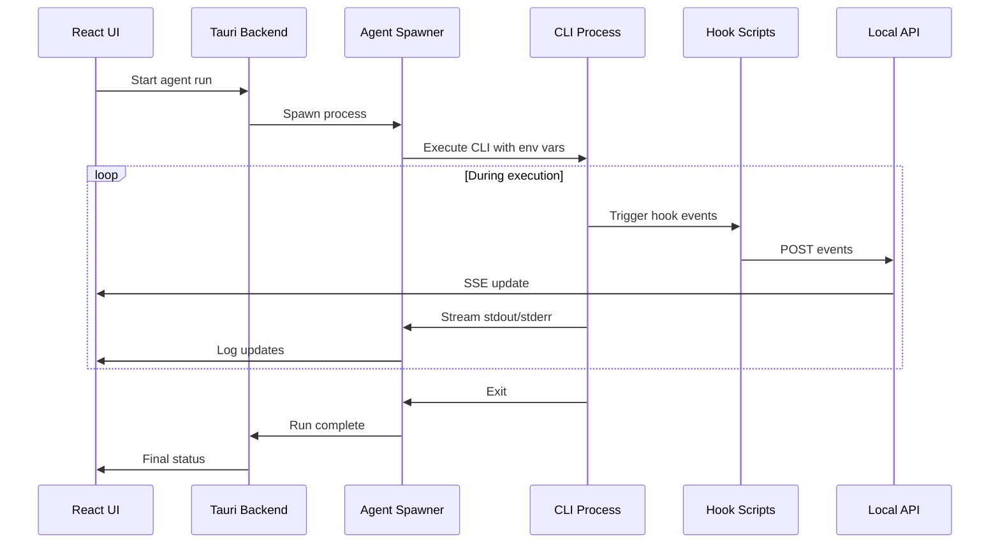

# 05 - Agent Orchestration

Implement process spawning and management for running Cursor and Claude Code agents from the desktop app.

## Overview

This guide implements:

- Spawning CLI processes for Cursor (`agent`) and Claude Code (`claude`)
- Environment variable injection for hook communication
- stdout/stderr capture and streaming to the UI
- Timeout handling and graceful cancellation
- Exit code interpretation and run finalization

## Prerequisites

- Completed [01-project-setup.md](./01-project-setup.md)
- Completed [02-database-design.md](./02-database-design.md)
- Completed [04-local-api.md](./04-local-api.md)
- Cursor CLI and/or Claude Code CLI installed and accessible

## Architecture



## Implementation Steps

### Step 1: Create Agent Module Structure

Set up the agents module:

```
src-tauri/src/agents/
├── mod.rs           # Module exports and common types
├── spawner.rs       # Process spawning logic
├── cursor.rs        # Cursor-specific adapter
├── claude.rs        # Claude Code-specific adapter
└── prompt.rs        # Prompt template generation
```

### Step 2: Define Common Types

Create `src-tauri/src/agents/mod.rs`:

```rust
pub mod spawner;
pub mod cursor;
pub mod claude;
pub mod prompt;

use serde::{Deserialize, Serialize};
use std::path::PathBuf;

/// Agent type enumeration
#[derive(Debug, Clone, Copy, PartialEq, Eq, Serialize, Deserialize)]
#[serde(rename_all = "lowercase")]
pub enum AgentKind {
    Cursor,
    Claude,
}

impl AgentKind {
    pub fn as_str(&self) -> &'static str {
        match self {
            AgentKind::Cursor => "cursor",
            AgentKind::Claude => "claude",
        }
    }
}

/// Configuration for running an agent
#[derive(Debug, Clone)]
pub struct AgentRunConfig {
    pub kind: AgentKind,
    pub ticket_id: String,
    pub run_id: String,
    pub repo_path: PathBuf,
    pub prompt: String,
    pub timeout_secs: Option<u64>,
    pub api_url: String,
    pub api_token: String,
}

/// Result of an agent run
#[derive(Debug, Clone, Serialize)]
#[serde(rename_all = "camelCase")]
pub struct AgentRunResult {
    pub run_id: String,
    pub exit_code: Option<i32>,
    pub status: RunOutcome,
    pub summary: Option<String>,
    pub duration_secs: f64,
}

/// Outcome of a run
#[derive(Debug, Clone, Copy, PartialEq, Eq, Serialize)]
#[serde(rename_all = "lowercase")]
pub enum RunOutcome {
    Success,
    Error,
    Timeout,
    Cancelled,
}

/// Callback for receiving log output
pub type LogCallback = Box<dyn Fn(LogLine) + Send + Sync>;

/// A line of log output
#[derive(Debug, Clone, Serialize)]
#[serde(rename_all = "camelCase")]
pub struct LogLine {
    pub stream: LogStream,
    pub content: String,
    pub timestamp: chrono::DateTime<chrono::Utc>,
}

#[derive(Debug, Clone, Copy, Serialize)]
#[serde(rename_all = "lowercase")]
pub enum LogStream {
    Stdout,
    Stderr,
}
```

### Step 3: Implement the Process Spawner

Create `src-tauri/src/agents/spawner.rs`:

```rust
use std::io::{BufRead, BufReader};
use std::process::{Child, Command, Stdio};
use std::sync::atomic::{AtomicBool, Ordering};
use std::sync::Arc;
use std::thread;
use std::time::{Duration, Instant};

use super::{AgentRunConfig, AgentRunResult, LogCallback, LogLine, LogStream, RunOutcome};

/// Errors that can occur during agent execution
#[derive(Debug, thiserror::Error)]
pub enum SpawnError {
    #[error("Failed to spawn process: {0}")]
    SpawnFailed(#[from] std::io::Error),
    
    #[error("Process timed out after {0} seconds")]
    Timeout(u64),
    
    #[error("Process was cancelled")]
    Cancelled,
    
    #[error("CLI not found: {0}")]
    CliNotFound(String),
}

/// Handle to a running agent process
pub struct AgentProcess {
    child: Child,
    cancelled: Arc<AtomicBool>,
    start_time: Instant,
}

impl AgentProcess {
    /// Start a new agent process
    pub fn spawn(
        command: &str,
        args: &[&str],
        working_dir: &std::path::Path,
        env_vars: &[(&str, &str)],
    ) -> Result<Self, SpawnError> {
        let mut cmd = Command::new(command);
        
        cmd.args(args)
            .current_dir(working_dir)
            .stdin(Stdio::null())
            .stdout(Stdio::piped())
            .stderr(Stdio::piped());

        // Add environment variables
        for (key, value) in env_vars {
            cmd.env(key, value);
        }

        let child = cmd.spawn().map_err(|e| {
            if e.kind() == std::io::ErrorKind::NotFound {
                SpawnError::CliNotFound(command.to_string())
            } else {
                SpawnError::SpawnFailed(e)
            }
        })?;

        Ok(Self {
            child,
            cancelled: Arc::new(AtomicBool::new(false)),
            start_time: Instant::now(),
        })
    }

    /// Get a handle to cancel this process
    pub fn cancel_handle(&self) -> CancelHandle {
        CancelHandle {
            cancelled: self.cancelled.clone(),
        }
    }

    /// Wait for the process to complete, streaming output
    pub fn wait_with_output(
        mut self,
        timeout: Option<Duration>,
        on_log: Option<LogCallback>,
    ) -> Result<(Option<i32>, RunOutcome), SpawnError> {
        let stdout = self.child.stdout.take();
        let stderr = self.child.stderr.take();
        let cancelled = self.cancelled.clone();

        // Spawn threads to read stdout/stderr
        let stdout_handle = stdout.map(|out| {
            let on_log = on_log.as_ref().map(|f| f as &LogCallback);
            thread::spawn(move || read_stream(out, LogStream::Stdout, on_log))
        });

        let stderr_handle = stderr.map(|err| {
            let on_log = on_log.as_ref().map(|f| f as &LogCallback);
            thread::spawn(move || read_stream(err, LogStream::Stderr, on_log))
        });

        // Wait for process with timeout
        let deadline = timeout.map(|t| Instant::now() + t);
        
        loop {
            // Check if cancelled
            if cancelled.load(Ordering::Relaxed) {
                let _ = self.child.kill();
                return Err(SpawnError::Cancelled);
            }

            // Check timeout
            if let Some(deadline) = deadline {
                if Instant::now() >= deadline {
                    let _ = self.child.kill();
                    return Err(SpawnError::Timeout(
                        timeout.unwrap().as_secs()
                    ));
                }
            }

            // Try to get exit status
            match self.child.try_wait() {
                Ok(Some(status)) => {
                    // Process exited
                    if let Some(h) = stdout_handle {
                        let _ = h.join();
                    }
                    if let Some(h) = stderr_handle {
                        let _ = h.join();
                    }

                    let exit_code = status.code();
                    let outcome = if exit_code == Some(0) {
                        RunOutcome::Success
                    } else {
                        RunOutcome::Error
                    };

                    return Ok((exit_code, outcome));
                }
                Ok(None) => {
                    // Still running
                    thread::sleep(Duration::from_millis(100));
                }
                Err(e) => {
                    return Err(SpawnError::SpawnFailed(e));
                }
            }
        }
    }

    /// Get elapsed time
    pub fn elapsed(&self) -> Duration {
        self.start_time.elapsed()
    }
}

/// Handle to cancel a running process
#[derive(Clone)]
pub struct CancelHandle {
    cancelled: Arc<AtomicBool>,
}

impl CancelHandle {
    /// Signal the process to cancel
    pub fn cancel(&self) {
        self.cancelled.store(true, Ordering::Relaxed);
    }
}

/// Read a stream line by line, calling the callback for each line
fn read_stream<R: std::io::Read>(
    reader: R,
    stream: LogStream,
    on_log: Option<&LogCallback>,
) {
    let reader = BufReader::new(reader);
    
    for line in reader.lines() {
        match line {
            Ok(content) => {
                if let Some(callback) = on_log {
                    callback(LogLine {
                        stream,
                        content,
                        timestamp: chrono::Utc::now(),
                    });
                }
            }
            Err(_) => break,
        }
    }
}

/// Run an agent with the given configuration
pub fn run_agent(
    config: AgentRunConfig,
    on_log: Option<LogCallback>,
) -> Result<AgentRunResult, SpawnError> {
    let start_time = Instant::now();

    // Build command based on agent type
    let (command, args) = match config.kind {
        super::AgentKind::Cursor => {
            super::cursor::build_command(&config)
        }
        super::AgentKind::Claude => {
            super::claude::build_command(&config)
        }
    };

    // Build environment variables
    let env_vars = build_env_vars(&config);
    let env_refs: Vec<(&str, &str)> = env_vars
        .iter()
        .map(|(k, v)| (k.as_str(), v.as_str()))
        .collect();

    // Spawn process
    let process = AgentProcess::spawn(
        &command,
        &args.iter().map(|s| s.as_str()).collect::<Vec<_>>(),
        &config.repo_path,
        &env_refs,
    )?;

    // Wait for completion
    let timeout = config.timeout_secs.map(Duration::from_secs);
    let (exit_code, outcome) = process.wait_with_output(timeout, on_log)?;

    let duration_secs = start_time.elapsed().as_secs_f64();

    Ok(AgentRunResult {
        run_id: config.run_id,
        exit_code,
        status: outcome,
        summary: None, // Will be filled in by hooks
        duration_secs,
    })
}

/// Build environment variables for the agent process
fn build_env_vars(config: &AgentRunConfig) -> Vec<(String, String)> {
    vec![
        ("AGENT_KANBAN_TICKET_ID".to_string(), config.ticket_id.clone()),
        ("AGENT_KANBAN_RUN_ID".to_string(), config.run_id.clone()),
        ("AGENT_KANBAN_API_URL".to_string(), config.api_url.clone()),
        ("AGENT_KANBAN_API_TOKEN".to_string(), config.api_token.clone()),
        ("AGENT_KANBAN_REPO_PATH".to_string(), config.repo_path.to_string_lossy().to_string()),
    ]
}
```

### Step 4: Implement Cursor Adapter

Create `src-tauri/src/agents/cursor.rs`:

```rust
use super::AgentRunConfig;

/// Build the command and arguments for Cursor agent
pub fn build_command(config: &AgentRunConfig) -> (String, Vec<String>) {
    // The Cursor CLI command
    // Note: The exact command may vary based on Cursor version and platform
    let command = "cursor".to_string();
    
    // Build arguments
    // Based on Cursor CLI documentation: cursor agent -p "prompt"
    let args = vec![
        "agent".to_string(),
        "-p".to_string(),
        config.prompt.clone(),
        "--output-format".to_string(),
        "text".to_string(),
    ];

    (command, args)
}

/// Cursor-specific settings
#[derive(Debug, Clone)]
pub struct CursorSettings {
    /// Path to cursor executable (if not in PATH)
    pub executable_path: Option<String>,
    
    /// Additional CLI flags
    pub extra_flags: Vec<String>,
    
    /// Whether to use yolo mode (no confirmations)
    pub yolo_mode: bool,
}

impl Default for CursorSettings {
    fn default() -> Self {
        Self {
            executable_path: None,
            extra_flags: vec![],
            yolo_mode: false,
        }
    }
}

/// Build command with custom settings
pub fn build_command_with_settings(
    config: &AgentRunConfig,
    settings: &CursorSettings,
) -> (String, Vec<String>) {
    let command = settings
        .executable_path
        .clone()
        .unwrap_or_else(|| "cursor".to_string());

    let mut args = vec![
        "agent".to_string(),
        "-p".to_string(),
        config.prompt.clone(),
    ];

    // Add output format
    args.push("--output-format".to_string());
    args.push("text".to_string());

    // Add yolo mode if enabled
    if settings.yolo_mode {
        args.push("--yolo".to_string());
    }

    // Add extra flags
    args.extend(settings.extra_flags.clone());

    (command, args)
}

/// Generate the hooks.json content for Cursor
pub fn generate_hooks_config(
    api_url: &str,
    hook_script_path: &str,
) -> serde_json::Value {
    serde_json::json!({
        "hooks": {
            "beforeShellExecution": {
                "command": hook_script_path,
                "args": ["beforeShellExecution"],
                "env": {
                    "AGENT_KANBAN_API_URL": api_url
                }
            },
            "afterFileEdit": {
                "command": hook_script_path,
                "args": ["afterFileEdit"],
                "env": {
                    "AGENT_KANBAN_API_URL": api_url
                }
            },
            "stop": {
                "command": hook_script_path,
                "args": ["stop"],
                "env": {
                    "AGENT_KANBAN_API_URL": api_url
                }
            }
        }
    })
}
```

### Step 5: Implement Claude Code Adapter

Create `src-tauri/src/agents/claude.rs`:

```rust
use super::AgentRunConfig;

/// Build the command and arguments for Claude Code
pub fn build_command(config: &AgentRunConfig) -> (String, Vec<String>) {
    let command = "claude".to_string();

    // Build the prompt with system instructions
    let args = vec![
        "-p".to_string(),
        config.prompt.clone(),
    ];

    (command, args)
}

/// Claude-specific settings
#[derive(Debug, Clone)]
pub struct ClaudeSettings {
    /// Path to claude executable (if not in PATH)
    pub executable_path: Option<String>,
    
    /// System prompt to append
    pub system_prompt: Option<String>,
    
    /// Path to system prompt file
    pub system_prompt_file: Option<String>,
    
    /// Additional CLI flags
    pub extra_flags: Vec<String>,
    
    /// Permission mode (default, ask, deny)
    pub permission_mode: Option<String>,
}

impl Default for ClaudeSettings {
    fn default() -> Self {
        Self {
            executable_path: None,
            system_prompt: None,
            system_prompt_file: None,
            extra_flags: vec![],
            permission_mode: None,
        }
    }
}

/// Build command with custom settings
pub fn build_command_with_settings(
    config: &AgentRunConfig,
    settings: &ClaudeSettings,
) -> (String, Vec<String>) {
    let command = settings
        .executable_path
        .clone()
        .unwrap_or_else(|| "claude".to_string());

    let mut args = vec![];

    // Add system prompt if provided
    if let Some(ref prompt) = settings.system_prompt {
        args.push("--append-system-prompt".to_string());
        args.push(prompt.clone());
    } else if let Some(ref file) = settings.system_prompt_file {
        args.push("--system-prompt-file".to_string());
        args.push(file.clone());
    }

    // Add permission mode
    if let Some(ref mode) = settings.permission_mode {
        args.push("--permission-mode".to_string());
        args.push(mode.clone());
    }

    // Add the prompt
    args.push("-p".to_string());
    args.push(config.prompt.clone());

    // Add extra flags
    args.extend(settings.extra_flags.clone());

    (command, args)
}

/// Generate the settings.json hooks content for Claude Code
pub fn generate_hooks_config(
    api_url: &str,
    hook_script_path: &str,
) -> serde_json::Value {
    serde_json::json!({
        "hooks": {
            "UserPromptSubmit": [{
                "matcher": "",
                "hooks": [{
                    "type": "command",
                    "command": format!("{} UserPromptSubmit", hook_script_path)
                }]
            }],
            "PreToolUse": [{
                "matcher": ".*",
                "hooks": [{
                    "type": "command",
                    "command": format!("{} PreToolUse", hook_script_path)
                }]
            }],
            "PostToolUse": [{
                "matcher": ".*",
                "hooks": [{
                    "type": "command",
                    "command": format!("{} PostToolUse", hook_script_path)
                }]
            }],
            "Stop": [{
                "matcher": "",
                "hooks": [{
                    "type": "command",
                    "command": format!("{} Stop", hook_script_path)
                }]
            }]
        }
    })
}
```

### Step 6: Implement Prompt Templates

Create `src-tauri/src/agents/prompt.rs`:

```rust
use crate::db::Ticket;

/// Generate a prompt for the agent based on a ticket
pub fn generate_ticket_prompt(ticket: &Ticket) -> String {
    let mut prompt = String::new();

    // Title and description
    prompt.push_str(&format!("# Task: {}\n\n", ticket.title));
    
    if !ticket.description_md.is_empty() {
        prompt.push_str("## Description\n\n");
        prompt.push_str(&ticket.description_md);
        prompt.push_str("\n\n");
    }

    // Priority context
    let priority_context = match ticket.priority {
        crate::db::Priority::Urgent => "This is an URGENT task. Please prioritize speed while maintaining quality.",
        crate::db::Priority::High => "This is a high-priority task.",
        crate::db::Priority::Medium => "",
        crate::db::Priority::Low => "This is a low-priority task. Take time to ensure quality.",
    };
    
    if !priority_context.is_empty() {
        prompt.push_str(&format!("{}\n\n", priority_context));
    }

    // Labels as context
    if !ticket.labels.is_empty() {
        prompt.push_str("## Labels\n\n");
        for label in &ticket.labels {
            prompt.push_str(&format!("- {}\n", label));
        }
        prompt.push_str("\n");
    }

    // Working directory info
    if let Some(ref repo_path) = ticket.repo_path {
        prompt.push_str(&format!("## Working Directory\n\n{}\n\n", repo_path));
    }

    // Standard instructions
    prompt.push_str("## Instructions\n\n");
    prompt.push_str("1. Carefully read and understand the task requirements\n");
    prompt.push_str("2. Implement the requested changes\n");
    prompt.push_str("3. Test your changes where appropriate\n");
    prompt.push_str("4. Commit your changes with a descriptive message\n");

    prompt
}

/// Generate a prompt with custom template
pub fn generate_custom_prompt(
    ticket: &Ticket,
    template: &str,
) -> String {
    let mut result = template.to_string();

    // Replace placeholders
    result = result.replace("{{title}}", &ticket.title);
    result = result.replace("{{description}}", &ticket.description_md);
    result = result.replace("{{priority}}", ticket.priority.as_str());
    result = result.replace("{{labels}}", &ticket.labels.join(", "));
    result = result.replace(
        "{{repo_path}}",
        ticket.repo_path.as_deref().unwrap_or(""),
    );

    result
}

/// System prompt for agent behavior
pub fn generate_system_prompt(api_url: &str, ticket_id: &str, run_id: &str) -> String {
    format!(
        r#"You are an AI coding agent working on a task from a Kanban board.

## Task Context
- Ticket ID: {ticket_id}
- Run ID: {run_id}
- API URL: {api_url}

## Guidelines
1. Focus on completing the task as described
2. Make incremental changes and test frequently
3. Write clear commit messages
4. If you encounter blockers, document them clearly

## Communication
Your actions are being tracked via hooks. The board will be automatically updated as you work.
"#
    )
}
```

### Step 7: Create Tauri Commands for Agent Runs

Update `src-tauri/src/commands/mod.rs` to add agent commands:

```rust
use std::sync::Arc;
use tauri::{State, Window};
use crate::db::{Database, AgentType};
use crate::agents::{self, AgentKind, AgentRunConfig, LogLine};

// ... existing commands ...

#[tauri::command]
pub async fn start_agent_run(
    window: Window,
    ticket_id: String,
    agent_type: String,
    repo_path: String,
    db: State<'_, Arc<Database>>,
) -> Result<String, String> {
    // Get ticket details
    let ticket = db.get_boards()
        .map_err(|e| e.to_string())?
        .into_iter()
        .find_map(|board| {
            db.get_tickets(&board.id, None)
                .ok()
                .and_then(|tickets| tickets.into_iter().find(|t| t.id == ticket_id))
        })
        .ok_or("Ticket not found")?;

    // Create run record
    let db_agent_type = match agent_type.as_str() {
        "cursor" => crate::db::AgentType::Cursor,
        "claude" => crate::db::AgentType::Claude,
        _ => return Err("Invalid agent type".to_string()),
    };

    let run = db.create_run(&crate::db::CreateRun {
        ticket_id: ticket_id.clone(),
        agent_type: db_agent_type,
        repo_path: repo_path.clone(),
    }).map_err(|e| e.to_string())?;

    let run_id = run.id.clone();

    // Get API config from app data dir
    // In production, these would come from app state
    let api_url = "http://127.0.0.1:7432".to_string();
    let api_token = "token".to_string(); // Would read from file

    // Generate prompt
    let prompt = agents::prompt::generate_ticket_prompt(&ticket);

    // Build config
    let config = AgentRunConfig {
        kind: match agent_type.as_str() {
            "cursor" => AgentKind::Cursor,
            _ => AgentKind::Claude,
        },
        ticket_id,
        run_id: run_id.clone(),
        repo_path: std::path::PathBuf::from(&repo_path),
        prompt,
        timeout_secs: Some(3600), // 1 hour default
        api_url,
        api_token,
    };

    // Clone what we need for the async task
    let window_clone = window.clone();
    let db_clone = db.inner().clone();
    let run_id_for_task = run_id.clone();

    // Spawn agent in background
    tauri::async_runtime::spawn(async move {
        // Update status to running
        let _ = db_clone.update_run_status(&run_id_for_task, crate::db::RunStatus::Running, None, None);

        // Create log callback that emits to frontend
        let window_for_logs = window_clone.clone();
        let run_id_for_logs = run_id_for_task.clone();
        let on_log = Box::new(move |log: LogLine| {
            let _ = window_for_logs.emit("agent-log", serde_json::json!({
                "runId": run_id_for_logs,
                "stream": log.stream,
                "content": log.content,
                "timestamp": log.timestamp,
            }));
        });

        // Run the agent
        match agents::spawner::run_agent(config, Some(on_log)) {
            Ok(result) => {
                let status = match result.status {
                    agents::RunOutcome::Success => crate::db::RunStatus::Finished,
                    agents::RunOutcome::Error => crate::db::RunStatus::Error,
                    agents::RunOutcome::Timeout => crate::db::RunStatus::Error,
                    agents::RunOutcome::Cancelled => crate::db::RunStatus::Aborted,
                };

                let _ = db_clone.update_run_status(
                    &result.run_id,
                    status,
                    result.exit_code,
                    result.summary.as_deref(),
                );

                let _ = window_clone.emit("agent-complete", serde_json::json!({
                    "runId": result.run_id,
                    "status": result.status,
                    "exitCode": result.exit_code,
                    "durationSecs": result.duration_secs,
                }));
            }
            Err(e) => {
                let _ = db_clone.update_run_status(
                    &run_id_for_task,
                    crate::db::RunStatus::Error,
                    None,
                    Some(&e.to_string()),
                );

                let _ = window_clone.emit("agent-error", serde_json::json!({
                    "runId": run_id_for_task,
                    "error": e.to_string(),
                }));
            }
        }
    });

    Ok(run_id)
}

#[tauri::command]
pub async fn cancel_agent_run(
    run_id: String,
    db: State<'_, Arc<Database>>,
) -> Result<(), String> {
    // TODO: Store cancel handles and use them here
    // For now, just update the status
    db.update_run_status(&run_id, crate::db::RunStatus::Aborted, None, Some("Cancelled by user"))
        .map_err(|e| e.to_string())
}

#[tauri::command]
pub async fn get_agent_runs(
    ticket_id: String,
    db: State<'_, Arc<Database>>,
) -> Result<Vec<crate::db::AgentRun>, String> {
    db.get_runs(&ticket_id).map_err(|e| e.to_string())
}
```

### Step 8: Create Frontend Agent Controls

Create `src/components/board/AgentControls.tsx`:

```typescript
import { useState } from 'react';
import { invoke } from '@tauri-apps/api/tauri';
import { listen } from '@tauri-apps/api/event';
import { useEffect } from 'react';
import type { Ticket, AgentRun } from '../../types';

interface AgentControlsProps {
  ticket: Ticket;
  onRunStarted?: (runId: string) => void;
}

export function AgentControls({ ticket, onRunStarted }: AgentControlsProps) {
  const [isRunning, setIsRunning] = useState(false);
  const [currentRunId, setCurrentRunId] = useState<string | null>(null);
  const [logs, setLogs] = useState<string[]>([]);

  useEffect(() => {
    // Listen for agent events
    const unlistenLog = listen('agent-log', (event: any) => {
      if (event.payload.runId === currentRunId) {
        setLogs(prev => [...prev, event.payload.content]);
      }
    });

    const unlistenComplete = listen('agent-complete', (event: any) => {
      if (event.payload.runId === currentRunId) {
        setIsRunning(false);
        setCurrentRunId(null);
      }
    });

    const unlistenError = listen('agent-error', (event: any) => {
      if (event.payload.runId === currentRunId) {
        setIsRunning(false);
        setCurrentRunId(null);
        console.error('Agent error:', event.payload.error);
      }
    });

    return () => {
      unlistenLog.then(f => f());
      unlistenComplete.then(f => f());
      unlistenError.then(f => f());
    };
  }, [currentRunId]);

  const handleRunAgent = async (agentType: 'cursor' | 'claude') => {
    if (!ticket.repoPath) {
      alert('Please set a repository path for this ticket first.');
      return;
    }

    setIsRunning(true);
    setLogs([]);

    try {
      const runId = await invoke<string>('start_agent_run', {
        ticketId: ticket.id,
        agentType,
        repoPath: ticket.repoPath,
      });
      
      setCurrentRunId(runId);
      onRunStarted?.(runId);
    } catch (error) {
      console.error('Failed to start agent:', error);
      setIsRunning(false);
    }
  };

  const handleCancel = async () => {
    if (!currentRunId) return;

    try {
      await invoke('cancel_agent_run', { runId: currentRunId });
      setIsRunning(false);
      setCurrentRunId(null);
    } catch (error) {
      console.error('Failed to cancel agent:', error);
    }
  };

  return (
    <div className="space-y-4">
      {/* Run buttons */}
      <div className="flex gap-2">
        <button
          onClick={() => handleRunAgent('cursor')}
          disabled={isRunning || !ticket.repoPath}
          className="px-4 py-2 bg-purple-600 text-white rounded hover:bg-purple-700 disabled:opacity-50 disabled:cursor-not-allowed"
        >
          {isRunning ? 'Running...' : 'Run with Cursor'}
        </button>
        
        <button
          onClick={() => handleRunAgent('claude')}
          disabled={isRunning || !ticket.repoPath}
          className="px-4 py-2 bg-green-600 text-white rounded hover:bg-green-700 disabled:opacity-50 disabled:cursor-not-allowed"
        >
          {isRunning ? 'Running...' : 'Run with Claude'}
        </button>

        {isRunning && (
          <button
            onClick={handleCancel}
            className="px-4 py-2 bg-red-600 text-white rounded hover:bg-red-700"
          >
            Cancel
          </button>
        )}
      </div>

      {/* Log output */}
      {logs.length > 0 && (
        <div className="mt-4">
          <h4 className="text-sm font-medium text-gray-400 mb-2">Output</h4>
          <div className="bg-gray-900 rounded p-3 max-h-60 overflow-y-auto font-mono text-xs">
            {logs.map((log, i) => (
              <div key={i} className="text-gray-300">{log}</div>
            ))}
          </div>
        </div>
      )}
    </div>
  );
}
```

## Testing

### Manual Testing

1. Ensure Cursor CLI or Claude Code CLI is installed:

```bash
cursor --version
claude --version
```

2. Create a ticket with a repo path set

3. Click "Run with Cursor" or "Run with Claude"

4. Observe:
   - Run ID is returned
   - Logs stream to the UI
   - Status updates on completion/error

### Mock Agent for Testing

Create a mock script for testing without real agents:

```bash
#!/bin/bash
# mock-agent.sh

echo "Starting mock agent..."
echo "Ticket ID: $AGENT_KANBAN_TICKET_ID"
echo "Run ID: $AGENT_KANBAN_RUN_ID"

for i in {1..5}; do
    echo "Working... step $i"
    sleep 1
done

echo "Mock agent complete!"
exit 0
```

## Troubleshooting

### "CLI not found" error

1. Verify the CLI is in your PATH:
   ```bash
   which cursor
   which claude
   ```

2. If installed but not in PATH, set the executable path in settings

### Agent runs but nothing happens

1. Check that hooks are configured (see guides 06 and 07)
2. Verify the API is running and accessible
3. Check logs for any errors

### Process doesn't terminate

1. Check the timeout setting
2. Use the cancel button
3. As last resort, find and kill the process manually

## Next Steps

With agent orchestration complete, proceed to:

- **[06-cursor-integration.md](./06-cursor-integration.md)**: Set up Cursor hooks for tracking
