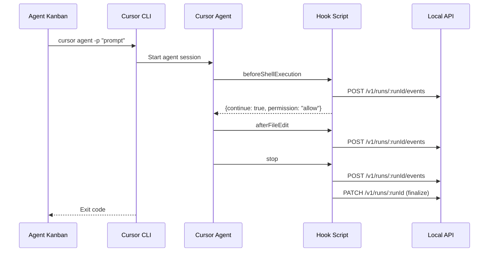

# 06 - Cursor Integration

Implement Cursor agent hooks and CLI adapter for tracking agent activities and controlling behavior.

## Overview

This guide covers:

- Cursor lifecycle hooks: `beforeShellExecution`, `afterFileEdit`, `stop`
- Hook script implementation that posts events to the local API
- `.cursor/hooks.json` configuration generation
- CLI adapter for spawning Cursor agent runs
- Handling beta limitations (informational-only events)

## Prerequisites

- Completed [04-local-api.md](./04-local-api.md)
- Completed [05-agent-orchestration.md](./05-agent-orchestration.md)
- Cursor installed with CLI access (`cursor` command available)

## Architecture



## Cursor Hooks Overview

Cursor supports lifecycle hooks configured via `hooks.json`:

| Hook | Description | Can Block? |
|------|-------------|------------|
| `beforeSubmitPrompt` | Before user submits a prompt | Informational only |
| `beforeShellExecution` | Before running a shell command | Yes - can deny |
| `beforeMCPExecution` | Before MCP tool call | Yes - can deny |
| `beforeReadFile` | Before reading a file | Yes - can deny |
| `afterFileEdit` | After editing a file | Informational only |
| `stop` | When agent stops | Informational only |

## Implementation Steps

### Step 1: Create Hook Script

Create `scripts/cursor-hook.js`:

```javascript
#!/usr/bin/env node
/**
 * Cursor hook script for Agent Kanban
 * 
 * This script is called by Cursor at various lifecycle events.
 * It reads JSON from stdin, processes the event, and writes JSON to stdout.
 */

const https = require('https');
const http = require('http');
const fs = require('fs');
const path = require('path');

// Get environment variables
const TICKET_ID = process.env.AGENT_KANBAN_TICKET_ID;
const RUN_ID = process.env.AGENT_KANBAN_RUN_ID;
const API_URL = process.env.AGENT_KANBAN_API_URL || 'http://127.0.0.1:7432';
const API_TOKEN = process.env.AGENT_KANBAN_API_TOKEN;

// Get the hook event type from args
const hookEvent = process.argv[2];

// Read stdin
let inputData = '';
process.stdin.setEncoding('utf8');

process.stdin.on('data', (chunk) => {
  inputData += chunk;
});

process.stdin.on('end', async () => {
  try {
    const input = inputData ? JSON.parse(inputData) : {};
    const result = await handleHook(hookEvent, input);
    
    // Write result to stdout
    console.log(JSON.stringify(result));
    process.exit(0);
  } catch (error) {
    console.error('Hook error:', error.message);
    // Return continue: true to not block on errors
    console.log(JSON.stringify({ continue: true }));
    process.exit(0);
  }
});

/**
 * Handle a hook event
 */
async function handleHook(event, input) {
  // Post event to API
  await postEvent(event, input);

  // Return appropriate response based on event type
  switch (event) {
    case 'beforeShellExecution':
      return handleBeforeShellExecution(input);
    
    case 'beforeReadFile':
      return handleBeforeReadFile(input);
    
    case 'beforeMCPExecution':
      return handleBeforeMCPExecution(input);
    
    case 'afterFileEdit':
      return handleAfterFileEdit(input);
    
    case 'stop':
      return await handleStop(input);
    
    default:
      return { continue: true };
  }
}

/**
 * Handle beforeShellExecution hook
 * Can block dangerous commands
 */
function handleBeforeShellExecution(input) {
  const command = input.command || '';
  
  // Check for dangerous commands (optional blocking)
  const dangerousPatterns = [
    /rm\s+-rf\s+\//,           // rm -rf /
    /rm\s+-rf\s+~\//,          // rm -rf ~/
    /git\s+push\s+.*--force/,  // force push
    /:\(\)\{\s*:\|:&\s*\};:/,  // fork bomb
  ];

  for (const pattern of dangerousPatterns) {
    if (pattern.test(command)) {
      return {
        continue: true,
        permission: 'deny',
        userMessage: `Blocked dangerous command: ${command}`,
        agentMessage: 'This command was blocked for safety. Please use a safer alternative.',
      };
    }
  }

  // Allow the command
  return {
    continue: true,
    permission: 'allow',
  };
}

/**
 * Handle beforeReadFile hook
 * Can block reading sensitive files
 */
function handleBeforeReadFile(input) {
  const filePath = input.path || '';
  
  // Check for sensitive files
  const sensitivePatterns = [
    /\.env$/,
    /\.env\.local$/,
    /credentials\.json$/,
    /secrets\.(json|yaml|yml)$/,
    /\.ssh\//,
    /\.aws\//,
  ];

  for (const pattern of sensitivePatterns) {
    if (pattern.test(filePath)) {
      // Log but allow (or deny based on settings)
      // For now, just log
      console.error(`Warning: Reading sensitive file: ${filePath}`);
    }
  }

  return { continue: true };
}

/**
 * Handle beforeMCPExecution hook
 */
function handleBeforeMCPExecution(input) {
  // Log MCP calls, allow by default
  return { continue: true };
}

/**
 * Handle afterFileEdit hook
 */
function handleAfterFileEdit(input) {
  // This is informational only - Cursor doesn't read our response
  // But we still post the event to the API
  return { continue: true };
}

/**
 * Handle stop hook
 * Finalize the run
 */
async function handleStop(input) {
  const status = input.status || 'completed';
  const exitCode = status === 'completed' ? 0 : 1;
  
  // Update run status
  if (RUN_ID) {
    try {
      await updateRunStatus({
        status: status === 'completed' ? 'finished' : 'error',
        exitCode,
        summaryMd: generateSummary(status),
      });
    } catch (error) {
      console.error('Failed to update run status:', error.message);
    }
  }

  return { continue: true };
}

/**
 * Post an event to the API
 */
async function postEvent(eventType, payload) {
  if (!RUN_ID || !API_TOKEN) {
    console.error('Missing RUN_ID or API_TOKEN');
    return;
  }

  const normalizedEvent = {
    eventType: normalizeEventType(eventType),
    payload: {
      raw: JSON.stringify(payload),
      structured: extractStructuredData(eventType, payload),
    },
    timestamp: new Date().toISOString(),
  };

  const url = `${API_URL}/v1/runs/${RUN_ID}/events`;
  
  await httpRequest('POST', url, normalizedEvent);
}

/**
 * Update run status
 */
async function updateRunStatus(data) {
  if (!RUN_ID || !API_TOKEN) return;

  const url = `${API_URL}/v1/runs/${RUN_ID}`;
  await httpRequest('PATCH', url, data);
}

/**
 * Normalize Cursor event type to canonical type
 */
function normalizeEventType(cursorEvent) {
  const mapping = {
    'beforeShellExecution': 'command_requested',
    'afterFileEdit': 'file_edited',
    'beforeReadFile': 'file_read',
    'beforeMCPExecution': 'command_requested',
    'stop': 'run_stopped',
  };
  return mapping[cursorEvent] || cursorEvent;
}

/**
 * Extract structured data from event payload
 */
function extractStructuredData(eventType, payload) {
  switch (eventType) {
    case 'beforeShellExecution':
      return {
        command: payload.command,
        workingDirectory: payload.cwd,
      };
    
    case 'afterFileEdit':
      return {
        filePath: payload.path,
        // Note: Cursor may provide old/new content
        hasChanges: true,
      };
    
    case 'beforeReadFile':
      return {
        filePath: payload.path,
      };
    
    case 'stop':
      return {
        status: payload.status,
        reason: payload.reason,
      };
    
    default:
      return payload;
  }
}

/**
 * Generate a summary for the stop event
 */
function generateSummary(status) {
  if (status === 'completed') {
    return 'Agent completed successfully.';
  } else if (status === 'error') {
    return 'Agent encountered an error and stopped.';
  } else if (status === 'aborted') {
    return 'Agent was aborted by user.';
  }
  return `Agent stopped with status: ${status}`;
}

/**
 * Make an HTTP request
 */
function httpRequest(method, url, data) {
  return new Promise((resolve, reject) => {
    const urlObj = new URL(url);
    const isHttps = urlObj.protocol === 'https:';
    const lib = isHttps ? https : http;

    const options = {
      hostname: urlObj.hostname,
      port: urlObj.port || (isHttps ? 443 : 80),
      path: urlObj.pathname + urlObj.search,
      method,
      headers: {
        'Content-Type': 'application/json',
        'X-AgentKanban-Token': API_TOKEN,
      },
    };

    const req = lib.request(options, (res) => {
      let body = '';
      res.on('data', chunk => body += chunk);
      res.on('end', () => {
        if (res.statusCode >= 200 && res.statusCode < 300) {
          resolve(body);
        } else {
          reject(new Error(`HTTP ${res.statusCode}: ${body}`));
        }
      });
    });

    req.on('error', reject);
    req.setTimeout(5000, () => {
      req.destroy();
      reject(new Error('Request timeout'));
    });

    if (data) {
      req.write(JSON.stringify(data));
    }
    req.end();
  });
}
```

### Step 2: Create Hooks Configuration Generator

Add to `src-tauri/src/agents/cursor.rs`:

```rust
use std::path::PathBuf;
use serde_json::json;

/// Generate hooks.json content for a project
pub fn generate_hooks_json(hook_script_path: &str) -> serde_json::Value {
    json!({
        "hooks": {
            "beforeShellExecution": {
                "command": hook_script_path,
                "args": ["beforeShellExecution"]
            },
            "beforeReadFile": {
                "command": hook_script_path,
                "args": ["beforeReadFile"]
            },
            "beforeMCPExecution": {
                "command": hook_script_path,
                "args": ["beforeMCPExecution"]
            },
            "afterFileEdit": {
                "command": hook_script_path,
                "args": ["afterFileEdit"]
            },
            "stop": {
                "command": hook_script_path,
                "args": ["stop"]
            }
        }
    })
}

/// Install hooks for a repository
pub fn install_hooks(repo_path: &PathBuf, hook_script_path: &str) -> std::io::Result<()> {
    let cursor_dir = repo_path.join(".cursor");
    std::fs::create_dir_all(&cursor_dir)?;

    let hooks_json = generate_hooks_json(hook_script_path);
    let hooks_path = cursor_dir.join("hooks.json");
    
    std::fs::write(
        hooks_path,
        serde_json::to_string_pretty(&hooks_json).unwrap(),
    )?;

    Ok(())
}

/// Get the global hooks path
pub fn global_hooks_path() -> Option<PathBuf> {
    dirs::home_dir().map(|h| h.join(".cursor").join("hooks.json"))
}

/// Install hooks globally (applies to all projects)
pub fn install_global_hooks(hook_script_path: &str) -> std::io::Result<()> {
    if let Some(hooks_path) = global_hooks_path() {
        if let Some(parent) = hooks_path.parent() {
            std::fs::create_dir_all(parent)?;
        }
        
        let hooks_json = generate_hooks_json(hook_script_path);
        std::fs::write(
            hooks_path,
            serde_json::to_string_pretty(&hooks_json).unwrap(),
        )?;
    }
    Ok(())
}
```

### Step 3: Create Hook Installation UI

Create `src/components/settings/CursorSettings.tsx`:

```typescript
import { useState, useEffect } from 'react';
import { invoke } from '@tauri-apps/api/tauri';
import { appDataDir, join } from '@tauri-apps/api/path';

export function CursorSettings() {
  const [hookScriptPath, setHookScriptPath] = useState('');
  const [hooksInstalled, setHooksInstalled] = useState(false);
  const [installLocation, setInstallLocation] = useState<'global' | 'project'>('global');
  const [projectPath, setProjectPath] = useState('');

  useEffect(() => {
    // Get the hook script path
    async function getHookPath() {
      const dataDir = await appDataDir();
      const path = await join(dataDir, 'scripts', 'cursor-hook.js');
      setHookScriptPath(path);
    }
    getHookPath();
  }, []);

  const handleInstallHooks = async () => {
    try {
      if (installLocation === 'global') {
        await invoke('install_cursor_hooks_global', { hookScriptPath });
      } else {
        await invoke('install_cursor_hooks_project', { 
          hookScriptPath,
          projectPath,
        });
      }
      setHooksInstalled(true);
      alert('Hooks installed successfully!');
    } catch (error) {
      console.error('Failed to install hooks:', error);
      alert(`Failed to install hooks: ${error}`);
    }
  };

  const handleCopyConfig = () => {
    const config = {
      hooks: {
        beforeShellExecution: {
          command: hookScriptPath,
          args: ['beforeShellExecution']
        },
        afterFileEdit: {
          command: hookScriptPath,
          args: ['afterFileEdit']
        },
        stop: {
          command: hookScriptPath,
          args: ['stop']
        }
      }
    };
    
    navigator.clipboard.writeText(JSON.stringify(config, null, 2));
    alert('Configuration copied to clipboard!');
  };

  return (
    <div className="p-6 space-y-6">
      <h2 className="text-xl font-semibold">Cursor Integration</h2>
      
      <div className="bg-gray-800 rounded-lg p-4 space-y-4">
        <h3 className="font-medium">Hook Script</h3>
        <p className="text-sm text-gray-400">
          The hook script intercepts Cursor agent events and sends them to Agent Kanban.
        </p>
        
        <div className="flex items-center gap-2">
          <input
            type="text"
            value={hookScriptPath}
            readOnly
            className="flex-1 px-3 py-2 bg-gray-700 rounded text-sm"
          />
          <button
            onClick={() => navigator.clipboard.writeText(hookScriptPath)}
            className="px-3 py-2 bg-gray-600 rounded hover:bg-gray-500"
          >
            Copy
          </button>
        </div>
      </div>

      <div className="bg-gray-800 rounded-lg p-4 space-y-4">
        <h3 className="font-medium">Install Hooks</h3>
        
        <div className="flex gap-4">
          <label className="flex items-center gap-2">
            <input
              type="radio"
              name="location"
              checked={installLocation === 'global'}
              onChange={() => setInstallLocation('global')}
            />
            <span>Global (all projects)</span>
          </label>
          
          <label className="flex items-center gap-2">
            <input
              type="radio"
              name="location"
              checked={installLocation === 'project'}
              onChange={() => setInstallLocation('project')}
            />
            <span>Project-specific</span>
          </label>
        </div>

        {installLocation === 'project' && (
          <input
            type="text"
            placeholder="/path/to/project"
            value={projectPath}
            onChange={e => setProjectPath(e.target.value)}
            className="w-full px-3 py-2 bg-gray-700 rounded"
          />
        )}

        <div className="flex gap-2">
          <button
            onClick={handleInstallHooks}
            className="px-4 py-2 bg-purple-600 text-white rounded hover:bg-purple-700"
          >
            Install Hooks
          </button>
          
          <button
            onClick={handleCopyConfig}
            className="px-4 py-2 bg-gray-600 text-white rounded hover:bg-gray-500"
          >
            Copy Config
          </button>
        </div>
      </div>

      <div className="bg-gray-800 rounded-lg p-4 space-y-4">
        <h3 className="font-medium">Manual Setup</h3>
        <p className="text-sm text-gray-400">
          If automatic installation doesn't work, manually create/edit:
        </p>
        <ul className="text-sm text-gray-400 list-disc list-inside space-y-1">
          <li>Global: <code>~/.cursor/hooks.json</code></li>
          <li>Project: <code>.cursor/hooks.json</code> in your project</li>
        </ul>
        
        <details className="text-sm">
          <summary className="cursor-pointer text-blue-400">View example configuration</summary>
          <pre className="mt-2 p-3 bg-gray-900 rounded overflow-x-auto">
{`{
  "hooks": {
    "beforeShellExecution": {
      "command": "${hookScriptPath}",
      "args": ["beforeShellExecution"]
    },
    "afterFileEdit": {
      "command": "${hookScriptPath}",
      "args": ["afterFileEdit"]
    },
    "stop": {
      "command": "${hookScriptPath}",
      "args": ["stop"]
    }
  }
}`}
          </pre>
        </details>
      </div>

      <div className="bg-yellow-900/30 border border-yellow-700 rounded-lg p-4">
        <h3 className="font-medium text-yellow-200">Beta Limitations</h3>
        <p className="text-sm text-yellow-100/70 mt-1">
          Some Cursor hooks are informational only and don't support blocking:
        </p>
        <ul className="text-sm text-yellow-100/70 list-disc list-inside mt-2">
          <li><code>beforeSubmitPrompt</code> - can't modify or block</li>
          <li><code>afterFileEdit</code> - can't block, only log</li>
        </ul>
      </div>
    </div>
  );
}
```

### Step 4: Add Tauri Commands for Hook Installation

Add to `src-tauri/src/commands/mod.rs`:

```rust
use crate::agents::cursor;
use std::path::PathBuf;

#[tauri::command]
pub async fn install_cursor_hooks_global(
    hook_script_path: String,
) -> Result<(), String> {
    cursor::install_global_hooks(&hook_script_path)
        .map_err(|e| e.to_string())
}

#[tauri::command]
pub async fn install_cursor_hooks_project(
    hook_script_path: String,
    project_path: String,
) -> Result<(), String> {
    cursor::install_hooks(&PathBuf::from(project_path), &hook_script_path)
        .map_err(|e| e.to_string())
}

#[tauri::command]
pub async fn get_cursor_hooks_config(
    hook_script_path: String,
) -> Result<String, String> {
    let config = cursor::generate_hooks_json(&hook_script_path);
    serde_json::to_string_pretty(&config)
        .map_err(|e| e.to_string())
}
```

### Step 5: Bundle Hook Script with App

Update `src-tauri/tauri.conf.json` to include the hook script:

```json
{
  "tauri": {
    "bundle": {
      "resources": [
        "scripts/*"
      ]
    }
  }
}
```

Create setup to copy script to app data:

```rust
// In src-tauri/src/main.rs setup

fn setup_hook_scripts(app: &tauri::App) -> Result<(), Box<dyn std::error::Error>> {
    let app_data_dir = app.path_resolver()
        .app_data_dir()
        .expect("Failed to get app data directory");
    
    let scripts_dir = app_data_dir.join("scripts");
    std::fs::create_dir_all(&scripts_dir)?;

    // Copy the hook script from resources
    let resource_path = app.path_resolver()
        .resolve_resource("scripts/cursor-hook.js")
        .expect("Failed to resolve resource");
    
    let target_path = scripts_dir.join("cursor-hook.js");
    std::fs::copy(resource_path, &target_path)?;

    // Make executable on Unix
    #[cfg(unix)]
    {
        use std::os::unix::fs::PermissionsExt;
        let mut perms = std::fs::metadata(&target_path)?.permissions();
        perms.set_mode(0o755);
        std::fs::set_permissions(&target_path, perms)?;
    }

    Ok(())
}
```

### Step 6: Implement CLI Wrapper

Enhance `src-tauri/src/agents/cursor.rs`:

```rust
use std::process::Command;

/// Check if Cursor CLI is available
pub fn is_cursor_available() -> bool {
    Command::new("cursor")
        .arg("--version")
        .output()
        .map(|o| o.status.success())
        .unwrap_or(false)
}

/// Get Cursor CLI version
pub fn get_cursor_version() -> Option<String> {
    Command::new("cursor")
        .arg("--version")
        .output()
        .ok()
        .and_then(|o| {
            if o.status.success() {
                String::from_utf8(o.stdout).ok()
            } else {
                None
            }
        })
        .map(|s| s.trim().to_string())
}

/// Build command for running Cursor agent
pub fn build_agent_command(
    prompt: &str,
    working_dir: &std::path::Path,
    yolo_mode: bool,
) -> (String, Vec<String>, Vec<(String, String)>) {
    let command = "cursor".to_string();
    
    let mut args = vec![
        "agent".to_string(),
        "-p".to_string(),
        prompt.to_string(),
        "--output-format".to_string(),
        "text".to_string(),
    ];

    if yolo_mode {
        args.push("--yolo".to_string());
    }

    // Environment variables that will be passed
    // These should be set by the caller
    let env: Vec<(String, String)> = vec![];

    (command, args, env)
}
```

## Testing

### Test Hook Script Directly

```bash
# Set environment variables
export AGENT_KANBAN_TICKET_ID="test-ticket"
export AGENT_KANBAN_RUN_ID="test-run"
export AGENT_KANBAN_API_URL="http://127.0.0.1:7432"
export AGENT_KANBAN_API_TOKEN="your-token"

# Test beforeShellExecution
echo '{"command": "ls -la"}' | node scripts/cursor-hook.js beforeShellExecution

# Test with dangerous command (should block)
echo '{"command": "rm -rf /"}' | node scripts/cursor-hook.js beforeShellExecution

# Test stop
echo '{"status": "completed"}' | node scripts/cursor-hook.js stop
```

### Test Integration

1. Install hooks globally or in a test project
2. Open Cursor in that project
3. Start an agent run from Agent Kanban
4. Observe events appearing in the run timeline

### Verify Hook Installation

```bash
# Check global hooks
cat ~/.cursor/hooks.json

# Check project hooks
cat /path/to/project/.cursor/hooks.json
```

## Troubleshooting

### Hook script not executing

1. Verify the script is executable:
   ```bash
   chmod +x /path/to/cursor-hook.js
   ```

2. Verify Node.js is available:
   ```bash
   which node
   ```

3. Check Cursor logs for hook errors

### Events not reaching API

1. Verify environment variables are set
2. Check API is running:
   ```bash
   curl http://127.0.0.1:7432/health
   ```

3. Check API token is correct

### "Permission denied" on commands

The hook is blocking the command. Check `beforeShellExecution` handler for overly strict patterns.

### afterFileEdit not reporting

This hook is informational only in Cursor beta. Events are posted but you can't block edits.

## Security Considerations

### Command Blocking

The default configuration blocks obviously dangerous commands. Customize patterns in the hook script:

```javascript
const dangerousPatterns = [
  /rm\s+-rf\s+\//,           // rm -rf /
  /rm\s+-rf\s+~\//,          // rm -rf ~/
  /git\s+push\s+.*--force/,  // force push
  /DROP\s+DATABASE/i,        // SQL drop
  // Add your own patterns
];
```

### Sensitive File Protection

Log or block access to sensitive files:

```javascript
const sensitivePatterns = [
  /\.env$/,
  /credentials\.json$/,
  /\.ssh\//,
  // Add your own patterns
];
```

## Next Steps

With Cursor integration complete, proceed to:

- **[07-claude-code-integration.md](./07-claude-code-integration.md)**: Set up Claude Code hooks
