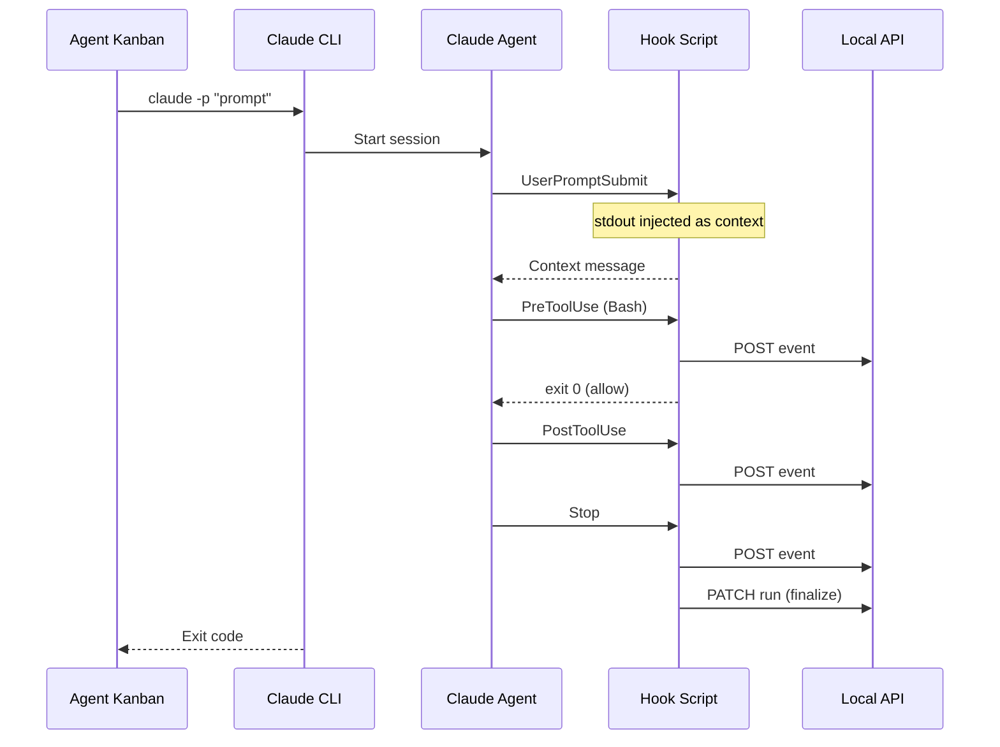

# 07 - Claude Code Integration

Implement Claude Code agent hooks and CLI adapter for tracking agent activities and controlling behavior.

## Overview

This guide covers:

- Claude Code lifecycle hooks: `UserPromptSubmit`, `PreToolUse`, `PostToolUse`, `Stop`
- Hook script implementation that posts events to the local API
- `settings.json` configuration for hooks
- CLI adapter for spawning Claude Code runs
- Understanding exit codes and stdout/stderr behavior

## Prerequisites

- Completed [04-local-api.md](./04-local-api.md)
- Completed [05-agent-orchestration.md](./05-agent-orchestration.md)
- Claude Code installed (`claude` command available)

## Architecture



## Claude Code Hooks Overview

Claude Code hooks are configured in `settings.json`:

| Hook | Trigger | Can Block? | Output Behavior |
|------|---------|------------|-----------------|
| `UserPromptSubmit` | User submits prompt | Yes (exit 2) | stdout injected as context |
| `PreToolUse` | Before tool execution | Yes (exit 2) | stderr fed to Claude |
| `PostToolUse` | After successful tool | No | stdout to user (verbose) |
| `PostToolUseFailure` | After failed tool | No | stdout to user (verbose) |
| `Stop` | Session ends | Yes (exit 2) | Can block stop |
| `SessionStart` | New session begins | No | Informational |
| `SessionEnd` | Session concludes | No | Informational |

### Exit Code Behavior

- **Exit 0**: Success, continue normally
- **Exit 2**: Blocking error - stderr is fed back to Claude as context
- **Other codes**: Treated as non-blocking failures

## Implementation Steps

### Step 1: Create Hook Script

Create `scripts/claude-hook.js`:

```javascript
#!/usr/bin/env node
/**
 * Claude Code hook script for Agent Kanban
 * 
 * This script is called by Claude Code at various lifecycle events.
 * It reads JSON from stdin and can write to stdout/stderr.
 * 
 * Exit codes:
 * - 0: Success
 * - 2: Blocking error (stderr fed to Claude)
 */

const https = require('https');
const http = require('http');
const fs = require('fs');

// Get environment variables
const TICKET_ID = process.env.AGENT_KANBAN_TICKET_ID;
const RUN_ID = process.env.AGENT_KANBAN_RUN_ID;
const API_URL = process.env.AGENT_KANBAN_API_URL || 'http://127.0.0.1:7432';
const API_TOKEN = process.env.AGENT_KANBAN_API_TOKEN;

// Get the hook event type from args
const hookEvent = process.argv[2];

// Read stdin
let inputData = '';
process.stdin.setEncoding('utf8');

process.stdin.on('data', (chunk) => {
  inputData += chunk;
});

process.stdin.on('end', async () => {
  try {
    const input = inputData ? JSON.parse(inputData) : {};
    await handleHook(hookEvent, input);
  } catch (error) {
    // Log error but don't block
    console.error('Hook error:', error.message);
    process.exit(0);
  }
});

/**
 * Handle a hook event
 */
async function handleHook(event, input) {
  // Input contains: session_id, transcript_path, cwd, hook_event_name, etc.
  
  // Post event to API
  await postEvent(event, input);

  switch (event) {
    case 'UserPromptSubmit':
      handleUserPromptSubmit(input);
      break;
    
    case 'PreToolUse':
      handlePreToolUse(input);
      break;
    
    case 'PostToolUse':
      handlePostToolUse(input);
      break;
    
    case 'PostToolUseFailure':
      handlePostToolUseFailure(input);
      break;
    
    case 'Stop':
      await handleStop(input);
      break;
    
    case 'SessionStart':
    case 'SessionEnd':
      // Informational only
      break;
    
    default:
      // Unknown event
      break;
  }

  process.exit(0);
}

/**
 * Handle UserPromptSubmit hook
 * stdout is injected as context to Claude
 */
function handleUserPromptSubmit(input) {
  // Inject context about the ticket and rules
  if (TICKET_ID && RUN_ID) {
    console.log(`
## Agent Kanban Context

You are working on ticket ${TICKET_ID} (run ${RUN_ID}).

### Guidelines:
1. Focus on completing the described task
2. Make incremental changes and verify they work
3. Commit your changes with descriptive messages
4. If blocked, document the issue clearly

### Important:
- Your actions are being tracked and will appear in the ticket timeline
- Avoid accessing sensitive files (.env, credentials, etc.)
`);
  }
}

/**
 * Handle PreToolUse hook
 * Can block with exit code 2
 */
function handlePreToolUse(input) {
  const tool = input.tool_name || '';
  const toolInput = input.tool_input || {};

  // Log the tool use
  const toolInfo = `Tool: ${tool}, Input: ${JSON.stringify(toolInput).substring(0, 200)}`;
  
  // Check for dangerous operations
  if (tool === 'Bash') {
    const command = toolInput.command || '';
    
    const dangerousPatterns = [
      /rm\s+-rf\s+\//,
      /rm\s+-rf\s+~\//,
      /git\s+push\s+.*--force/,
      /sudo\s+rm/,
      /mkfs\./,
    ];

    for (const pattern of dangerousPatterns) {
      if (pattern.test(command)) {
        // Block the command
        console.error(`Blocked dangerous command: ${command}`);
        process.exit(2); // Exit 2 feeds stderr to Claude
      }
    }
  }

  // Check for sensitive file access
  if (tool === 'Read' || tool === 'Edit' || tool === 'Write') {
    const filePath = toolInput.file_path || toolInput.path || '';
    
    const sensitivePatterns = [
      /\.env$/,
      /\.env\.local$/,
      /credentials\.(json|yaml|yml)$/,
      /secrets\.(json|yaml|yml)$/,
    ];

    for (const pattern of sensitivePatterns) {
      if (pattern.test(filePath)) {
        console.error(`Warning: Accessing potentially sensitive file: ${filePath}`);
        // Could block with exit(2) or just warn
      }
    }
  }
}

/**
 * Handle PostToolUse hook
 */
function handlePostToolUse(input) {
  // Log successful tool use
  const tool = input.tool_name || '';
  const result = input.tool_result || '';
  
  // Could log to file or update metrics
}

/**
 * Handle PostToolUseFailure hook
 */
function handlePostToolUseFailure(input) {
  // Log failed tool use
  const tool = input.tool_name || '';
  const error = input.error || '';
  
  console.error(`Tool ${tool} failed: ${error}`);
}

/**
 * Handle Stop hook
 * Finalize the run
 */
async function handleStop(input) {
  const stopReason = input.stop_reason || 'unknown';
  
  // Determine status based on stop reason
  let status = 'finished';
  let exitCode = 0;
  
  if (stopReason === 'error' || stopReason === 'tool_error') {
    status = 'error';
    exitCode = 1;
  } else if (stopReason === 'user_cancelled' || stopReason === 'interrupt') {
    status = 'aborted';
    exitCode = 130;
  }

  // Update run status
  if (RUN_ID) {
    try {
      await updateRunStatus({
        status,
        exitCode,
        summaryMd: generateSummary(stopReason, input),
      });
    } catch (error) {
      console.error('Failed to update run status:', error.message);
    }
  }

  // Could store transcript path for later reference
  if (input.transcript_path) {
    // Log or store for linking from the UI
  }
}

/**
 * Post an event to the API
 */
async function postEvent(eventType, payload) {
  if (!RUN_ID || !API_TOKEN) {
    return;
  }

  const normalizedEvent = {
    eventType: normalizeEventType(eventType, payload),
    payload: {
      raw: JSON.stringify(payload),
      structured: extractStructuredData(eventType, payload),
    },
    timestamp: new Date().toISOString(),
  };

  const url = `${API_URL}/v1/runs/${RUN_ID}/events`;
  
  try {
    await httpRequest('POST', url, normalizedEvent);
  } catch (error) {
    // Don't block on API errors
    console.error('Failed to post event:', error.message);
  }
}

/**
 * Update run status
 */
async function updateRunStatus(data) {
  if (!RUN_ID || !API_TOKEN) return;

  const url = `${API_URL}/v1/runs/${RUN_ID}`;
  await httpRequest('PATCH', url, data);
}

/**
 * Normalize Claude event type to canonical type
 */
function normalizeEventType(claudeEvent, payload) {
  const toolName = payload.tool_name || '';
  
  switch (claudeEvent) {
    case 'PreToolUse':
      if (toolName === 'Bash') return 'command_requested';
      if (['Read', 'Edit', 'Write'].includes(toolName)) return 'file_read';
      return 'command_requested';
    
    case 'PostToolUse':
      if (toolName === 'Bash') return 'command_executed';
      if (['Edit', 'Write'].includes(toolName)) return 'file_edited';
      return 'command_executed';
    
    case 'Stop':
      return 'run_stopped';
    
    default:
      return claudeEvent.toLowerCase();
  }
}

/**
 * Extract structured data from event payload
 */
function extractStructuredData(eventType, payload) {
  const tool = payload.tool_name || '';
  const input = payload.tool_input || {};
  
  switch (eventType) {
    case 'PreToolUse':
    case 'PostToolUse':
      if (tool === 'Bash') {
        return {
          tool: 'bash',
          command: input.command,
          workingDirectory: payload.cwd,
        };
      }
      if (tool === 'Read') {
        return {
          tool: 'read',
          filePath: input.file_path,
        };
      }
      if (tool === 'Edit' || tool === 'Write') {
        return {
          tool: tool.toLowerCase(),
          filePath: input.file_path,
        };
      }
      return { tool, input };
    
    case 'Stop':
      return {
        reason: payload.stop_reason,
        transcriptPath: payload.transcript_path,
      };
    
    default:
      return payload;
  }
}

/**
 * Generate a summary for the stop event
 */
function generateSummary(stopReason, input) {
  switch (stopReason) {
    case 'end_turn':
    case 'stop_sequence':
      return 'Agent completed the task successfully.';
    case 'max_tokens':
      return 'Agent stopped due to reaching token limit.';
    case 'tool_error':
      return 'Agent stopped due to a tool error.';
    case 'error':
      return 'Agent encountered an error and stopped.';
    case 'user_cancelled':
    case 'interrupt':
      return 'Agent was cancelled by user.';
    default:
      return `Agent stopped: ${stopReason}`;
  }
}

/**
 * Make an HTTP request
 */
function httpRequest(method, url, data) {
  return new Promise((resolve, reject) => {
    const urlObj = new URL(url);
    const isHttps = urlObj.protocol === 'https:';
    const lib = isHttps ? https : http;

    const options = {
      hostname: urlObj.hostname,
      port: urlObj.port || (isHttps ? 443 : 80),
      path: urlObj.pathname + urlObj.search,
      method,
      headers: {
        'Content-Type': 'application/json',
        'X-AgentKanban-Token': API_TOKEN,
      },
    };

    const req = lib.request(options, (res) => {
      let body = '';
      res.on('data', chunk => body += chunk);
      res.on('end', () => {
        if (res.statusCode >= 200 && res.statusCode < 300) {
          resolve(body);
        } else {
          reject(new Error(`HTTP ${res.statusCode}: ${body}`));
        }
      });
    });

    req.on('error', reject);
    req.setTimeout(5000, () => {
      req.destroy();
      reject(new Error('Request timeout'));
    });

    if (data) {
      req.write(JSON.stringify(data));
    }
    req.end();
  });
}
```

### Step 2: Create Settings Generator

Add to `src-tauri/src/agents/claude.rs`:

```rust
use std::path::PathBuf;
use serde_json::json;

/// Generate settings.json hooks content
pub fn generate_hooks_settings(hook_script_path: &str) -> serde_json::Value {
    json!({
        "hooks": {
            "UserPromptSubmit": [
                {
                    "matcher": "",
                    "hooks": [
                        {
                            "type": "command",
                            "command": format!("{} UserPromptSubmit", hook_script_path)
                        }
                    ]
                }
            ],
            "PreToolUse": [
                {
                    "matcher": "Bash",
                    "hooks": [
                        {
                            "type": "command",
                            "command": format!("{} PreToolUse", hook_script_path)
                        }
                    ]
                },
                {
                    "matcher": "Read|Edit|Write",
                    "hooks": [
                        {
                            "type": "command",
                            "command": format!("{} PreToolUse", hook_script_path)
                        }
                    ]
                }
            ],
            "PostToolUse": [
                {
                    "matcher": ".*",
                    "hooks": [
                        {
                            "type": "command",
                            "command": format!("{} PostToolUse", hook_script_path)
                        }
                    ]
                }
            ],
            "Stop": [
                {
                    "matcher": "",
                    "hooks": [
                        {
                            "type": "command",
                            "command": format!("{} Stop", hook_script_path)
                        }
                    ]
                }
            ]
        }
    })
}

/// Get user settings path
pub fn user_settings_path() -> Option<PathBuf> {
    dirs::home_dir().map(|h| h.join(".claude").join("settings.json"))
}

/// Get project settings path
pub fn project_settings_path(project: &PathBuf) -> PathBuf {
    project.join(".claude").join("settings.json")
}

/// Get local project settings path (gitignored)
pub fn local_settings_path(project: &PathBuf) -> PathBuf {
    project.join(".claude").join("settings.local.json")
}

/// Install hooks in user settings
pub fn install_user_hooks(hook_script_path: &str) -> std::io::Result<()> {
    if let Some(settings_path) = user_settings_path() {
        if let Some(parent) = settings_path.parent() {
            std::fs::create_dir_all(parent)?;
        }
        
        // Read existing settings or create new
        let mut settings = if settings_path.exists() {
            let content = std::fs::read_to_string(&settings_path)?;
            serde_json::from_str(&content).unwrap_or_else(|_| json!({}))
        } else {
            json!({})
        };

        // Merge hooks
        let hooks = generate_hooks_settings(hook_script_path);
        if let Some(obj) = settings.as_object_mut() {
            obj.insert("hooks".to_string(), hooks["hooks"].clone());
        }

        std::fs::write(
            settings_path,
            serde_json::to_string_pretty(&settings).unwrap(),
        )?;
    }
    Ok(())
}

/// Install hooks in project settings
pub fn install_project_hooks(project: &PathBuf, hook_script_path: &str) -> std::io::Result<()> {
    let claude_dir = project.join(".claude");
    std::fs::create_dir_all(&claude_dir)?;

    let settings_path = claude_dir.join("settings.json");
    
    let mut settings = if settings_path.exists() {
        let content = std::fs::read_to_string(&settings_path)?;
        serde_json::from_str(&content).unwrap_or_else(|_| json!({}))
    } else {
        json!({})
    };

    let hooks = generate_hooks_settings(hook_script_path);
    if let Some(obj) = settings.as_object_mut() {
        obj.insert("hooks".to_string(), hooks["hooks"].clone());
    }

    std::fs::write(
        settings_path,
        serde_json::to_string_pretty(&settings).unwrap(),
    )?;

    Ok(())
}
```

### Step 3: Create Settings UI

Create `src/components/settings/ClaudeSettings.tsx`:

```typescript
import { useState, useEffect } from 'react';
import { invoke } from '@tauri-apps/api/tauri';
import { appDataDir, join } from '@tauri-apps/api/path';

export function ClaudeSettings() {
  const [hookScriptPath, setHookScriptPath] = useState('');
  const [hooksInstalled, setHooksInstalled] = useState(false);
  const [installLocation, setInstallLocation] = useState<'user' | 'project'>('user');
  const [projectPath, setProjectPath] = useState('');

  useEffect(() => {
    async function getHookPath() {
      const dataDir = await appDataDir();
      const path = await join(dataDir, 'scripts', 'claude-hook.js');
      setHookScriptPath(path);
    }
    getHookPath();
  }, []);

  const handleInstallHooks = async () => {
    try {
      if (installLocation === 'user') {
        await invoke('install_claude_hooks_user', { hookScriptPath });
      } else {
        await invoke('install_claude_hooks_project', { 
          hookScriptPath,
          projectPath,
        });
      }
      setHooksInstalled(true);
      alert('Hooks installed successfully!');
    } catch (error) {
      console.error('Failed to install hooks:', error);
      alert(`Failed to install hooks: ${error}`);
    }
  };

  const handleCopyConfig = () => {
    const config = {
      hooks: {
        UserPromptSubmit: [{
          matcher: "",
          hooks: [{
            type: "command",
            command: `${hookScriptPath} UserPromptSubmit`
          }]
        }],
        PreToolUse: [{
          matcher: ".*",
          hooks: [{
            type: "command",
            command: `${hookScriptPath} PreToolUse`
          }]
        }],
        PostToolUse: [{
          matcher: ".*",
          hooks: [{
            type: "command",
            command: `${hookScriptPath} PostToolUse`
          }]
        }],
        Stop: [{
          matcher: "",
          hooks: [{
            type: "command",
            command: `${hookScriptPath} Stop`
          }]
        }]
      }
    };
    
    navigator.clipboard.writeText(JSON.stringify(config, null, 2));
    alert('Configuration copied to clipboard!');
  };

  return (
    <div className="p-6 space-y-6">
      <h2 className="text-xl font-semibold">Claude Code Integration</h2>
      
      <div className="bg-gray-800 rounded-lg p-4 space-y-4">
        <h3 className="font-medium">Hook Script</h3>
        <p className="text-sm text-gray-400">
          The hook script intercepts Claude Code events and sends them to Agent Kanban.
        </p>
        
        <div className="flex items-center gap-2">
          <input
            type="text"
            value={hookScriptPath}
            readOnly
            className="flex-1 px-3 py-2 bg-gray-700 rounded text-sm"
          />
          <button
            onClick={() => navigator.clipboard.writeText(hookScriptPath)}
            className="px-3 py-2 bg-gray-600 rounded hover:bg-gray-500"
          >
            Copy
          </button>
        </div>
      </div>

      <div className="bg-gray-800 rounded-lg p-4 space-y-4">
        <h3 className="font-medium">Install Hooks</h3>
        
        <div className="flex gap-4">
          <label className="flex items-center gap-2">
            <input
              type="radio"
              name="location"
              checked={installLocation === 'user'}
              onChange={() => setInstallLocation('user')}
            />
            <span>User settings (~/.claude/settings.json)</span>
          </label>
          
          <label className="flex items-center gap-2">
            <input
              type="radio"
              name="location"
              checked={installLocation === 'project'}
              onChange={() => setInstallLocation('project')}
            />
            <span>Project settings</span>
          </label>
        </div>

        {installLocation === 'project' && (
          <input
            type="text"
            placeholder="/path/to/project"
            value={projectPath}
            onChange={e => setProjectPath(e.target.value)}
            className="w-full px-3 py-2 bg-gray-700 rounded"
          />
        )}

        <div className="flex gap-2">
          <button
            onClick={handleInstallHooks}
            className="px-4 py-2 bg-green-600 text-white rounded hover:bg-green-700"
          >
            Install Hooks
          </button>
          
          <button
            onClick={handleCopyConfig}
            className="px-4 py-2 bg-gray-600 text-white rounded hover:bg-gray-500"
          >
            Copy Config
          </button>
        </div>
      </div>

      <div className="bg-gray-800 rounded-lg p-4 space-y-4">
        <h3 className="font-medium">Settings File Locations</h3>
        <ul className="text-sm text-gray-400 space-y-2">
          <li>
            <strong>User settings:</strong>
            <code className="ml-2 bg-gray-900 px-2 py-0.5 rounded">~/.claude/settings.json</code>
          </li>
          <li>
            <strong>Project settings:</strong>
            <code className="ml-2 bg-gray-900 px-2 py-0.5 rounded">.claude/settings.json</code>
          </li>
          <li>
            <strong>Local (gitignored):</strong>
            <code className="ml-2 bg-gray-900 px-2 py-0.5 rounded">.claude/settings.local.json</code>
          </li>
        </ul>
      </div>

      <div className="bg-blue-900/30 border border-blue-700 rounded-lg p-4">
        <h3 className="font-medium text-blue-200">Hook Behavior</h3>
        <ul className="text-sm text-blue-100/70 mt-2 space-y-1">
          <li><strong>Exit 0:</strong> Success, continue normally</li>
          <li><strong>Exit 2:</strong> Blocking error, stderr fed to Claude</li>
          <li><strong>UserPromptSubmit:</strong> stdout is injected as context</li>
        </ul>
      </div>
    </div>
  );
}
```

### Step 4: Add Tauri Commands

Add to `src-tauri/src/commands/mod.rs`:

```rust
use crate::agents::claude;
use std::path::PathBuf;

#[tauri::command]
pub async fn install_claude_hooks_user(
    hook_script_path: String,
) -> Result<(), String> {
    claude::install_user_hooks(&hook_script_path)
        .map_err(|e| e.to_string())
}

#[tauri::command]
pub async fn install_claude_hooks_project(
    hook_script_path: String,
    project_path: String,
) -> Result<(), String> {
    claude::install_project_hooks(&PathBuf::from(project_path), &hook_script_path)
        .map_err(|e| e.to_string())
}

#[tauri::command]
pub async fn get_claude_hooks_config(
    hook_script_path: String,
) -> Result<String, String> {
    let config = claude::generate_hooks_settings(&hook_script_path);
    serde_json::to_string_pretty(&config)
        .map_err(|e| e.to_string())
}

#[tauri::command]
pub async fn check_claude_available() -> bool {
    claude::is_claude_available()
}
```

### Step 5: Enhance Claude Adapter

Update `src-tauri/src/agents/claude.rs`:

```rust
use std::process::Command;

/// Check if Claude CLI is available
pub fn is_claude_available() -> bool {
    Command::new("claude")
        .arg("--version")
        .output()
        .map(|o| o.status.success())
        .unwrap_or(false)
}

/// Get Claude CLI version
pub fn get_claude_version() -> Option<String> {
    Command::new("claude")
        .arg("--version")
        .output()
        .ok()
        .and_then(|o| {
            if o.status.success() {
                String::from_utf8(o.stdout).ok()
            } else {
                None
            }
        })
        .map(|s| s.trim().to_string())
}

/// Build Claude command with system prompt
pub fn build_command_with_context(
    prompt: &str,
    system_prompt: Option<&str>,
    working_dir: &std::path::Path,
) -> (String, Vec<String>) {
    let command = "claude".to_string();
    
    let mut args = vec![];

    // Add system prompt if provided
    if let Some(sp) = system_prompt {
        args.push("--append-system-prompt".to_string());
        args.push(sp.to_string());
    }

    // Add the prompt
    args.push("-p".to_string());
    args.push(prompt.to_string());

    (command, args)
}

/// Permission modes for Claude
pub enum PermissionMode {
    /// Ask for permission on dangerous operations
    Default,
    /// Accept all permissions
    AcceptAll,
    /// Deny all permissions (read-only mode)
    DenyAll,
}

impl PermissionMode {
    pub fn as_arg(&self) -> Option<&'static str> {
        match self {
            PermissionMode::Default => None,
            PermissionMode::AcceptAll => Some("--dangerously-skip-permissions"),
            PermissionMode::DenyAll => Some("--permission-mode=deny"),
        }
    }
}
```

## Testing

### Test Hook Script Directly

```bash
# Set environment variables
export AGENT_KANBAN_TICKET_ID="test-ticket"
export AGENT_KANBAN_RUN_ID="test-run"
export AGENT_KANBAN_API_URL="http://127.0.0.1:7432"
export AGENT_KANBAN_API_TOKEN="your-token"

# Test UserPromptSubmit (should output context)
echo '{"prompt": "test"}' | node scripts/claude-hook.js UserPromptSubmit

# Test PreToolUse with Bash
echo '{"tool_name": "Bash", "tool_input": {"command": "ls -la"}}' | \
  node scripts/claude-hook.js PreToolUse

# Test blocking dangerous command
echo '{"tool_name": "Bash", "tool_input": {"command": "rm -rf /"}}' | \
  node scripts/claude-hook.js PreToolUse
echo "Exit code: $?"  # Should be 2

# Test Stop
echo '{"stop_reason": "end_turn"}' | node scripts/claude-hook.js Stop
```

### Test Full Integration

1. Install hooks (user or project level)
2. Start an agent run from Agent Kanban
3. Observe:
   - Context injection on prompt submit
   - Events appearing in timeline
   - Run finalization on stop

### Verify Hook Installation

```bash
# Check user settings
cat ~/.claude/settings.json | jq '.hooks'

# Check project settings
cat /path/to/project/.claude/settings.json | jq '.hooks'
```

## Troubleshooting

### Hooks not triggering

1. Verify settings.json is valid JSON:
   ```bash
   cat ~/.claude/settings.json | jq .
   ```

2. Check Claude Code is reading the correct settings file
   - User settings: `~/.claude/settings.json`
   - Project: `.claude/settings.json` in project root

3. Ensure hook script is executable:
   ```bash
   chmod +x /path/to/claude-hook.js
   ```

### Context not being injected

For `UserPromptSubmit`, stdout is only injected when:
- Exit code is 0
- The hook outputs to stdout (not stderr)

### Exit code 2 not blocking

Ensure:
- Script exits with code 2 (`process.exit(2)`)
- Error message is written to stderr (`console.error()`)

### Transcript path not available

The `transcript_path` is only available in certain hooks and may require enabling transcript saving in Claude settings.

## Security Considerations

### Blocking Dangerous Commands

The default configuration blocks obviously dangerous commands:

```javascript
const dangerousPatterns = [
  /rm\s+-rf\s+\//,
  /git\s+push\s+.*--force/,
  /sudo\s+rm/,
];
```

### Context Injection Security

Be careful what you inject via `UserPromptSubmit`:
- Don't include sensitive data (tokens, passwords)
- Limit the context to necessary information
- Consider the prompt injection risk

## Next Steps

With Claude Code integration complete, proceed to:

- **[08-hook-bridge.md](./08-hook-bridge.md)**: Unify event handling across both agents
