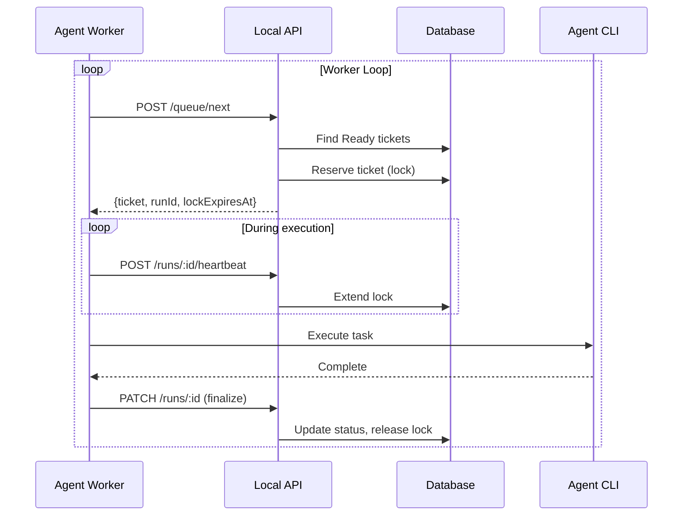

# 09 - Worker Mode

Implement queue semantics and automated agent workers that continuously process tickets without manual intervention.

## Overview

This guide covers:

- `/queue/next` endpoint implementation with reservation
- Lock TTL and heartbeat mechanism
- Crash recovery (unlocking stale tickets)
- Concurrency controls (repo-level mutex)
- Worker UI showing current ticket, queue depth, and recent runs

## Prerequisites

- Completed [05-agent-orchestration.md](./05-agent-orchestration.md)
- Completed [08-hook-bridge.md](./08-hook-bridge.md)

## Architecture



## Queue Semantics

### Ticket Selection

1. Only tickets in **Ready** column can be picked up
2. Only tickets without active locks can be reserved
3. Optional filters: repo path, agent preference
4. FIFO ordering by creation date (oldest first)

### Reservation (Locking)

When a worker reserves a ticket:
1. Create an `agent_run` record
2. Set `locked_by_run_id` on the ticket
3. Set `lock_expires_at` (default: 30 minutes)
4. Move ticket to **In Progress** column

### Heartbeat

While working, the worker sends periodic heartbeats:
1. Extends `lock_expires_at` by another lock period
2. If no heartbeat received, lock expires
3. Expired locks can be recovered by the cleanup process

### Finalization

When the run completes:
1. Update run status (finished/error/aborted)
2. Clear ticket lock (`locked_by_run_id = NULL`)
3. Move ticket to appropriate column (Review/Blocked/Done)

## Implementation Steps

### Step 1: Enhance Database for Locking

Add to `src-tauri/src/db/mod.rs`:

```rust
use chrono::{Duration, Utc};

impl Database {
    /// Reserve a ticket for an agent run
    pub fn reserve_ticket(
        &self,
        ticket_id: &str,
        run_id: &str,
        lock_duration_mins: i64,
    ) -> Result<chrono::DateTime<Utc>, DbError> {
        self.with_conn_mut(|conn| {
            let tx = conn.transaction()?;
            
            // Check ticket is available
            let locked: Option<String> = tx.query_row(
                "SELECT locked_by_run_id FROM tickets WHERE id = ?",
                [ticket_id],
                |row| row.get(0),
            )?;
            
            if locked.is_some() {
                return Err(DbError::Validation("Ticket is already locked".to_string()));
            }
            
            // Calculate lock expiration
            let lock_expires_at = Utc::now() + Duration::minutes(lock_duration_mins);
            
            // Lock the ticket
            tx.execute(
                "UPDATE tickets SET locked_by_run_id = ?, lock_expires_at = ? WHERE id = ?",
                rusqlite::params![run_id, lock_expires_at.to_rfc3339(), ticket_id],
            )?;
            
            tx.commit()?;
            Ok(lock_expires_at)
        })
    }

    /// Extend a ticket lock (heartbeat)
    pub fn extend_lock(
        &self,
        ticket_id: &str,
        run_id: &str,
        extension_mins: i64,
    ) -> Result<chrono::DateTime<Utc>, DbError> {
        self.with_conn(|conn| {
            // Verify the run owns the lock
            let current_lock: Option<String> = conn.query_row(
                "SELECT locked_by_run_id FROM tickets WHERE id = ?",
                [ticket_id],
                |row| row.get(0),
            )?;
            
            if current_lock.as_deref() != Some(run_id) {
                return Err(DbError::Validation("Run does not own the lock".to_string()));
            }
            
            let new_expires_at = Utc::now() + Duration::minutes(extension_mins);
            
            conn.execute(
                "UPDATE tickets SET lock_expires_at = ? WHERE id = ? AND locked_by_run_id = ?",
                rusqlite::params![new_expires_at.to_rfc3339(), ticket_id, run_id],
            )?;
            
            Ok(new_expires_at)
        })
    }

    /// Release a ticket lock
    pub fn release_lock(&self, ticket_id: &str, run_id: &str) -> Result<(), DbError> {
        self.with_conn(|conn| {
            conn.execute(
                "UPDATE tickets SET locked_by_run_id = NULL, lock_expires_at = NULL 
                 WHERE id = ? AND locked_by_run_id = ?",
                rusqlite::params![ticket_id, run_id],
            )?;
            Ok(())
        })
    }

    /// Clean up expired locks
    pub fn cleanup_expired_locks(&self) -> Result<Vec<String>, DbError> {
        self.with_conn(|conn| {
            let now = Utc::now().to_rfc3339();
            
            // Find expired locks
            let mut stmt = conn.prepare(
                "SELECT id, locked_by_run_id FROM tickets 
                 WHERE locked_by_run_id IS NOT NULL 
                 AND lock_expires_at < ?"
            )?;
            
            let expired: Vec<(String, String)> = stmt
                .query_map([&now], |row| Ok((row.get(0)?, row.get(1)?)))?
                .collect::<Result<Vec<_>, _>>()?;
            
            let ticket_ids: Vec<String> = expired.iter().map(|(id, _)| id.clone()).collect();
            
            // Clear expired locks
            conn.execute(
                "UPDATE tickets SET locked_by_run_id = NULL, lock_expires_at = NULL 
                 WHERE lock_expires_at < ?",
                [&now],
            )?;
            
            // Mark associated runs as aborted
            for (_, run_id) in &expired {
                conn.execute(
                    "UPDATE agent_runs SET status = 'aborted', 
                     summary_md = 'Lock expired - run may have crashed' 
                     WHERE id = ? AND status = 'running'",
                    [run_id],
                )?;
            }
            
            Ok(ticket_ids)
        })
    }

    /// Get next available ticket for queue
    pub fn get_next_queued_ticket(
        &self,
        board_id: Option<&str>,
        repo_path: Option<&str>,
    ) -> Result<Option<Ticket>, DbError> {
        self.with_conn(|conn| {
            // Find "Ready" column
            let ready_column_id: Option<String> = if let Some(bid) = board_id {
                conn.query_row(
                    "SELECT id FROM columns WHERE board_id = ? AND name = 'Ready'",
                    [bid],
                    |row| row.get(0),
                ).ok()
            } else {
                conn.query_row(
                    "SELECT id FROM columns WHERE name = 'Ready' LIMIT 1",
                    [],
                    |row| row.get(0),
                ).ok()
            };

            let Some(ready_id) = ready_column_id else {
                return Ok(None);
            };

            // Build query
            let mut sql = String::from(
                "SELECT id, board_id, column_id, title, description_md, priority, 
                        labels_json, created_at, updated_at, locked_by_run_id, 
                        lock_expires_at, repo_path, agent_pref
                 FROM tickets 
                 WHERE column_id = ? 
                 AND locked_by_run_id IS NULL"
            );
            
            let mut params: Vec<Box<dyn rusqlite::ToSql>> = vec![Box::new(ready_id.clone())];
            
            if let Some(path) = repo_path {
                sql.push_str(" AND repo_path = ?");
                params.push(Box::new(path.to_string()));
            }
            
            sql.push_str(" ORDER BY created_at ASC LIMIT 1");

            let param_refs: Vec<&dyn rusqlite::ToSql> = params.iter().map(|p| p.as_ref()).collect();
            
            conn.query_row(&sql, param_refs.as_slice(), Self::map_ticket_row).optional()
                .map_err(DbError::from)
        })
    }

    /// Get queue depth (count of Ready tickets)
    pub fn get_queue_depth(&self, board_id: Option<&str>) -> Result<i64, DbError> {
        self.with_conn(|conn| {
            let count: i64 = if let Some(bid) = board_id {
                conn.query_row(
                    "SELECT COUNT(*) FROM tickets t
                     JOIN columns c ON t.column_id = c.id
                     WHERE c.board_id = ? AND c.name = 'Ready'
                     AND t.locked_by_run_id IS NULL",
                    [bid],
                    |row| row.get(0),
                )?
            } else {
                conn.query_row(
                    "SELECT COUNT(*) FROM tickets t
                     JOIN columns c ON t.column_id = c.id
                     WHERE c.name = 'Ready'
                     AND t.locked_by_run_id IS NULL",
                    [],
                    |row| row.get(0),
                )?
            };
            Ok(count)
        })
    }
}
```

### Step 2: Enhance API Handlers

Update `src-tauri/src/api/handlers.rs`:

```rust
// Add these handlers

/// Reserve a ticket and create a run
pub async fn reserve_ticket(
    State(state): State<AppState>,
    Path(ticket_id): Path<String>,
    Json(req): Json<ReserveTicketRequest>,
) -> Result<Json<ReservationResponse>, (StatusCode, String)> {
    // Create run
    let run = state.db.create_run(&CreateRun {
        ticket_id: ticket_id.clone(),
        agent_type: req.agent_type.clone(),
        repo_path: req.repo_path.clone(),
    })
    .map_err(|e| (StatusCode::INTERNAL_SERVER_ERROR, e.to_string()))?;

    // Reserve the ticket with 30-minute lock
    let lock_expires_at = state.db.reserve_ticket(&ticket_id, &run.id, 30)
        .map_err(|e| (StatusCode::CONFLICT, e.to_string()))?;

    // Get the board and move ticket to "In Progress"
    // This would require knowing the board_id from the ticket
    // For now, we'll handle this in the worker

    state.broadcast(LiveEvent::RunStarted {
        run_id: run.id.clone(),
        ticket_id,
    });

    Ok(Json(ReservationResponse {
        run_id: run.id,
        lock_expires_at: lock_expires_at.to_rfc3339(),
    }))
}

/// Heartbeat to extend lock
pub async fn heartbeat(
    State(state): State<AppState>,
    Path(run_id): Path<String>,
) -> Result<Json<HeartbeatResponse>, (StatusCode, String)> {
    // Get ticket_id from run
    let runs = state.db.get_runs(&run_id)
        .map_err(|e| (StatusCode::INTERNAL_SERVER_ERROR, e.to_string()))?;
    
    // Find the run and its ticket
    // In production, you'd have a get_run method
    let ticket_id = ""; // Would come from the run
    
    let new_expires_at = state.db.extend_lock(&ticket_id, &run_id, 30)
        .map_err(|e| (StatusCode::CONFLICT, e.to_string()))?;

    Ok(Json(HeartbeatResponse {
        lock_expires_at: new_expires_at.to_rfc3339(),
    }))
}

/// Get next ticket from queue
pub async fn queue_next(
    State(state): State<AppState>,
    Json(req): Json<QueueNextRequest>,
) -> Result<Json<QueueNextResponse>, (StatusCode, String)> {
    // Find next available ticket
    let ticket = state.db.get_next_queued_ticket(None, req.repo_path.as_deref())
        .map_err(|e| (StatusCode::INTERNAL_SERVER_ERROR, e.to_string()))?
        .ok_or((StatusCode::NOT_FOUND, "No tickets in queue".to_string()))?;

    // Create run
    let run = state.db.create_run(&CreateRun {
        ticket_id: ticket.id.clone(),
        agent_type: req.agent_type.clone(),
        repo_path: req.repo_path.clone().unwrap_or_else(|| {
            ticket.repo_path.clone().unwrap_or_default()
        }),
    })
    .map_err(|e| (StatusCode::INTERNAL_SERVER_ERROR, e.to_string()))?;

    // Reserve the ticket
    let lock_expires_at = state.db.reserve_ticket(&ticket.id, &run.id, 30)
        .map_err(|e| (StatusCode::CONFLICT, e.to_string()))?;

    state.broadcast(LiveEvent::RunStarted {
        run_id: run.id.clone(),
        ticket_id: ticket.id.clone(),
    });

    Ok(Json(QueueNextResponse {
        ticket,
        run_id: run.id,
        lock_expires_at: lock_expires_at.to_rfc3339(),
    }))
}

/// Get queue status
pub async fn queue_status(
    State(state): State<AppState>,
    Query(params): Query<QueueStatusParams>,
) -> Result<Json<QueueStatusResponse>, (StatusCode, String)> {
    let depth = state.db.get_queue_depth(params.board_id.as_deref())
        .map_err(|e| (StatusCode::INTERNAL_SERVER_ERROR, e.to_string()))?;

    Ok(Json(QueueStatusResponse {
        depth,
        active_workers: 0, // Would track this in state
    }))
}

#[derive(Debug, Deserialize)]
pub struct QueueStatusParams {
    pub board_id: Option<String>,
}

#[derive(Debug, Serialize)]
pub struct QueueStatusResponse {
    pub depth: i64,
    pub active_workers: i32,
}

#[derive(Debug, Serialize)]
pub struct HeartbeatResponse {
    pub lock_expires_at: String,
}
```

### Step 3: Create Lock Cleanup Service

Create `src-tauri/src/api/cleanup.rs`:

```rust
use std::sync::Arc;
use std::time::Duration;
use tokio::time::interval;

use crate::db::Database;

/// Start the background cleanup service
pub async fn start_cleanup_service(db: Arc<Database>) {
    let mut ticker = interval(Duration::from_secs(60)); // Check every minute
    
    loop {
        ticker.tick().await;
        
        match db.cleanup_expired_locks() {
            Ok(expired) => {
                if !expired.is_empty() {
                    tracing::info!("Cleaned up {} expired locks", expired.len());
                    for ticket_id in expired {
                        tracing::debug!("Released expired lock on ticket {}", ticket_id);
                    }
                }
            }
            Err(e) => {
                tracing::error!("Lock cleanup error: {}", e);
            }
        }
    }
}
```

### Step 4: Implement Worker Process

Create `src-tauri/src/agents/worker.rs`:

```rust
use std::sync::atomic::{AtomicBool, Ordering};
use std::sync::Arc;
use std::time::Duration;
use tokio::time::{interval, sleep};

use super::{AgentKind, AgentRunConfig, spawner};
use crate::db::{Database, AgentType, RunStatus};

/// Configuration for a worker
pub struct WorkerConfig {
    pub agent_type: AgentKind,
    pub repo_path: Option<String>,
    pub api_url: String,
    pub api_token: String,
    pub poll_interval_secs: u64,
    pub heartbeat_interval_secs: u64,
    pub lock_duration_mins: i64,
}

/// A worker that continuously processes tickets
pub struct Worker {
    config: WorkerConfig,
    db: Arc<Database>,
    running: Arc<AtomicBool>,
}

impl Worker {
    pub fn new(config: WorkerConfig, db: Arc<Database>) -> Self {
        Self {
            config,
            db,
            running: Arc::new(AtomicBool::new(false)),
        }
    }

    /// Start the worker loop
    pub async fn start(&self) {
        self.running.store(true, Ordering::Relaxed);
        
        tracing::info!(
            "Starting {:?} worker for repo: {:?}",
            self.config.agent_type,
            self.config.repo_path
        );

        while self.running.load(Ordering::Relaxed) {
            match self.process_next().await {
                Ok(true) => {
                    // Processed a ticket, check for more immediately
                    tracing::debug!("Ticket processed, checking for more");
                }
                Ok(false) => {
                    // No tickets, wait before polling again
                    sleep(Duration::from_secs(self.config.poll_interval_secs)).await;
                }
                Err(e) => {
                    tracing::error!("Worker error: {}", e);
                    sleep(Duration::from_secs(5)).await;
                }
            }
        }

        tracing::info!("Worker stopped");
    }

    /// Stop the worker
    pub fn stop(&self) {
        self.running.store(false, Ordering::Relaxed);
    }

    /// Process the next available ticket
    async fn process_next(&self) -> Result<bool, Box<dyn std::error::Error + Send + Sync>> {
        // Get next ticket
        let ticket = self.db.get_next_queued_ticket(
            None,
            self.config.repo_path.as_deref(),
        )?;

        let Some(ticket) = ticket else {
            return Ok(false);
        };

        tracing::info!("Processing ticket: {} - {}", ticket.id, ticket.title);

        // Create run
        let run = self.db.create_run(&crate::db::CreateRun {
            ticket_id: ticket.id.clone(),
            agent_type: match self.config.agent_type {
                AgentKind::Cursor => AgentType::Cursor,
                AgentKind::Claude => AgentType::Claude,
            },
            repo_path: self.config.repo_path.clone().unwrap_or_else(|| {
                ticket.repo_path.clone().unwrap_or_default()
            }),
        })?;

        // Reserve the ticket
        let lock_expires = self.db.reserve_ticket(
            &ticket.id,
            &run.id,
            self.config.lock_duration_mins,
        )?;

        tracing::debug!("Ticket reserved until {}", lock_expires);

        // Update run status to running
        self.db.update_run_status(&run.id, RunStatus::Running, None, None)?;

        // Start heartbeat task
        let db_for_heartbeat = self.db.clone();
        let ticket_id_for_heartbeat = ticket.id.clone();
        let run_id_for_heartbeat = run.id.clone();
        let heartbeat_interval = self.config.heartbeat_interval_secs;
        let lock_duration = self.config.lock_duration_mins;
        let running = self.running.clone();

        let heartbeat_handle = tokio::spawn(async move {
            let mut ticker = interval(Duration::from_secs(heartbeat_interval));
            
            while running.load(Ordering::Relaxed) {
                ticker.tick().await;
                
                match db_for_heartbeat.extend_lock(
                    &ticket_id_for_heartbeat,
                    &run_id_for_heartbeat,
                    lock_duration,
                ) {
                    Ok(new_expires) => {
                        tracing::debug!("Heartbeat sent, lock extended to {}", new_expires);
                    }
                    Err(e) => {
                        tracing::error!("Heartbeat failed: {}", e);
                        break;
                    }
                }
            }
        });

        // Generate prompt
        let prompt = super::prompt::generate_ticket_prompt(&ticket);

        // Build run config
        let run_config = AgentRunConfig {
            kind: self.config.agent_type,
            ticket_id: ticket.id.clone(),
            run_id: run.id.clone(),
            repo_path: std::path::PathBuf::from(
                ticket.repo_path.as_deref().unwrap_or(".")
            ),
            prompt,
            timeout_secs: Some(3600), // 1 hour
            api_url: self.config.api_url.clone(),
            api_token: self.config.api_token.clone(),
        };

        // Run the agent
        let result = spawner::run_agent(run_config, None);

        // Stop heartbeat
        heartbeat_handle.abort();

        // Finalize run
        match result {
            Ok(run_result) => {
                let status = match run_result.status {
                    super::RunOutcome::Success => RunStatus::Finished,
                    super::RunOutcome::Error => RunStatus::Error,
                    super::RunOutcome::Timeout => RunStatus::Error,
                    super::RunOutcome::Cancelled => RunStatus::Aborted,
                };

                self.db.update_run_status(
                    &run.id,
                    status,
                    run_result.exit_code,
                    run_result.summary.as_deref(),
                )?;

                tracing::info!(
                    "Run {} completed with status {:?}",
                    run.id,
                    run_result.status
                );
            }
            Err(e) => {
                self.db.update_run_status(
                    &run.id,
                    RunStatus::Error,
                    None,
                    Some(&format!("Error: {}", e)),
                )?;

                tracing::error!("Run {} failed: {}", run.id, e);
            }
        }

        // Release lock
        self.db.release_lock(&ticket.id, &run.id)?;

        Ok(true)
    }
}

/// Manager for multiple workers
pub struct WorkerManager {
    workers: Vec<Arc<Worker>>,
    handles: Vec<tokio::task::JoinHandle<()>>,
}

impl WorkerManager {
    pub fn new() -> Self {
        Self {
            workers: Vec::new(),
            handles: Vec::new(),
        }
    }

    /// Start a new worker
    pub fn start_worker(&mut self, config: WorkerConfig, db: Arc<Database>) {
        let worker = Arc::new(Worker::new(config, db));
        let worker_clone = worker.clone();
        
        let handle = tokio::spawn(async move {
            worker_clone.start().await;
        });

        self.workers.push(worker);
        self.handles.push(handle);
    }

    /// Stop all workers
    pub async fn stop_all(&mut self) {
        for worker in &self.workers {
            worker.stop();
        }

        for handle in self.handles.drain(..) {
            let _ = handle.await;
        }

        self.workers.clear();
    }

    /// Get worker count
    pub fn worker_count(&self) -> usize {
        self.workers.len()
    }
}
```

### Step 5: Create Worker UI

Create `src/components/workers/WorkerPanel.tsx`:

```typescript
import { useState, useEffect } from 'react';
import { invoke } from '@tauri-apps/api/tauri';
import { listen } from '@tauri-apps/api/event';

interface WorkerStatus {
  id: string;
  agentType: 'cursor' | 'claude';
  repoPath?: string;
  status: 'idle' | 'running' | 'stopped';
  currentTicketId?: string;
  ticketsProcessed: number;
  startedAt: string;
}

interface QueueStatus {
  depth: number;
  activeWorkers: number;
}

export function WorkerPanel() {
  const [workers, setWorkers] = useState<WorkerStatus[]>([]);
  const [queueStatus, setQueueStatus] = useState<QueueStatus>({ depth: 0, activeWorkers: 0 });
  const [isStarting, setIsStarting] = useState(false);
  const [newWorkerType, setNewWorkerType] = useState<'cursor' | 'claude'>('cursor');
  const [newWorkerRepo, setNewWorkerRepo] = useState('');

  useEffect(() => {
    loadStatus();
    
    const interval = setInterval(loadStatus, 5000);
    return () => clearInterval(interval);
  }, []);

  const loadStatus = async () => {
    try {
      const [workerData, queueData] = await Promise.all([
        invoke<WorkerStatus[]>('get_workers'),
        invoke<QueueStatus>('get_queue_status'),
      ]);
      setWorkers(workerData);
      setQueueStatus(queueData);
    } catch (error) {
      console.error('Failed to load status:', error);
    }
  };

  const handleStartWorker = async () => {
    setIsStarting(true);
    try {
      await invoke('start_worker', {
        agentType: newWorkerType,
        repoPath: newWorkerRepo || undefined,
      });
      await loadStatus();
      setNewWorkerRepo('');
    } catch (error) {
      console.error('Failed to start worker:', error);
      alert(`Failed to start worker: ${error}`);
    } finally {
      setIsStarting(false);
    }
  };

  const handleStopWorker = async (workerId: string) => {
    try {
      await invoke('stop_worker', { workerId });
      await loadStatus();
    } catch (error) {
      console.error('Failed to stop worker:', error);
    }
  };

  const handleStopAll = async () => {
    try {
      await invoke('stop_all_workers');
      await loadStatus();
    } catch (error) {
      console.error('Failed to stop workers:', error);
    }
  };

  return (
    <div className="p-6 space-y-6">
      <div className="flex items-center justify-between">
        <h2 className="text-xl font-semibold">Agent Workers</h2>
        {workers.length > 0 && (
          <button
            onClick={handleStopAll}
            className="px-3 py-1.5 bg-red-600 text-white text-sm rounded hover:bg-red-700"
          >
            Stop All
          </button>
        )}
      </div>

      {/* Queue Status */}
      <div className="bg-gray-800 rounded-lg p-4">
        <h3 className="text-sm font-medium text-gray-400 mb-3">Queue Status</h3>
        <div className="grid grid-cols-2 gap-4">
          <div className="bg-gray-700 rounded p-3 text-center">
            <div className="text-3xl font-bold">{queueStatus.depth}</div>
            <div className="text-sm text-gray-400">Tickets in Queue</div>
          </div>
          <div className="bg-gray-700 rounded p-3 text-center">
            <div className="text-3xl font-bold">{workers.length}</div>
            <div className="text-sm text-gray-400">Active Workers</div>
          </div>
        </div>
      </div>

      {/* Start New Worker */}
      <div className="bg-gray-800 rounded-lg p-4">
        <h3 className="text-sm font-medium text-gray-400 mb-3">Start New Worker</h3>
        
        <div className="space-y-3">
          <div className="flex gap-4">
            <label className="flex items-center gap-2">
              <input
                type="radio"
                name="agentType"
                checked={newWorkerType === 'cursor'}
                onChange={() => setNewWorkerType('cursor')}
              />
              <span>Cursor</span>
            </label>
            <label className="flex items-center gap-2">
              <input
                type="radio"
                name="agentType"
                checked={newWorkerType === 'claude'}
                onChange={() => setNewWorkerType('claude')}
              />
              <span>Claude</span>
            </label>
          </div>

          <input
            type="text"
            placeholder="Repository path (optional, filters queue)"
            value={newWorkerRepo}
            onChange={e => setNewWorkerRepo(e.target.value)}
            className="w-full px-3 py-2 bg-gray-700 rounded text-sm"
          />

          <button
            onClick={handleStartWorker}
            disabled={isStarting}
            className="w-full px-4 py-2 bg-green-600 text-white rounded hover:bg-green-700 disabled:opacity-50"
          >
            {isStarting ? 'Starting...' : 'Start Worker'}
          </button>
        </div>
      </div>

      {/* Active Workers */}
      <div className="bg-gray-800 rounded-lg p-4">
        <h3 className="text-sm font-medium text-gray-400 mb-3">Active Workers</h3>
        
        {workers.length === 0 ? (
          <p className="text-gray-500 text-sm">No workers running</p>
        ) : (
          <div className="space-y-3">
            {workers.map(worker => (
              <div
                key={worker.id}
                className="flex items-center justify-between bg-gray-700 rounded p-3"
              >
                <div>
                  <div className="flex items-center gap-2">
                    <span className={`w-2 h-2 rounded-full ${
                      worker.status === 'running' ? 'bg-green-500' : 
                      worker.status === 'idle' ? 'bg-yellow-500' : 'bg-gray-500'
                    }`}></span>
                    <span className="font-medium">
                      {worker.agentType === 'cursor' ? 'Cursor' : 'Claude'} Worker
                    </span>
                  </div>
                  <div className="text-xs text-gray-400 mt-1">
                    {worker.repoPath || 'All repos'} • {worker.ticketsProcessed} processed
                  </div>
                  {worker.currentTicketId && (
                    <div className="text-xs text-blue-400 mt-1">
                      Working on: {worker.currentTicketId}
                    </div>
                  )}
                </div>
                <button
                  onClick={() => handleStopWorker(worker.id)}
                  className="px-3 py-1 bg-gray-600 text-sm rounded hover:bg-gray-500"
                >
                  Stop
                </button>
              </div>
            ))}
          </div>
        )}
      </div>

      {/* Info */}
      <div className="bg-blue-900/30 border border-blue-700 rounded-lg p-4 text-sm">
        <h4 className="font-medium text-blue-200 mb-2">How Workers Operate</h4>
        <ul className="text-blue-100/70 space-y-1 list-disc list-inside">
          <li>Workers continuously poll for Ready tickets</li>
          <li>Each ticket is locked while being processed</li>
          <li>Heartbeats prevent lock expiration during work</li>
          <li>On completion, tickets move to Review or Blocked</li>
        </ul>
      </div>
    </div>
  );
}
```

### Step 6: Add Tauri Commands for Workers

Add to `src-tauri/src/commands/mod.rs`:

```rust
use crate::agents::worker::{Worker, WorkerConfig, WorkerManager};
use once_cell::sync::Lazy;
use std::sync::Mutex;

static WORKER_MANAGER: Lazy<Mutex<WorkerManager>> = Lazy::new(|| {
    Mutex::new(WorkerManager::new())
});

#[tauri::command]
pub async fn start_worker(
    agent_type: String,
    repo_path: Option<String>,
    db: State<'_, Arc<Database>>,
) -> Result<String, String> {
    let config = WorkerConfig {
        agent_type: match agent_type.as_str() {
            "claude" => crate::agents::AgentKind::Claude,
            _ => crate::agents::AgentKind::Cursor,
        },
        repo_path,
        api_url: "http://127.0.0.1:7432".to_string(),
        api_token: "token".to_string(), // Would read from config
        poll_interval_secs: 10,
        heartbeat_interval_secs: 60,
        lock_duration_mins: 30,
    };

    let mut manager = WORKER_MANAGER.lock().map_err(|e| e.to_string())?;
    manager.start_worker(config, db.inner().clone());

    Ok(format!("worker-{}", manager.worker_count()))
}

#[tauri::command]
pub async fn stop_all_workers() -> Result<(), String> {
    let mut manager = WORKER_MANAGER.lock().map_err(|e| e.to_string())?;
    // Would need async context
    // manager.stop_all().await;
    Ok(())
}

#[tauri::command]
pub async fn get_queue_status(
    db: State<'_, Arc<Database>>,
) -> Result<serde_json::Value, String> {
    let depth = db.get_queue_depth(None).map_err(|e| e.to_string())?;
    let manager = WORKER_MANAGER.lock().map_err(|e| e.to_string())?;
    
    Ok(serde_json::json!({
        "depth": depth,
        "activeWorkers": manager.worker_count(),
    }))
}
```

## Testing

### Test Lock Mechanism

```bash
# Reserve a ticket
curl -X POST \
  -H "X-AgentKanban-Token: $TOKEN" \
  -H "Content-Type: application/json" \
  -d '{"agentType":"cursor","repoPath":"/path/to/repo"}' \
  http://127.0.0.1:7432/v1/tickets/$TICKET_ID/reserve

# Send heartbeat
curl -X POST \
  -H "X-AgentKanban-Token: $TOKEN" \
  http://127.0.0.1:7432/v1/runs/$RUN_ID/heartbeat

# Check queue depth
curl -H "X-AgentKanban-Token: $TOKEN" \
  http://127.0.0.1:7432/v1/queue/status
```

### Test Worker Mode

1. Create several tickets and move to Ready
2. Start a worker from the UI
3. Observe tickets being processed automatically
4. Check that lock expiration and recovery works

## Troubleshooting

### Tickets not being picked up

1. Verify tickets are in "Ready" column
2. Check tickets don't have active locks
3. Verify repo_path filter matches (if set)

### Lock not releasing

1. Check cleanup service is running
2. Verify heartbeat is failing (triggering expiration)
3. Manual cleanup: set `locked_by_run_id = NULL`

### Concurrent workers stepping on each other

1. Ensure reservation is atomic (transaction)
2. Check for race conditions in ticket selection
3. Add repo-level mutex if needed

## Next Steps

With worker mode complete, proceed to:

- **[10-ticket-lifecycle.md](./10-ticket-lifecycle.md)**: Define and enforce the ticket state machine
