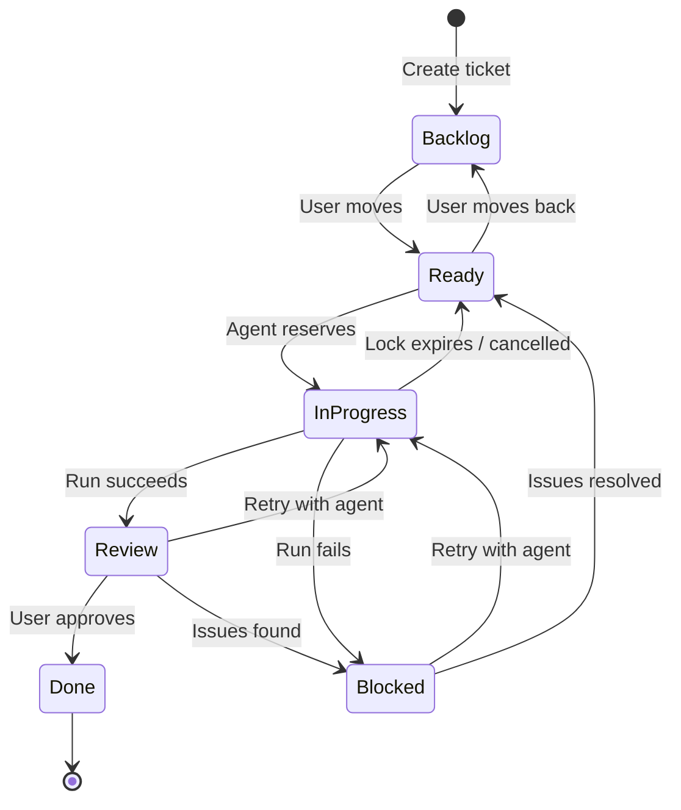
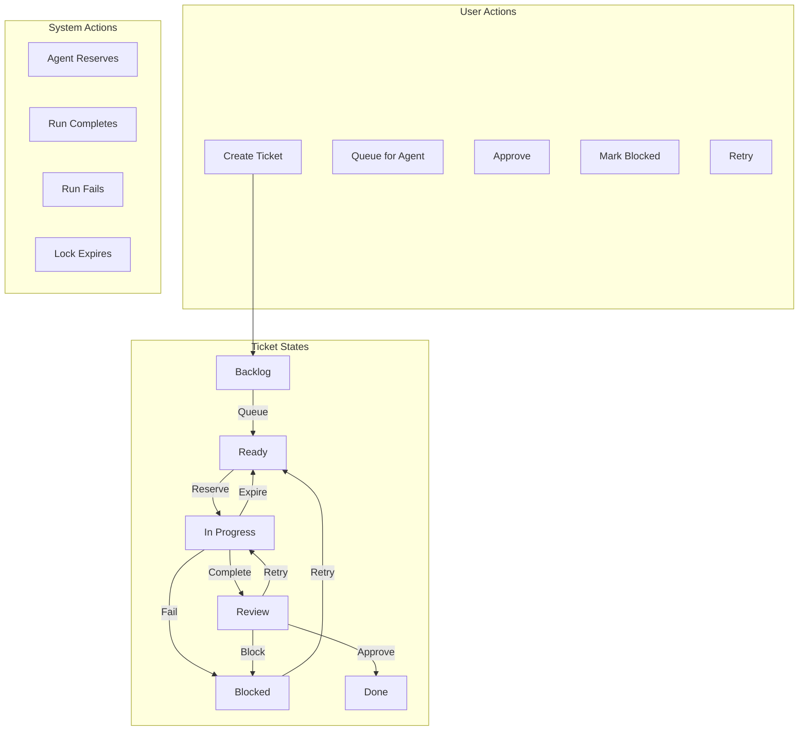

# 10 - Ticket Lifecycle

Define and enforce the ticket state machine, including column transitions, reservation rules, and automated state changes based on agent run outcomes.

## Overview

This guide covers:

- Column states: Backlog, Ready, In Progress, Blocked, Review, Done
- Reservation rules and locking semantics
- Auto-transition logic on run completion/error
- Run entity tracking (status, artifacts, transcript)
- Validation and enforcement

## Prerequisites

- Completed [02-database-design.md](./02-database-design.md)
- Completed [09-worker-mode.md](./09-worker-mode.md)

## State Machine



## Column Definitions

| Column | Description | Can Agent Pick Up? | Locked? |
|--------|-------------|-------------------|---------|
| **Backlog** | Ideas and future work | No | No |
| **Ready** | Queued for agent work | Yes | No |
| **In Progress** | Currently being worked | No | Yes |
| **Blocked** | Needs attention/help | No | No |
| **Review** | Awaiting human review | No | No |
| **Done** | Completed | No | No |

## Transition Rules

### Manual Transitions (User)

| From | To | Allowed? | Notes |
|------|-----|----------|-------|
| Any | Backlog | Yes | Deprioritize |
| Backlog | Ready | Yes | Queue for agents |
| Ready | Backlog | Yes | Deprioritize |
| In Progress | Ready | Only if unlocked | Cancel |
| In Progress | Blocked | Only if unlocked | Manual block |
| Blocked | Ready | Yes | Retry |
| Review | Done | Yes | Approve |
| Review | Blocked | Yes | Issues found |
| Review | Ready | Yes | Retry |
| Done | Review | Yes | Reopen |

### Automatic Transitions (System)

| Trigger | From | To | Condition |
|---------|------|-----|-----------|
| Agent reserves | Ready | In Progress | Ticket unlocked |
| Run succeeds | In Progress | Review | Exit code 0 |
| Run fails | In Progress | Blocked | Exit code non-0 |
| Run aborted | In Progress | Ready | User cancelled |
| Lock expires | In Progress | Ready | No heartbeat |

## Implementation Steps

### Step 1: Define State Machine

Create `src-tauri/src/lifecycle/mod.rs`:

```rust
pub mod state;
pub mod transitions;
pub mod rules;

pub use state::*;
pub use transitions::*;
pub use rules::*;
```

Create `src-tauri/src/lifecycle/state.rs`:

```rust
use serde::{Deserialize, Serialize};

/// Ticket column states
#[derive(Debug, Clone, Copy, PartialEq, Eq, Hash, Serialize, Deserialize)]
#[serde(rename_all = "snake_case")]
pub enum TicketState {
    Backlog,
    Ready,
    InProgress,
    Blocked,
    Review,
    Done,
}

impl TicketState {
    pub fn from_column_name(name: &str) -> Option<Self> {
        match name.to_lowercase().as_str() {
            "backlog" => Some(Self::Backlog),
            "ready" => Some(Self::Ready),
            "in progress" | "in_progress" | "inprogress" => Some(Self::InProgress),
            "blocked" => Some(Self::Blocked),
            "review" => Some(Self::Review),
            "done" => Some(Self::Done),
            _ => None,
        }
    }

    pub fn to_column_name(&self) -> &'static str {
        match self {
            Self::Backlog => "Backlog",
            Self::Ready => "Ready",
            Self::InProgress => "In Progress",
            Self::Blocked => "Blocked",
            Self::Review => "Review",
            Self::Done => "Done",
        }
    }

    /// Can agents pick up tickets from this state?
    pub fn is_queueable(&self) -> bool {
        matches!(self, Self::Ready)
    }

    /// Is this a terminal state?
    pub fn is_terminal(&self) -> bool {
        matches!(self, Self::Done)
    }

    /// Does this state require a lock?
    pub fn requires_lock(&self) -> bool {
        matches!(self, Self::InProgress)
    }
}

/// Run outcome states
#[derive(Debug, Clone, Copy, PartialEq, Eq, Serialize, Deserialize)]
#[serde(rename_all = "snake_case")]
pub enum RunOutcome {
    /// Run completed successfully
    Success,
    /// Run failed with error
    Error,
    /// Run was aborted by user
    Aborted,
    /// Run timed out
    Timeout,
}

impl RunOutcome {
    /// Get the target ticket state for this outcome
    pub fn target_state(&self) -> TicketState {
        match self {
            Self::Success => TicketState::Review,
            Self::Error => TicketState::Blocked,
            Self::Aborted => TicketState::Ready,
            Self::Timeout => TicketState::Blocked,
        }
    }
}
```

### Step 2: Define Transition Rules

Create `src-tauri/src/lifecycle/rules.rs`:

```rust
use super::TicketState;
use std::collections::HashSet;

/// Transition permission
#[derive(Debug, Clone, PartialEq, Eq)]
pub enum TransitionPermission {
    /// Transition is allowed
    Allowed,
    /// Transition requires unlocked ticket
    RequiresUnlock,
    /// Transition is not allowed
    Denied(String),
}

/// Check if a transition is allowed
pub fn can_transition(
    from: TicketState,
    to: TicketState,
    is_locked: bool,
    is_system: bool,
) -> TransitionPermission {
    // Same state is always allowed (no-op)
    if from == to {
        return TransitionPermission::Allowed;
    }

    // System transitions have different rules
    if is_system {
        return check_system_transition(from, to, is_locked);
    }

    // User transitions
    check_user_transition(from, to, is_locked)
}

fn check_user_transition(
    from: TicketState,
    to: TicketState,
    is_locked: bool,
) -> TransitionPermission {
    use TicketState::*;

    // Define allowed user transitions
    let allowed: &[(TicketState, TicketState)] = &[
        // From Backlog
        (Backlog, Ready),
        
        // From Ready
        (Ready, Backlog),
        
        // From In Progress (only if unlocked)
        (InProgress, Ready),
        (InProgress, Blocked),
        
        // From Blocked
        (Blocked, Ready),
        (Blocked, Backlog),
        
        // From Review
        (Review, Done),
        (Review, Blocked),
        (Review, Ready),
        (Review, InProgress), // Retry
        
        // From Done
        (Done, Review), // Reopen
    ];

    if allowed.contains(&(from, to)) {
        // Check lock requirement
        if from == InProgress && is_locked {
            return TransitionPermission::RequiresUnlock;
        }
        TransitionPermission::Allowed
    } else {
        TransitionPermission::Denied(format!(
            "Cannot move ticket from {} to {}",
            from.to_column_name(),
            to.to_column_name()
        ))
    }
}

fn check_system_transition(
    from: TicketState,
    to: TicketState,
    is_locked: bool,
) -> TransitionPermission {
    use TicketState::*;

    match (from, to) {
        // Agent reservation
        (Ready, InProgress) => TransitionPermission::Allowed,
        
        // Run completion
        (InProgress, Review) => TransitionPermission::Allowed,
        (InProgress, Blocked) => TransitionPermission::Allowed,
        
        // Run cancellation / lock expiry
        (InProgress, Ready) => TransitionPermission::Allowed,
        
        _ => TransitionPermission::Denied(format!(
            "System cannot transition from {} to {}",
            from.to_column_name(),
            to.to_column_name()
        ))
    }
}

/// Get valid target states from current state
pub fn valid_targets(from: TicketState, is_locked: bool) -> Vec<TicketState> {
    use TicketState::*;

    let mut targets = Vec::new();

    // Always can stay in same state
    targets.push(from);

    match from {
        Backlog => {
            targets.push(Ready);
        }
        Ready => {
            targets.push(Backlog);
            // InProgress only via agent reservation
        }
        InProgress => {
            if !is_locked {
                targets.push(Ready);
                targets.push(Blocked);
            }
            // Review/Blocked via system only
        }
        Blocked => {
            targets.push(Ready);
            targets.push(Backlog);
        }
        Review => {
            targets.push(Done);
            targets.push(Blocked);
            targets.push(Ready);
        }
        Done => {
            targets.push(Review);
        }
    }

    targets
}
```

### Step 3: Implement Transitions

Create `src-tauri/src/lifecycle/transitions.rs`:

```rust
use super::{TicketState, RunOutcome, TransitionPermission, can_transition};
use crate::db::{Database, DbError};

/// Execute a ticket state transition
pub struct TransitionExecutor<'a> {
    db: &'a Database,
}

impl<'a> TransitionExecutor<'a> {
    pub fn new(db: &'a Database) -> Self {
        Self { db }
    }

    /// Attempt to move a ticket to a new state
    pub fn move_ticket(
        &self,
        ticket_id: &str,
        target_state: TicketState,
        is_system: bool,
    ) -> Result<TransitionResult, DbError> {
        // Get current ticket info
        let ticket = self.get_ticket(ticket_id)?;
        let current_state = TicketState::from_column_name(&ticket.column_name)
            .ok_or_else(|| DbError::Validation("Unknown column state".into()))?;
        
        let is_locked = ticket.locked_by_run_id.is_some();

        // Check if transition is allowed
        match can_transition(current_state, target_state, is_locked, is_system) {
            TransitionPermission::Allowed => {
                self.execute_transition(ticket_id, &ticket.board_id, target_state)?;
                Ok(TransitionResult::Success {
                    from: current_state,
                    to: target_state,
                })
            }
            TransitionPermission::RequiresUnlock => {
                Ok(TransitionResult::RequiresUnlock {
                    from: current_state,
                    to: target_state,
                })
            }
            TransitionPermission::Denied(reason) => {
                Ok(TransitionResult::Denied {
                    from: current_state,
                    to: target_state,
                    reason,
                })
            }
        }
    }

    /// Handle run completion and transition ticket accordingly
    pub fn handle_run_completion(
        &self,
        ticket_id: &str,
        outcome: RunOutcome,
    ) -> Result<TransitionResult, DbError> {
        let target_state = outcome.target_state();
        self.move_ticket(ticket_id, target_state, true)
    }

    /// Get ticket info for transition checking
    fn get_ticket(&self, ticket_id: &str) -> Result<TicketInfo, DbError> {
        self.db.with_conn(|conn| {
            conn.query_row(
                r#"SELECT t.id, t.board_id, c.name as column_name, t.locked_by_run_id
                   FROM tickets t
                   JOIN columns c ON t.column_id = c.id
                   WHERE t.id = ?"#,
                [ticket_id],
                |row| {
                    Ok(TicketInfo {
                        id: row.get(0)?,
                        board_id: row.get(1)?,
                        column_name: row.get(2)?,
                        locked_by_run_id: row.get(3)?,
                    })
                },
            ).map_err(|_| DbError::NotFound(format!("Ticket {} not found", ticket_id)))
        })
    }

    /// Execute the actual transition
    fn execute_transition(
        &self,
        ticket_id: &str,
        board_id: &str,
        target_state: TicketState,
    ) -> Result<(), DbError> {
        self.db.with_conn(|conn| {
            // Find target column
            let target_column_id: String = conn.query_row(
                "SELECT id FROM columns WHERE board_id = ? AND name = ?",
                rusqlite::params![board_id, target_state.to_column_name()],
                |row| row.get(0),
            ).map_err(|_| DbError::NotFound(format!(
                "Column {} not found in board {}",
                target_state.to_column_name(),
                board_id
            )))?;

            // Update ticket
            let now = chrono::Utc::now().to_rfc3339();
            conn.execute(
                "UPDATE tickets SET column_id = ?, updated_at = ? WHERE id = ?",
                rusqlite::params![target_column_id, now, ticket_id],
            )?;

            Ok(())
        })
    }
}

/// Result of a transition attempt
#[derive(Debug)]
pub enum TransitionResult {
    Success {
        from: TicketState,
        to: TicketState,
    },
    RequiresUnlock {
        from: TicketState,
        to: TicketState,
    },
    Denied {
        from: TicketState,
        to: TicketState,
        reason: String,
    },
}

/// Internal ticket info for transitions
struct TicketInfo {
    id: String,
    board_id: String,
    column_name: String,
    locked_by_run_id: Option<String>,
}
```

### Step 4: Add Run Artifact Tracking

Add to `src-tauri/src/db/mod.rs`:

```rust
/// Artifacts produced by an agent run
#[derive(Debug, Clone, Serialize, Deserialize)]
#[serde(rename_all = "camelCase")]
pub struct RunArtifacts {
    /// Git commit hash if changes were committed
    pub commit_hash: Option<String>,
    /// Summary of files changed
    pub files_changed: Vec<String>,
    /// Path to diff file
    pub diff_path: Option<String>,
    /// Path to transcript (Claude)
    pub transcript_path: Option<String>,
    /// Path to log file
    pub log_path: Option<String>,
}

impl Database {
    /// Update run with artifacts
    pub fn update_run_artifacts(
        &self,
        run_id: &str,
        artifacts: &RunArtifacts,
    ) -> Result<(), DbError> {
        self.with_conn(|conn| {
            let metadata = serde_json::to_string(artifacts)
                .unwrap_or_else(|_| "{}".to_string());
            
            conn.execute(
                "UPDATE agent_runs SET metadata_json = ? WHERE id = ?",
                rusqlite::params![metadata, run_id],
            )?;
            Ok(())
        })
    }

    /// Get run artifacts
    pub fn get_run_artifacts(&self, run_id: &str) -> Result<Option<RunArtifacts>, DbError> {
        self.with_conn(|conn| {
            let metadata: Option<String> = conn.query_row(
                "SELECT metadata_json FROM agent_runs WHERE id = ?",
                [run_id],
                |row| row.get(0),
            ).ok();
            
            Ok(metadata.and_then(|m| serde_json::from_str(&m).ok()))
        })
    }
}
```

### Step 5: Integrate with Agent Runs

Update the agent orchestration to use the lifecycle:

```rust
// In src-tauri/src/agents/spawner.rs, after run completion:

use crate::lifecycle::{TransitionExecutor, RunOutcome};

pub async fn finalize_run(
    db: &Database,
    ticket_id: &str,
    run_id: &str,
    outcome: RunOutcome,
    artifacts: Option<RunArtifacts>,
) -> Result<(), Box<dyn std::error::Error>> {
    // Update run status
    let status = match outcome {
        RunOutcome::Success => crate::db::RunStatus::Finished,
        RunOutcome::Error | RunOutcome::Timeout => crate::db::RunStatus::Error,
        RunOutcome::Aborted => crate::db::RunStatus::Aborted,
    };
    
    db.update_run_status(run_id, status, None, None)?;

    // Save artifacts if provided
    if let Some(arts) = artifacts {
        db.update_run_artifacts(run_id, &arts)?;
    }

    // Release lock
    db.release_lock(ticket_id, run_id)?;

    // Transition ticket
    let executor = TransitionExecutor::new(db);
    executor.handle_run_completion(ticket_id, outcome)?;

    Ok(())
}
```

### Step 6: Add Validation to API

Update `src-tauri/src/api/handlers.rs`:

```rust
use crate::lifecycle::{TransitionExecutor, TicketState, can_transition, TransitionPermission};

/// Move ticket with validation
pub async fn move_ticket_validated(
    State(state): State<AppState>,
    Path(ticket_id): Path<String>,
    Json(req): Json<MoveTicketRequest>,
) -> Result<StatusCode, (StatusCode, Json<ApiError>)> {
    // Get ticket and target column info
    let ticket = get_ticket_info(&state.db, &ticket_id)
        .map_err(|e| (StatusCode::NOT_FOUND, Json(ApiError {
            error: e.to_string(),
            code: "TICKET_NOT_FOUND".to_string(),
        })))?;

    let target_column = get_column_info(&state.db, &req.column_id)
        .map_err(|e| (StatusCode::NOT_FOUND, Json(ApiError {
            error: e.to_string(),
            code: "COLUMN_NOT_FOUND".to_string(),
        })))?;

    let current_state = TicketState::from_column_name(&ticket.column_name)
        .ok_or_else(|| (StatusCode::INTERNAL_SERVER_ERROR, Json(ApiError {
            error: "Unknown current state".to_string(),
            code: "INVALID_STATE".to_string(),
        })))?;

    let target_state = TicketState::from_column_name(&target_column.name)
        .ok_or_else(|| (StatusCode::BAD_REQUEST, Json(ApiError {
            error: "Unknown target state".to_string(),
            code: "INVALID_TARGET".to_string(),
        })))?;

    // Check transition
    let is_locked = ticket.locked_by_run_id.is_some();
    match can_transition(current_state, target_state, is_locked, false) {
        TransitionPermission::Allowed => {
            // Execute transition
            let executor = TransitionExecutor::new(&state.db);
            executor.move_ticket(&ticket_id, target_state, false)
                .map_err(|e| (StatusCode::INTERNAL_SERVER_ERROR, Json(ApiError {
                    error: e.to_string(),
                    code: "TRANSITION_FAILED".to_string(),
                })))?;

            state.broadcast(LiveEvent::TicketMoved {
                ticket_id,
                column_id: req.column_id,
            });

            Ok(StatusCode::OK)
        }
        TransitionPermission::RequiresUnlock => {
            Err((StatusCode::CONFLICT, Json(ApiError {
                error: "Ticket is locked by an active run".to_string(),
                code: "TICKET_LOCKED".to_string(),
            })))
        }
        TransitionPermission::Denied(reason) => {
            Err((StatusCode::BAD_REQUEST, Json(ApiError {
                error: reason,
                code: "TRANSITION_DENIED".to_string(),
            })))
        }
    }
}
```

### Step 7: Add UI Feedback for Invalid Transitions

Create `src/components/board/TransitionGuard.tsx`:

```typescript
import { useMemo } from 'react';
import type { Column, Ticket } from '../../types';

interface TransitionGuardProps {
  ticket: Ticket;
  columns: Column[];
  targetColumnId: string;
}

type TicketState = 'Backlog' | 'Ready' | 'In Progress' | 'Blocked' | 'Review' | 'Done';

const ALLOWED_TRANSITIONS: Record<TicketState, TicketState[]> = {
  'Backlog': ['Backlog', 'Ready'],
  'Ready': ['Ready', 'Backlog'],
  'In Progress': ['In Progress'], // Locked transitions only via system
  'Blocked': ['Blocked', 'Ready', 'Backlog'],
  'Review': ['Review', 'Done', 'Blocked', 'Ready'],
  'Done': ['Done', 'Review'],
};

export function useTransitionValidation(
  ticket: Ticket,
  columns: Column[],
  targetColumnId: string
) {
  return useMemo(() => {
    const currentColumn = columns.find(c => c.id === ticket.columnId);
    const targetColumn = columns.find(c => c.id === targetColumnId);

    if (!currentColumn || !targetColumn) {
      return { valid: false, reason: 'Column not found' };
    }

    const currentState = currentColumn.name as TicketState;
    const targetState = targetColumn.name as TicketState;

    // Same column is always valid
    if (currentState === targetState) {
      return { valid: true };
    }

    // Check if locked
    if (ticket.lockedByRunId && currentState === 'In Progress') {
      return { 
        valid: false, 
        reason: 'Ticket is locked by an active agent run' 
      };
    }

    // Check allowed transitions
    const allowed = ALLOWED_TRANSITIONS[currentState] || [];
    if (allowed.includes(targetState)) {
      return { valid: true };
    }

    return {
      valid: false,
      reason: `Cannot move from ${currentState} to ${targetState}`,
    };
  }, [ticket, columns, targetColumnId]);
}

export function TransitionErrorToast({ message }: { message: string }) {
  return (
    <div className="fixed bottom-4 right-4 bg-red-600 text-white px-4 py-3 rounded-lg shadow-lg flex items-center gap-2">
      <span className="text-lg">⚠️</span>
      <span>{message}</span>
    </div>
  );
}
```

Update the Board component to use validation:

```typescript
// In Board.tsx, update handleDragEnd:

const handleDragEnd = async (event: DragEndEvent) => {
  const { active, over } = event;
  setActiveTicket(null);

  if (!over) return;

  const ticketId = active.id as string;
  const ticket = tickets.find(t => t.id === ticketId);
  if (!ticket) return;

  // Find target column
  let targetColumnId: string | null = null;
  const column = columns.find(c => c.id === over.id);
  if (column) {
    targetColumnId = column.id;
  } else {
    const targetTicket = tickets.find(t => t.id === over.id);
    if (targetTicket) {
      targetColumnId = targetTicket.columnId;
    }
  }

  if (!targetColumnId || targetColumnId === ticket.columnId) return;

  // Validate transition
  const { valid, reason } = useTransitionValidation(ticket, columns, targetColumnId);
  
  if (!valid) {
    showError(reason);
    return;
  }

  try {
    await moveTicket(ticketId, targetColumnId);
  } catch (error: any) {
    showError(error.message || 'Failed to move ticket');
  }
};
```

## State Diagram Summary



## Testing

### Test State Transitions

```bash
# Create ticket in Backlog
curl -X POST ... # Creates in Backlog

# Move to Ready
curl -X POST .../move -d '{"columnId":"ready-column-id"}'

# Try to move In Progress ticket without lock (should work)
# Try to move locked In Progress ticket (should fail)
```

### Validate Lock Behavior

1. Reserve a ticket
2. Try to move it manually (should be blocked)
3. Let lock expire
4. Verify ticket returns to Ready

### Test Run Outcomes

1. Create ticket, move to Ready
2. Run agent that succeeds -> verify moves to Review
3. Run agent that fails -> verify moves to Blocked
4. Cancel running agent -> verify moves to Ready

## Troubleshooting

### Ticket stuck in In Progress

1. Check if lock has expired
2. Run cleanup service manually
3. Force release: `UPDATE tickets SET locked_by_run_id = NULL`

### Invalid transitions allowed

1. Verify transition rules match the matrix
2. Check is_system flag is set correctly
3. Review API handler validation

### State mismatch between UI and database

1. Ensure SSE events are firing
2. Check for race conditions in optimistic updates
3. Force refresh board data

## Next Steps

With the ticket lifecycle complete, you have a fully functional Agent Kanban MVP. Consider these enhancements:

- **WIP limits**: Enforce column limits
- **Subtasks/checklists**: Break tickets into smaller items
- **Labels and filters**: Better organization
- **Keyboard shortcuts**: Power user features
- **Auto-close settings**: Move directly to Done on success
