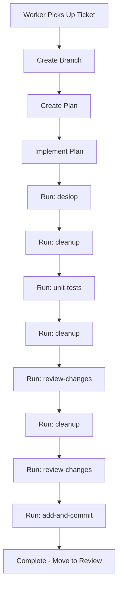

# Worker Workflow Guide

This guide documents the standardized workflow for Agent Kanban workers processing tickets. The workflow ensures consistent, high-quality code through structured phases and quality assurance commands.

## Overview

When a worker picks up a ticket from the Ready column, it follows a structured workflow:

1. **Branch Creation** - Create a dedicated branch for the ticket
2. **Planning Phase** - Create a plan before implementing
3. **Implementation Phase** - Execute the plan
4. **Quality Assurance** - Run the command sequence to ensure code quality
5. **Commit** - Stage and commit with a detailed message

## Workflow State Machine



## Branch Naming Convention

Branches created by workers follow this pattern:

```
ticket/<ticket-id>/<short-title>
```

For example:
- `ticket/abc123/add-user-authentication`
- `ticket/xyz789/fix-login-bug`

The short title is derived from the ticket title, converted to lowercase with spaces replaced by hyphens.

## Quality Assurance Command Sequence

After implementation, workers run through a structured QA sequence:

| Step | Command | Purpose |
|------|---------|---------|
| 1 | `deslop` | Remove AI-generated code patterns (over-commenting, defensive code) |
| 2 | `cleanup` | Fix any lint/type errors introduced |
| 3 | `unit-tests` | Ensure patch has test coverage |
| 4 | `cleanup` | Fix test-related issues |
| 5 | `review-changes` | Apply best practices, check modularity |
| 6 | `cleanup` | Final lint pass |
| 7 | `review-changes` | Second review for anything missed |
| 8 | `add-and-commit` | Stage and commit with proper message |

### Command Sequence Rationale

- **deslop**: First pass removes AI-generated code patterns that don't match team style
- **cleanup**: Ensures build/lint/type checks pass after each major step
- **unit-tests**: Adds test coverage for new/changed code
- **review-changes**: Two passes catch issues the first review might miss
- **add-and-commit**: Creates a well-structured commit with detailed message

## Available Commands

The following command templates are bundled with Agent Kanban:

### add-and-commit.md

Applies code changes and creates a commit with a detailed message. This command:
- Understands repo conventions (Makefile, package.json, Cargo.toml, etc.)
- Runs validation (lint, typecheck, test, build)
- Stages changes intentionally
- Creates a detailed commit message following repo conventions

### cleanup.md

Eliminates all warnings and errors from lint/build/typecheck and removes dead code. Never suppresses warnings with comments or disables rules.

### deslop.md

Removes AI-generated code patterns ("slop") from the branch:
- Narration-style comments
- Unnecessary defensive code
- Type escapes (`as any`, `@ts-ignore`)
- Inconsistent style/structure

### review-changes.md

Reviews recent changes and applies improvements for:
- Correctness and behavior
- API design and modularity
- Readability and maintainability
- Types and contracts
- Security and privacy
- Performance
- Tests and docs

Enforces the 500-line file soft cap and suggests splits when needed.

### unit-tests.md

Adds/updates unit tests for patch coverage:
- Maps changed code to test plan
- Covers new functions, branches, error paths
- Follows repo test conventions
- Ensures regression tests for bug fixes

## Installing Commands to Projects

Commands can be installed to projects in two ways:

### For Cursor

Commands are installed to `.cursor/commands/` in the project:

```
project/
  .cursor/
    commands/
      add-and-commit.md
      cleanup.md
      deslop.md
      review-changes.md
      unit-tests.md
```

Invoke with `/deslop`, `/cleanup`, etc.

### For Claude Code

Commands are installed to `.claude/commands/` or can be read from the project root. Claude agents read and follow the command files directly.

## Integration with Hooks

The worker workflow integrates with the hook system:

1. **Hooks track progress** - Each step emits events to the Agent Kanban API
2. **Heartbeats maintain locks** - Long-running steps don't expire the ticket lock
3. **Errors are captured** - Failed steps move tickets to Blocked column

## Worker Environment Validation

Before a worker can start, the environment must pass validation:

| Check | Required? | Auto-Fix? |
|-------|-----------|-----------|
| CLI Available | Yes | No |
| Hooks Configured | Yes | Yes |
| Commands Installed | Yes | Yes |
| Git Repository | Yes | No |
| API Reachable | Yes | No |
| Project Registered | Warning | Yes |
| Git Clean State | Warning | No |

The UI shows validation status before allowing worker start, with "Fix" buttons for auto-fixable issues.

## Prompt Generation

When a worker picks up a ticket, the generated prompt includes:

1. **Task Context** - Title, description, priority, labels
2. **Workflow Instructions** - Branch creation, planning, QA sequence
3. **Command Invocation** - How to run each command for the agent type

### For Cursor Workers

```
## Workflow

1. Create a branch: ticket/<ticket-id>/<short-title>
2. Create a plan before implementing
3. After implementation, run this QA sequence:
   - /deslop
   - /cleanup
   - /unit-tests
   - /cleanup
   - /review-changes
   - /cleanup
   - /review-changes
   - /add-and-commit
```

### For Claude Workers

```
## Workflow

1. Create a branch: ticket/<ticket-id>/<short-title>
2. Create a plan before implementing
3. After implementation, run the QA sequence by reading and following
   each command file in order:
   - .claude/commands/deslop.md
   - .claude/commands/cleanup.md
   - .claude/commands/unit-tests.md
   - (continue sequence...)
```

## Troubleshooting

### Worker Won't Start

1. Check CLI is installed (`cursor --version` or `claude --version`)
2. Verify hooks are configured
3. Ensure commands are installed
4. Check API is running and reachable

### Ticket Stuck in Progress

1. Check worker logs for errors
2. Verify lock hasn't expired (heartbeat failure)
3. Check if agent process is still running

### QA Sequence Failing

1. Check which command is failing
2. Review command output for specific errors
3. Some cleanup may require manual intervention
