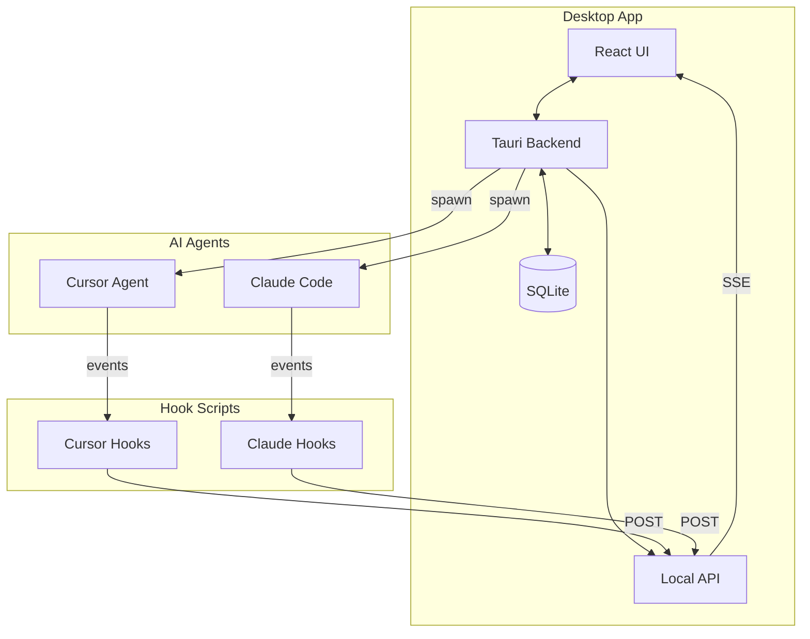
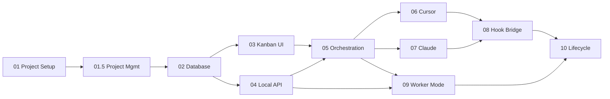

# Agent Kanban Implementation Guides

A comprehensive set of implementation guides for building the Agent Kanban desktop application - a local-first Kanban board that orchestrates AI coding agents (Cursor and Claude Code) to automatically work on tickets.

## Overview

Agent Kanban is a Tauri + React desktop application that:

- Provides a visual Kanban board for managing coding tasks
- Spawns AI agents (Cursor Agent, Claude Code) to work on tickets
- Tracks agent progress through lifecycle hooks
- Automatically updates ticket status based on agent outcomes
- Supports "worker mode" for continuous, unattended operation

## Architecture



## Guide Index

### Foundation Guides

| # | Guide | Description |
|---|-------|-------------|
| 01 | [Project Setup](./01-project-setup.md) | Initialize Tauri + React project with TypeScript, Vite, and Tailwind CSS |
| 01.5 | [Project Management](./01.5-project-management.md) | Projects registry for managing repositories where agents work |
| 02 | [Database Design](./02-database-design.md) | SQLite schema, migrations, and Rust data models |

### Core Application Guides

| # | Guide | Description |
|---|-------|-------------|
| 03 | [Kanban UI](./03-kanban-ui.md) | React components with drag-and-drop, Zustand state management |
| 04 | [Local API](./04-local-api.md) | REST API with Axum, WebSocket/SSE for real-time updates |

### Agent Integration Guides

| # | Guide | Description |
|---|-------|-------------|
| 05 | [Agent Orchestration](./05-agent-orchestration.md) | Process spawning, environment setup, output streaming |
| 06 | [Cursor Integration](./06-cursor-integration.md) | Cursor hooks and CLI adapter |
| 07 | [Claude Code Integration](./07-claude-code-integration.md) | Claude Code hooks and CLI adapter |
| 08 | [Hook Bridge](./08-hook-bridge.md) | Unified event handling and normalization |

### Advanced Features Guides

| # | Guide | Description |
|---|-------|-------------|
| 09 | [Worker Mode](./09-worker-mode.md) | Queue semantics, locking, and automated workers |
| 10 | [Ticket Lifecycle](./10-ticket-lifecycle.md) | State machine and transition rules |

## Reading Order

The guides are designed to be followed in order, as each builds upon the previous:



**Recommended path for MVP:**
1. 01-project-setup
2. 01.5-project-management (manages repos where agents work)
3. 02-database-design
4. 03-kanban-ui
5. 04-local-api
6. 05-agent-orchestration
7. 06-cursor-integration OR 07-claude-code-integration
8. 08-hook-bridge
9. 09-worker-mode
10. 10-ticket-lifecycle

## Quick Start

If you want to get something working quickly:

1. Follow guides 01-04 to get the basic app running
2. Follow guide 05 + either 06 or 07 to add one agent
3. Add guide 08 for proper event tracking
4. Guides 09-10 add automation and polish

## Technology Stack

| Component | Technology |
|-----------|------------|
| Desktop Framework | Tauri 1.x |
| Frontend | React 18 + TypeScript |
| Build Tool | Vite |
| Styling | Tailwind CSS |
| State Management | Zustand |
| Drag & Drop | dnd-kit |
| Backend Runtime | Rust |
| HTTP Server | Axum |
| Database | SQLite (rusqlite) |
| Async Runtime | Tokio |

## Key Concepts

### Projects

A **Project** represents a local repository/directory that agents can work in:

- Users register directories via Settings > Projects
- Boards can have a default project
- Tickets can override with a different project
- Agents run in the project's directory
- Hook configuration is tracked per-project

### Ticket States

| State | Description |
|-------|-------------|
| **Backlog** | Future work, not ready for agents |
| **Ready** | Queued for agent pickup |
| **In Progress** | Currently being worked by an agent |
| **Blocked** | Failed or needs attention |
| **Review** | Completed, awaiting approval |
| **Done** | Finished |

### Agent Hooks

Hooks intercept agent lifecycle events:

- **Cursor**: `beforeShellExecution`, `afterFileEdit`, `stop`
- **Claude**: `PreToolUse`, `PostToolUse`, `Stop`, `UserPromptSubmit`

### Normalized Events

All hook events are normalized to a common format:

```json
{
  "runId": "uuid",
  "ticketId": "uuid",
  "agentType": "cursor|claude",
  "eventType": "command_requested|file_edited|run_stopped|...",
  "payload": { "raw": "...", "structured": {...} },
  "timestamp": "2024-01-01T00:00:00Z"
}
```

### Worker Mode

Workers continuously:
1. Poll for Ready tickets
2. Reserve and lock the ticket
3. Spawn the agent
4. Send heartbeats to maintain lock
5. Finalize and transition on completion

## API Quick Reference

### Tickets

| Method | Endpoint | Description |
|--------|----------|-------------|
| GET | `/v1/boards/:id/tickets` | List tickets |
| POST | `/v1/tickets` | Create ticket |
| PATCH | `/v1/tickets/:id` | Update ticket |
| POST | `/v1/tickets/:id/move` | Move to column |
| POST | `/v1/tickets/:id/reserve` | Lock for agent |

### Runs

| Method | Endpoint | Description |
|--------|----------|-------------|
| POST | `/v1/runs` | Create run |
| GET | `/v1/runs/:id` | Get run details |
| PATCH | `/v1/runs/:id` | Update status |
| POST | `/v1/runs/:id/heartbeat` | Extend lock |
| POST | `/v1/runs/:id/events` | Post event |

### Queue

| Method | Endpoint | Description |
|--------|----------|-------------|
| POST | `/v1/queue/next` | Get next ticket |
| GET | `/v1/queue/status` | Queue depth |

### Real-time

| Method | Endpoint | Description |
|--------|----------|-------------|
| GET | `/v1/stream` | SSE event stream |

## File Structure

```
agent-kanban/
├── src/                          # React frontend
│   ├── components/
│   │   ├── board/               # Kanban components
│   │   ├── layout/              # App layout
│   │   ├── settings/            # Settings panels (incl. Projects)
│   │   ├── timeline/            # Event timeline
│   │   └── workers/             # Worker management
│   ├── hooks/                   # React hooks
│   ├── stores/                  # Zustand stores
│   ├── types/                   # TypeScript types
│   └── lib/                     # Utilities
├── src-tauri/                   # Rust backend
│   └── src/
│       ├── commands/            # Tauri commands
│       ├── db/                  # Database layer (incl. projects table)
│       ├── api/                 # HTTP API
│       ├── agents/              # Agent orchestration
│       └── lifecycle/           # State machine
├── scripts/                     # Hook scripts
│   ├── cursor-hook.js
│   ├── claude-hook.js
│   └── agent-kanban-hook.js    # Unified hook
└── docs/
    └── guides/                  # These implementation guides
        ├── 01-project-setup.md
        ├── 01.5-project-management.md  # NEW
        ├── 02-database-design.md
        └── ...
```

## Success Criteria

The MVP is complete when:

- [ ] Tickets can be created, edited, and moved between columns
- [ ] Cursor agent can be spawned from a ticket
- [ ] Claude Code agent can be spawned from a ticket
- [ ] Hook events appear in ticket timeline
- [ ] Tickets auto-transition on run completion
- [ ] Worker mode processes tickets automatically
- [ ] Lock expiration recovers orphaned tickets

## Contributing

Each guide follows a consistent structure:

1. **Overview**: What the guide covers
2. **Prerequisites**: Required prior guides
3. **Architecture**: Diagrams and design decisions
4. **Implementation Steps**: Detailed walkthrough with code
5. **Testing**: Verification steps
6. **Troubleshooting**: Common issues

## License

MIT
